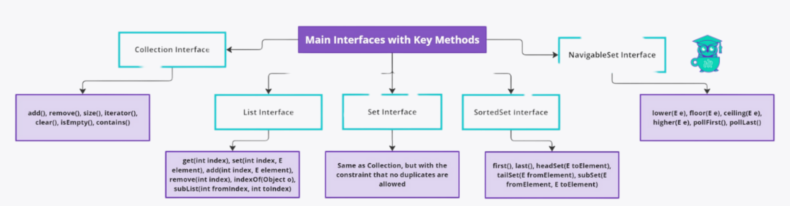

Collections
---
### What are the differences between Collection and Collections in Java?
In Java, Collection and Collections are often confused due to their similar names, but they serve different purposes and have distinct functionalities:

**Collection:**
- `Type`: Interface
- `Package`: java.util
- `Purpose`: Collection is the root interface in the Java Collections Framework. It represents a group of objects, known as elements. Some of its subinterfaces include List, Set, and Queue.
- `Usage`: Collection defines the basic operations that can be performed on a collection of elements, such as adding, removing, and querying elements.
- `Key Methods`: add(E e), remove(Object o), size(), iterator(), isEmpty(), clear(), contains(Object o).

```java
Collection<String> collection = new ArrayList<>();
collection.add("Element1");
collection.add("Element2");
```

**Collections:**
- `Type`: Utility Class
- `Package`: java.util
- `Purpose`: Collections is a utility class that consists of static methods that operate on or return collections. It provides methods for manipulating and creating collections.
- `Usage`: Collections provides static methods for various collection operations, such as sorting, searching, reversing, and synchronizing collections. It also provides methods to create empty or singleton collections.
- `Key Methods`: sort(), reverse(), shuffle(), unmodifiableCollection(),  synchronizedCollection(), binarySearch()

```java
List<String> list = new ArrayList<>();
list.add("Element3");
list.add("Element1");
list.add("Element2");
Collections.sort(list);
System.out.println(list); // Output: [Element1, Element2, Element3]
```


| **Aspect**                    | **Collection**                                           | **Collections**                                                                                                                                                            |
|-------------------------------|---------------------------------------------------------|----------------------------------------------------------------------------------------------------------------------------------------------------------------------------|
| **Type**                      | Interface                                               | Utility class                                                                                                                                                              |
| **Purpose**                   | Represents a group of objects (elements)               | Provides static methods for operations on collections                                                                                                                      |
| **Hierarchy**                 | Root of the Java Collections Framework                  | Part of the Java Collections Framework                                                                                                                                     |
| **Methods**                   | Contains instance methods like `add()`, `remove()`, `size()`, `iterator()`, `clear()`, `isEmpty()`, `contains()`. | Contains only static methods like `sort()`, `min()`, `max()`, `fill()`, `copy()`, `reverse()`, `binarySearch()`, `shuffle()`, `disjoint()`, `synchronizedCollection()`,`unmodifiableCollection()`. |
| **Implementation**            | Can be implemented by custom classes                    | Cannot be instantiated; all methods are static                                                                                                                             |
| **Generics Support**          | Supports generics for type-safe operations              | Does not directly support generics; operates on Collection types                                                                                                           |
| **Examples of Subinterfaces** | List, Set, Queue                                        | N/A (Utility class does not have subinterfaces)                                                                                                                            |
| **Usage Context**             | Used to define data structures                           | Used to perform common operations on collections                                                                                                                           |

Links : https://www.geeksforgeeks.org/collections-in-java-2/

### How do you implement a custom collection in Java?
Implementing a custom collection in Java involves defining a new class that encapsulates the data structure you want to create and implementing relevant interfaces from the Java Collections Framework (JCF). Here's a step-by-step guide on how to create a simple custom collection, such as a custom list, by implementing the List interface.

- Define the Class and Implement the Interface:
```java
import java.util.*;

public class CustomList<E> implements List<E> {
    private Object[] elements;
    private int size = 0;
    private static final int DEFAULT_CAPACITY = 10;

    public CustomList() {
        elements = new Object[DEFAULT_CAPACITY];
    }
}
```
**Implement Required Methods:**
The List interface contains many methods that need to be implemented. Here, we'll implement the core methods: size(), add(), get(), and remove().

```java
@Override
public int size() {
    return size;
}

@Override
public boolean isEmpty() {
    return size == 0;
}

@Override
public boolean add(E e) {
    ensureCapacity();
    elements[size++] = e;
    return true;
}

@Override
public E get(int index) {
    checkIndex(index);
    return (E) elements[index];
}

@Override
public E remove(int index) {
    checkIndex(index);
    E oldValue = (E) elements[index];

    int numMoved = size - index - 1;
    if (numMoved > 0) {
        System.arraycopy(elements, index + 1, elements, index, numMoved);
    }
    elements[--size] = null; // Clear to let GC do its work
    return oldValue;
}

private void ensureCapacity() {
    if (size == elements.length) {
        int newCapacity = elements.length * 2;
        elements = Arrays.copyOf(elements, newCapacity);
    }
}

private void checkIndex(int index) {
    if (index < 0 || index >= size) {
        throw new IndexOutOfBoundsException("Index: " + index + ", Size: " + size);
    }
}
```
**Implement Remaining Methods:**
The List interface has many other methods. Implementing them all can be tedious, but it ensures your collection behaves correctly as a list. Here are some more essential methods you might want to implement:
```java
@Override
public void add(int index, E element) {
    checkIndexForAdd(index);
    ensureCapacity();

    System.arraycopy(elements, index, elements, index + 1, size - index);
    elements[index] = element;
    size++;
}

@Override
public boolean contains(Object o) {
    return indexOf(o) >= 0;
}

@Override
public int indexOf(Object o) {
    if (o == null) {
        for (int i = 0; i < size; i++) {
            if (elements[i] == null) {
                return i;
            }
        }
    } else {
        for (int i = 0; i < size; i++) {
            if (o.equals(elements[i])) {
                return i;
            }
        }
    }
    return -1;
}

@Override
public Object[] toArray() {
    return Arrays.copyOf(elements, size);
}

@Override
public <T> T[] toArray(T[] a) {
    if (a.length < size) {
        return (T[]) Arrays.copyOf(elements, size, a.getClass());
    }
    System.arraycopy(elements, 0, a, 0, size);
    if (a.length > size) {
        a[size] = null;
    }
    return a;
}
```

### What Are the com.manish.OOD.CreationalDesign.BuilderDesign.Pizza.Main Interfaces in Java Collections?
Java Collections Framework provides several interfaces that define various types of collections. Here are the main interfaces
in Java collections:

#### Collection Interface:
- The root interface of the collection hierarchy. It defines the basic operations for all types of collections, such as adding, removing, and querying elements.
- Key methods: add(), remove(), size(), iterator(), clear(), isEmpty(), contains().

#### List Interface:
- An ordered collection (also known as a sequence). Lists can contain duplicate elements and allow positional access and insertion of elements.
- Extends Collection.
- Key methods: get(int index), set(int index, E element), add(int index, E element), remove(int index), indexOf(Object o), subList(int fromIndex, int toIndex).

#### Set Interface:
- A collection that cannot contain duplicate elements. It models the mathematical set abstraction.
- Extends Collection.
- Key methods: Same as Collection, but with the constraint that no duplicates are allowed.

#### SortedSet Interface:
- A Set that maintains its elements in ascending order. Implements the NavigableSet interface.
- Extends Set.
- Key methods: first(), last(), headSet(E toElement), tailSet(E fromElement), subSet(E fromElement, E toElement).

#### NavigableSet Interface:
- A SortedSet with navigation methods reporting closest matches for given search targets.
- Extends SortedSet.
- Key methods: lower(E e), floor(E e), ceiling(E e), higher(E e), pollFirst(), pollLast().


### What Is the Difference Between Fail-Safe and Fail-Fast Iterators?
- Fail-Safe and Fail-Fast iterators are concepts used to describe the behavior of iterators in the face of concurrent modifications

**Fail-Fast Iterators:**
- `Definition`: Fail-Fast systems `abort operation` as-fast-as-possible `exposing failures` immediately and `stopping` the whole operation. 
  - They immediately throw a **ConcurrentModificationException** if they detect any `structural modifications` to the collection while iterating.
- `Behavior`:  These iterators `directly access` the collection's data structure, making them highly `sensitive` to modifications.
- `Example`: Iterators of most of the Java Collections Framework classes such as `ArrayList`, `HashSet`, `HashMap` are `Fail-Fast`.

```java
import java.util.ArrayList;
import java.util.Arrays;
import java.util.Iterator;
import java.util.List;

public class FailFastTest {
    public void failFast() {
        ArrayList<Integer> numbers = new ArrayList<>(Arrays.asList(1, 2, 3));
        Iterator<Integer> iterator = numbers.iterator();
        while (iterator.hasNext()) {
            Integer number = iterator.next();
            numbers.add(50); // This line will throw error
        }
    }
}
```
**Fail-Safe Iterators:**
- **Definition**: Fail-Safe iterators `do not throw exceptions` when the underlying collection is modified. Instead, they operate on a `clone or a snapshot` of the collection's data.
- **Behavior**:  These iterators maintain a copy of the collection's state at the time the iterator was created.
- **Example**: Iterators of concurrent collections such as `CopyOnWriteArrayList`, `ConcurrentHashMap` in Java are `Fail-Safe`.
```java
import java.util.Arrays;
import java.util.Iterator;
import java.util.concurrent.CopyOnWriteArrayList;

public class FailSafeTest {
    public void failSafe() {
        CopyOnWriteArrayList<String> list = new CopyOnWriteArrayList<>(Arrays.asList("a", "b", "c"));
        Iterator<String> iterator = list.iterator();
        while (iterator.hasNext()) {
            if (iterator.next().equals("b")) {
                list.remove("b"); // This will not cause an exception
            }
        }
        System.out.println(list); // ["a", "c"]
    }
}
```
### What is the Difference Between Linkedlist and Arraylist?
- LinkedList and Arraylist both are data structures in java or any other language used to store data.

#### Arraylist:
- Underlying Data Structure: Uses a dynamic array to store elements. Provides fast random access to elements using an index.
- Time Complexity: Uses O(1) Time complexity for get and set operations and appending element to last. But it takes O(n) to add
or remove element in between.
- Usecase: Best suited for applications where frequent access to elements using an index is required. Ideal when the size of the list is relatively stable, and insertion or deletion operations are infrequent.

#### Linkedlist:
- Underlying Data Structure: : Uses a doubly linked list to store elements. Does not support efficient random access. Elements are accessed sequentially.
- Time Complexity: Uses O(n) for get and set operations because it requires traversal from the beginning or end to the desired index. O(1) for adding or removing elements at the beginning or end, but O(n) for accessing elements at arbitrary positions.
- Usecase: Best suited for applications where frequent insertions and deletions are required, especially at the beginning or middle of the list.

```java
import java.util.ArrayList;
import java.util.List;

public class ArrayListExample {
    public static void main(String[] args) {
        // Create an ArrayList
        List<String> arrayList = new ArrayList<>();

        // Add elements to the ArrayList
        arrayList.add("Apple");
        arrayList.add("Banana");
        arrayList.add("Cherry");

        // Access elements by index
        System.out.println("Element at index 1: " + arrayList.get(1)); // Element at index 1: Banana

        // Iterate through the ArrayList
        System.out.println("ArrayList elements:");
        for (String fruit : arrayList) {
            System.out.println(fruit);
        }
// 		  Output:
//        ArrayList elements:
//        Apple
//        Banana
//        Cherry

        // Remove an element
        arrayList.remove(1); // Removes "Banana"
        System.out.println("After removal:");
        for (String fruit : arrayList) {
            System.out.println(fruit);
        }

//        After removal:
//        Apple
//        Cherry

    }
}
```

```java
import java.util.LinkedList;

public class LinkedListExample {
    public static void main(String[] args) {
        // Create a LinkedList
        LinkedList<String> linkedList = new LinkedList<>();

        // Add elements to the LinkedList
        linkedList.add("Apple");
        linkedList.add("Banana");
        linkedList.add("Cherry");

        // Access elements by index (not efficient)
        System.out.println("Element at index 1: " + linkedList.get(1)); // Banana

        // Iterate through the LinkedList
        System.out.println("LinkedList elements:");
        for (String fruit : linkedList) {
            System.out.println(fruit);
        }

//        LinkedList elements:
//        Apple
//        Banana
//        Cherry

        // Remove an element
        linkedList.remove(1); // Removes "Banana"
        System.out.println("After removal:");
        for (String fruit : linkedList) {
            System.out.println(fruit);
        }

//        After removal:
//        Apple
//        Cherry

        // Add element at the beginning and the end
        linkedList.addFirst("Mango");
        linkedList.addLast("Orange");
        System.out.println("After adding at the beginning and end:");
        for (String fruit : linkedList) {
            System.out.println(fruit);
        }

//        After adding at the beginning and end:
//        Mango
//        Apple
//        Cherry
//        Orange
    }
}
```
### What is the Difference Between HashMap and HashTable?
1. `Thread Safety:`
   - HashMap: Not thread-safe. Concurrent modification can lead to inconsistent state.
   - Hashtable: Thread-safe. All methods are synchronized.

2. `Synchronization:`
   - HashMap: No internal synchronization. Needs external synchronization for thread safety.
   - Hashtable: Methods are internally synchronized.

3. `Performance:`
   - HashMap: Faster because it does not have synchronization overhead.
   - Hashtable: Slower due to synchronization overhead.

4. `Null Keys and Values:`
   - HashMap: Allows one null key and multiple null values.
   - Hashtable: Does not allow null keys or null values.

5. `Iterator Type:`
   - HashMap: Fail-fast iterator, which throws ConcurrentModificationException if the map is modified during iteration.
   - Hashtable: Fail-safe enumeration, which does not throw ConcurrentModificationException.

6. `Use Case:`
   - HashMap: Suitable for non-threaded applications where thread safety is not a concern.
   - Hashtable: Suitable for threaded applications where thread safety is required.

7. `Legacy:`
   - HashMap: Considered modern and more versatile.
   - Hashtable: Considered legacy; use ConcurrentHashMap for thread-safe operations.
```java
 //HashMap allows one null key and any number of null values.
 Map<String, Integer> hashMap = new HashMap<>();
 hashMap.put(null,null);

 //Hashtable does not allow null keys or values
 Map<String, Integer> hashtable = new Hashtable<>();
 hashtable.put(null,null); //exception
```
### What Is the Difference Between Hashset and Treeset?
- HashSet and TreeSet are both `implementations of the Set interface` in Java, but they have different underlying mechanisms, performance characteristics, and usage scenarios.

#### Hashset:
- Underlying Data Structure: Uses a hash table to store elements. Relies on hashing for its operations, meaning it uses the hashCode method to determine the storage location of elements.
- Time Complexity: O(1) average time complexity for add, remove, and contains operations.
- Ordering: Does not maintain any order of elements. The order of elements when iterating over the set is unpredictable and can change over time.
- UseCase: Suitable when you need fast lookups and do not care about the order of elements.

#### Treeset:
- Underlying Data Structure: Uses a Red-Black tree (a self-balancing binary search tree) to store elements.
- Time Complexity: O(log n) for add, remove, and contains operations.
- Ordering: Maintains elements in a sorted order.  The elements are sorted according to their natural ordering (using Comparable) or by a specified Comparator.
- UseCase: Suitable when you need to maintain a sorted order of elements.
```java
// Hashset Example
import java.util.HashSet;
import java.util.Set;

public class HashSetExample {
    public static void main(String[] args) {
        Set<String> hashSet = new HashSet<>();

        // Add elements to the HashSet
        hashSet.add("Apple");
        hashSet.add("Banana");
        hashSet.add("Cherry");

        // Check if an element exists
        System.out.println("Contains 'Apple': " + hashSet.contains("Apple")); // Contains 'Apple': true

        // Remove an element
        hashSet.remove("Banana");

        // Iterate over the HashSet
        System.out.println("HashSet elements:");
        for (String fruit : hashSet) {
            System.out.println(fruit);
        }
      // Output
      // HashSet elements:
      // Apple
      // Cherry
    }
}
```

```java
// Treeset example
import java.util.Set;
import java.util.TreeSet;

public class TreeSetExample {
    public static void main(String[] args) {
        Set<String> treeSet = new TreeSet<>();

        // Add elements to the TreeSet
        treeSet.add("Apple");
        treeSet.add("Banana");
        treeSet.add("Cherry");

        // Check if an element exists
        System.out.println("Contains 'Apple': " + treeSet.contains("Apple")); // Contains Apple: true

        // Remove an element
        treeSet.remove("Banana");

        // Iterate over the TreeSet
        System.out.println("TreeSet elements:");
        for (String fruit : treeSet) {
            System.out.println(fruit);
        }
      // Output
      // TreeSet elements: 
      // Apple Cherry
    }
}
```
### How Is Hashmap Implemented in Java (explain in detail)?
- A HashMap is a data structure that allows you to store and `retrieve key-value pairs efficiently`. 
  - Think of it like a `digital dictionary` where you can look up values (like definitions) using unique keys (like words).

- The HashMap class implements a hash map data structure using a `resizable array` of `power-of-two` size. 
  - When adding an element, the key's hashCode is calculated and `its lower bits` determine the array `index` (bucket). Accessing elements by array index is `very fast (O(1))`.

- However, hash `collisions` occur when `different` keys produce the `same index`. In Java’s `HashMap`, each bucket points to a `red-black tree` (a linked list before Java 8) of colliding elements. 
  - The HashMap traverses this tree to insert or find key-value pairs, replacing existing pairs with matching keys.

- Retrieving an element involves calculating the key's hashCode, finding the bucket, and traversing the tree to match the key. HashMap operations generally have O(1) complexity but can degrade to O(log(n)) with many collisions. Using a good hash function helps maintain performance.

- When the internal array fills up, the HashMap doubles its size, triggering a costly rehashing process. Thus, it's advisable to estimate the initial size to avoid frequent resizing.

Here is the implementation of Hashmaps in java:

```java
// Entry.java
class Entry<K, V> {
    K key;
    V value;
    Entry<K, V> next;

    public Entry(K key, V value) {
        this.key = key;
        this.value = value;
        this.next = null;
    }
}

// MyHashMap.java
public class MyHashMap<K, V> {
    private Entry<K, V>[] buckets;
    private static final int INITIAL_CAPACITY = 16;
    private int size = 0;

    public MyHashMap() {
        this.buckets = new Entry[INITIAL_CAPACITY];
    }
    
    // Hash function to calculate the index for a given key
    private int getBucketIndex(K key) {
        return Math.abs(key.hashCode()) % buckets.length;
    }

    // Add or update a key-value pair
    public void put(K key, V value) {
        int bucketIndex = getBucketIndex(key);
        Entry<K, V> newEntry = new Entry<>(key, value);

        // If bucket is empty, add the new entry
        if (buckets[bucketIndex] == null) {
            buckets[bucketIndex] = newEntry;
            size++;
        } else {
            // Traverse the bucket and update the value if key is found, otherwise append the new entry
            Entry<K, V> current = buckets[bucketIndex];
            Entry<K, V> previous = null;
            while (current != null) {
                if (current.key.equals(key)) {
                    current.value = value; // Update value
                    return;
                }
                previous = current;
                current = current.next;
            }
            previous.next = newEntry; // Append the new entry at the end
            size++;
        }
    }

    // Retrieve a value by key
    public V get(K key) {
        int bucketIndex = getBucketIndex(key);
        Entry<K, V> current = buckets[bucketIndex];

        // Traverse the bucket to find the key
        while (current != null) {
            if (current.key.equals(key)) {
                return current.value;
            }
            current = current.next;
        }
        return null; // Key not found
    }

    // Remove a key-value pair by key
    public V remove(K key) {
        int bucketIndex = getBucketIndex(key);
        Entry<K, V> current = buckets[bucketIndex];
        Entry<K, V> previous = null;

        // Traverse the bucket to find the key and remove the entry
        while (current != null) {
            if (current.key.equals(key)) {
                if (previous == null) {
                    buckets[bucketIndex] = current.next; // Remove first entry in the bucket
                } else {
                    previous.next = current.next; // Bypass the entry to be removed
                }
                size--;
                return current.value;
            }
            previous = current;
            current = current.next;
        }
        return null; // Key not found
    }

    // Return the number of key-value pairs in the map
    public int size() {
        return size;
    }

    // Check if the map is empty
    public boolean isEmpty() {
        return size == 0;
    }
}

// MyHashMapTest.java
public class MyHashMapTest {
    public static void main(String[] args) {
        MyHashMap<String, Integer> map = new MyHashMap<>();
        
        // Add some key-value pairs
        map.put("one", 1);
        map.put("two", 2);
        map.put("three", 3);

        // Retrieve values
        System.out.println("Value for 'one': " + map.get("one")); // Output: 1
        System.out.println("Value for 'two': " + map.get("two")); // Output: 2

        // Remove a key-value pair
        System.out.println("Removed value for 'two': " + map.remove("two")); // Output: 2

        // Check size and content
        System.out.println("Size of map: " + map.size()); // Output: 2
        System.out.println("Value for 'two': " + map.get("two")); // Output: null

        // Check if map is empty
        System.out.println("Is map empty? " + map.isEmpty()); // Output: false

        // Remove all elements
        map.remove("one");
        map.remove("three");

        // Check if map is empty
        System.out.println("Is map empty? " + map.isEmpty()); // Output: true
    }
}
```
### What Is the use of the Initial Capacity and Load Factor Parameters of a Hashmap and their Default Values?
#### Initial Capacity:
- `Purpose`: Sets the initial size of the internal array that stores the key-value pairs.
- `Default Value`: **16**.
- `Effect`: If the specified initial capacity is not a power of two, it is adjusted to the next power of two. For example, an initial capacity of 10 will be adjusted to 16.
- `Usage`: Helps to minimize the number of resizings if the number of elements to be stored is known in advance, improving performance.

#### Load Factor:
- `Purpose`: Determines when to increase the size of the internal array to maintain performance.
- `Default Value`: 0.75.
- `Effect`: When the number of elements exceeds the product of the load factor and the current capacity, the array size is doubled, and the elements are rehashed.
- `Usage`: Balances time complexity of operations and space usage. A lower load factor reduces the likelihood of collisions but increases memory usage, while a higher load factor saves memory but may increase collisions and degrade performance.

Choosing the right initialCapacity can be challenging. Guava's Maps.newHashMapWithExpectedSize() and Sets.newHashSetWithExpectedSize() methods help create maps and sets sized to minimize resizing.

- `Initial Capacity`: Determines the starting size of the internal array.
- `Load Factor`: Controls the threshold for resizing the array.
- `Default Settings`: 16 for initial capacity and 0.75 for load factor, providing a good balance of performance and memory usage for general use cases.
```java
// Creating a HashMap with initial capacity of 32 and load factor of 0.5
HashMap<Integer, String> map = new HashMap<>(32, 0.5f);

```
### How to Use Comparable and Comparator Interfaces to Sort Collections?

#### Comparable:
- The Comparable interface is used to define the `natural ordering` of objects. 
- A class that implements `Comparable` must override the `compareTo` method. 
- This method compares the current object with the specified object for order.

#### Steps to Use Comparable:
- Implement Comparable: Implement the Comparable interface in the class whose instances need to be sorted.
- Override compareTo: Override the compareTo method to define the natural order.
```java
import java.util.*;

class Student implements Comparable<Student> {
    private String name;
    private int grade;

    public Student(String name, int grade) {
        this.name = name;
        this.grade = grade;
    }

    public String getName() {
        return name;
    }

    public int getGrade() {
        return grade;
    }

    @Override
    public int compareTo(Student other) {
        return Integer.compare(this.grade, other.grade); // Natural order by grade
    }

    @Override
    public String toString() {
        return name + ": " + grade;
    }
}

public class ComparableExample {
    public static void main(String[] args) {
        List<Student> students = new ArrayList<>();
        students.add(new Student("Alice", 85));
        students.add(new Student("Bob", 90));
        students.add(new Student("Charlie", 80));

        Collections.sort(students); // Sort using natural order defined in compareTo

        for (Student student : students) {
            System.out.println(student);
        }
      // Output
      // Charlie: 80
      // Alice: 85
      // Bob: 90
    }
}
```
#### Comparator :
- The Comparator interface is used to define a custom order for sorting objects. 
- It can be implemented as a separate class, or as an anonymous class or lambda expression. 
- A Comparator must `override` the compare method.

#### Steps to Use Comparator:

- Implement Comparator: Create a class or use a lambda expression that implements the Comparator interface.
- Override compareTo: Override the compareTo method to define the natural order.
```java
import java.util.*;

class Student {
    private String name;
    private int grade;

    public Student(String name, int grade) {
        this.name = name;
        this.grade = grade;
    }

    public String getName() {
        return name;
    }

    public int getGrade() {
        return grade;
    }

    @Override
    public String toString() {
        return name + ": " + grade;
    }
}

class NameComparator implements Comparator<Student> {
    @Override
    public int compare(Student s1, Student s2) {
        return s1.getName().compareTo(s2.getName()); // Custom order by name
    }
}

public class ComparatorExample {
    public static void main(String[] args) {
        List<Student> students = new ArrayList<>();
        students.add(new Student("Alice", 85));
        students.add(new Student("Bob", 90));
        students.add(new Student("Charlie", 80));

        Collections.sort(students, new NameComparator()); // Sort using custom comparator

        for (Student student : students) {
            System.out.println(student);
        }
      // Output
      // Alice: 85
      // Bob: 90
      // Charlie: 80

        // Using a lambda expression for custom sorting by grade in descending order
        Collections.sort(students, (s1, s2) -> Integer.compare(s2.getGrade(), s1.getGrade()));
        System.out.println("Sorted by grade (desc): " + students);

     // Output
      // Bob: 90
      // Alice: 85
      // Charlie: 80
      
    }
}
```


### What is the difference between HashMap and LinkedHashMap?

**Hashmap:**
- `Order of Entries`: HashMap `does not maintain any order` of its *entries*. The order of elements can `change over time`, especially when `rehashing occurs` after `resizing the map`.
- `Performance`: HashMap generally provides `constant-time performance` for the basic operations (get and put), assuming the hash function disperses the elements properly among the buckets.
- `Internal Structure`: HashMap uses a hash table to `store the map entries`. Each entry is stored in a `bucket` which is determined by the `hash code` of the key.
- `Use Cases`: Suitable for general-purpose use where the `order of the entries is not important`

```java
import java.util.HashMap;
import java.util.Map;

public class HashMapExample {
    public static void main(String[] args) {
        Map<String, Integer> map = new HashMap<>();
        map.put("one", 1);
        map.put("two", 2);
        map.put("three", 3);

        System.out.println(map); // Output can be in any order
    }
}
```

**LinkedHashmap:**
- `Order of Entries`: LinkedHashMap maintains a `doubly-linked list running through all of its entries`. This allows it to maintain the `order in which keys were inserted` (insertion-order).
- `Performance`: LinkedHashMap has a slightly `lower performance compared to HashMap` due to the overhead of maintaining the linked list. However, it still provides `constant-time performance` for basic operations, assuming the hash function disperses the elements properly.
- `Internal Structure`: Like HashMap, LinkedHashMap uses a `hash table to store the map entries`. Additionally, each entry maintains pointers to the next and previous entries in the doubly-linked list.
- `Use Cases`: Suitable when you need to maintain the insertion order of the elements.

```java
import java.util.HashMap;
import java.util.Map;

public class HashMapExample {
    public static void main(String[] args) {
        Map<String, Integer> map = new HashMap<>();
        map.put("one", 1);
        map.put("two", 2);
        map.put("three", 3);

        System.out.println(map); // Output can be in any order
    }
}
```
### How does ConcurrentHashMap work and how is it different from HashMap?
- `ConcurrentHashMap` and `HashMap` are both implementations of the `Map interface in Java`, but they are designed for different use cases, especially when it comes to handling concurrent access. 
- Here's an in-depth look at how ConcurrentHashMap works and how it differs from HashMap.

**ConcurrentHashMap:**
- `Concurrency Level`: ConcurrentHashMap divides the map into segments or buckets. Each segment is a smaller, independently synchronized map, allowing multiple threads to access different segments concurrently without contention.
- `Locking Mechanism` or (`No Locking on Read`): Instead of locking the entire map, ConcurrentHashMap locks only the specific segment that a key belongs to. This fine-grained locking mechanism significantly improves performance in multi-threaded environments.
- `Performance`: ConcurrentHashMap provides better performance in a multi-threaded environment compared to HashMap when synchronized externally, due to its advanced locking mechanism.

```java
import java.util.concurrent.ConcurrentHashMap;
import java.util.Map;

public class ConcurrentHashMapExample {
    public static void main(String[] args) {
        Map<String, Integer> map = new ConcurrentHashMap<>();
        map.put("one", 1);
        map.put("two", 2);
        map.put("three", 3);

        map.forEach((key, value) -> System.out.println(key + ": " + value));

        // Concurrent modification example
        map.computeIfAbsent("four", k -> 4);
        System.out.println("four: " + map.get("four"));
      // Output
    // one: 1
	// two: 2
	// three: 3
	// four: 4
    }
}
```

### HashMap:
- **Simple Structure**: HashMap uses an` array of buckets`. Each `bucket is a linked list` (or a tree, in case of many hash collisions), where each `entry contains a key-value pair`.
- **No Internal Synchronization**: HashMap does not handle synchronization internally. When accessed by multiple threads concurrently, external synchronization is needed to avoid data corruption or inconsistent results.
- **Performance**: In a single-threaded environment, HashMap is faster than ConcurrentHashMap due to the lack of synchronization overhead.
- **Iteration**: Iterators on a HashMap are `fail-fast`, meaning that `if the map is modified after the iterator is created`, a `ConcurrentModificationException` is thrown.

```java
import java.util.HashMap;
import java.util.Map;

public class HashMapExample {
    public static void main(String[] args) {
        Map<String, Integer> map = new HashMap<>();
        map.put("one", 1);
        map.put("two", 2);
        map.put("three", 3);

        map.forEach((key, value) -> System.out.println(key + ": " + value));
      
    // Output
    // one: 1
	// two: 2
	// three: 3
    }
}
```

### Explain the internal structure and working of a TreeMap.
#### Internal Structure:
**1. Red Black Tree**:
   - Internally, `TreeMap` is implemented using a `Red-Black tree`, which is a type of `self-balancing binary search tree`.
   - Red-Black tree `properties ensure` that the tree remains approximately `balanced`, providing `O(log n) time complexity` for basic operations like `get`, `put`, `remove`, etc.

**2. Nodes**:
   - `Each node` in the Red-Black tree contains a `key-value` pair.
   - `Every node` also contains `references to its parent`, `left child`, and `right child` nodes.
   - Additionally, each node has a color attribute, which can either be `red` or `black`.
   
#### Working of TreeMap:
**1. Insertion (put method)**:
   - When a `new key-value` pair is `added`, the `put` method `traverses` the tree to find the `correct location` for the `new node`, maintaining the `sorted order of keys`.
   - After inserting the `new node`, the tree may need to be `rebalanced to maintain` the Red-Black tree properties. This involves `recoloring` and `possibly rotating` nodes.

**2. Deletion (remove method)**:
   - When a key is removed, the remove method `locates the node` and `removes it from the tree`.
   - After deletion, the tree is `rebalanced` to ensure it remains a `valid Red-Black` tree. This may also involve `recoloring` and `rotating` nodes.

**3. Searching (get method)**:
   - The get method `searches` for a `specific key` by traversing the tree from the root, moving left or right based on the `comparison` of the `key with the current node’s key`.
   - The search operation has a time complexity of `O(log n)` due to the `balanced` nature of the Red-Black tree.

**4. Iteration**:
   - TreeMap supports `in-order traversal`, which means `iterating` over the entries will return them in the `sorted order of key`s.
   - The iterators are `fail-fast`, meaning they throw `ConcurrentModificationException` if the `map is modified after the iterator is created`.


### How does a PriorityQueue work and how is it different from a regular queue?
- PriorityQueue uses `binary heap`. Elements are `ordered` based on their `priority` (natural order or a provided comparator). 
- In a `min-heap`, the smallest element is always at the `head`.

#### Differences from a Regular Queue
**Order of Elements:**
- **PriorityQueue**: Elements are `ordered by priority`. 
- **Regular Queue** (e.g., LinkedList): Elements follow `FIFO` order.

**Head Element:**
- **PriorityQueue**: Head is the element with the `highest priority`.
- **Regular Queue**: Head is the `oldest element` (first inserted).

**Use Cases:**
- **PriorityQueue**: Suitable for `scheduling tasks`, `simulations`, or any scenario where order is determined by `priority`.
- **Regular Queue**: Suitable for `simple task queues`, buffers, or any scenario requiring `FIFO` order.

```java
import java.util.PriorityQueue;
import java.util.LinkedList;
import java.util.Queue;

PriorityQueue<Integer> pq = new PriorityQueue<>();
pq.offer(3);
pq.offer(1);
pq.offer(2);

System.out.println(pq.poll()); // Outputs: 1 (smallest element)

Queue<Integer> queue = new LinkedList<>();
queue.offer(3);
queue.offer(1);
queue.offer(2);

System.out.println(queue.poll()); // Outputs: 3 (first inserted element)
```

### What is the difference between deep copy and shallow copy in collections?

#### Shallow Copy:
- A shallow copy of an object is a `new object` which is a `copy` of the `original object`, but the `internal objects` referenced by the `original object` are `not copied`. 
- Instead, the `references` to the `original objects` are copied. This means that both the `original object` and its `shallow copy` share references to the same objects.

#### Characteristics of Shallow Copy:
**1. Copies Object Structure Only**:
   - The `outer` object is `copied`, but the `inner` objects (objects referred by the fields) are `not copied`.

**2. Shared References**:
- Any changes made to the `mutable objects` within the `copied object` will reflect in the `original object`, and `vice versa`.

```java
package com.example.hungrycoder;
class ABC
{
    // instance variable of the class ABC
    int x = 30;
}
public class ShallowCopyTest
{
    // main method
    public static void main(String argvs[])
    {
// creating an object of the class ABC  
        ABC obj1 = new ABC();

// it will copy the reference, not value  
        ABC obj2 = obj1;

// updating the value to 6   
// using the reference variable obj2  
        obj2.x = 6;

// printing the value of x using reference variable obj1   
        System.out.println("The value of x is: " + obj1.x); // The value of x is: 6
    }
}   
```

#### Deep Copy:
- A deep copy of an object is a `new object` which is a `copy` of the `original object` along with all the `objects referenced` by the original object, `recursively`. 
- This means that the deep copy has its `own copies of the objects`, and `changes` to the inner objects in the copied structure `do not affect` the `original object` and vice versa.

#### Characteristics of DeepCopy:
**1. Copies Entire Structure:**
   - Both the outer object and all objects it references (directly or indirectly) are recursively copied.

**2. Independent Copies:**
   - Changes to the copied objects do not affect the original objects, and vice versa.

```java
class ABC  
{  
// instance variable of the class ABC  
int x = 30;  
}  
public class DeepCopyExample   
{     
// main method  
public static void main(String argvs[])   
{  
// creating an object of the class ABC  
ABC obj1 = new ABC();  
  
// it will copy the reference, not value  
ABC obj2 = new ABC();  
  
// updating the value to 6   
// using the reference variable obj2  
obj2.x = 6;  
  
// printing the value of x using reference variable obj1   
System.out.println("The value of x is: " + obj1.x);   //The value of x is: 30
}  
}   
```

### How do you handle duplicates in collections such as List, Set, and Map?
- Handling duplicates in collections in Java varies depending on the type of collection you are using (List, Set, or Map). Here’s a detailed explanation of how to handle duplicates in each of these collection types:

#### List
- A List in Java allows duplicate elements. However, if you need to handle or remove duplicates, you can do so manually using various approaches:

#### Removing Duplicates from a List
**1. Using a Set to Filter Duplicates:**
```java
import java.util.ArrayList;
import java.util.LinkedHashSet;
import java.util.List;
import java.util.Set;

public class RemoveDuplicatesFromList {
    public static void main(String[] args) {
        List<String> listWithDuplicates = new ArrayList<>();
        listWithDuplicates.add("apple");
        listWithDuplicates.add("banana");
        listWithDuplicates.add("apple");
        listWithDuplicates.add("orange");

        // Using LinkedHashSet to maintain insertion order
        Set<String> set = new LinkedHashSet<>(listWithDuplicates);
        List<String> listWithoutDuplicates = new ArrayList<>(set);

        System.out.println("List without duplicates: " + listWithoutDuplicates); //  List without duplicates:  ["apple", "banana", "orange"]
    }
}
// This approach maintains the insertion order by using a LinkedHashSet.
```

**2. Using Streams (Java 8+):**
```java
import java.util.ArrayList;
import java.util.List;
import java.util.stream.Collectors;

public class RemoveDuplicatesWithStreams {
    public static void main(String[] args) {
        List<String> listWithDuplicates = new ArrayList<>();
        listWithDuplicates.add("apple");
        listWithDuplicates.add("banana");
        listWithDuplicates.add("apple");
        listWithDuplicates.add("orange");

        List<String> listWithoutDuplicates = listWithDuplicates.stream()
                .distinct()
                .collect(Collectors.toList());

        System.out.println("List without duplicates: " + listWithoutDuplicates); //  List without duplicates:  ["apple", "banana", "orange"]
    }
}
```

**3. Set:**
- A Set in Java inherently does not allow duplicate elements. If you add a duplicate element to a Set, it will not be added. Different implementations of Set (e.g., HashSet, TreeSet, LinkedHashSet) have different behaviors regarding order and performance.
```java
import java.util.HashSet;
import java.util.Set;

public class SetExample {
    public static void main(String[] args) {
        Set<String> set = new HashSet<>();
        set.add("apple");
        set.add("banana");
        set.add("apple"); // Duplicate element

        System.out.println("Set: " + set); // Set: [banana, apple]
    }
}
```
**4. Map**
- A Map in Java does not allow duplicate keys, but it allows duplicate values. If you insert an entry with a key that already exists, the old value is replaced with the new value.

```java
import java.util.ArrayList;
import java.util.HashMap;
import java.util.List;
import java.util.Map;

public class MapWithListValues {
    public static void main(String[] args) {
        Map<String, List<String>> map = new HashMap<>();

        addValueToMap(map, "fruit", "apple");
        addValueToMap(map, "fruit", "banana");
        addValueToMap(map, "fruit", "apple"); // Duplicate value for the same key

        System.out.println("Map: " + map); // Map: {fruit=[apple, banana, apple]}
    }

    public static void addValueToMap(Map<String, List<String>> map, String key, String value) {
        map.computeIfAbsent(key, k -> new ArrayList<>()).add(value);
    }
}
```

### What is the difference between Synchronized Collections and Concurrent Collections in Java?
- In Java, both synchronized collections and concurrent collections are used to handle multithreaded access to data structures.

#### Synchronized Collections
- Synchronized collections are part of the legacy collections framework and are designed to provide `basic thread safety` by `synchronizing` the entire collection. 
- This means that all methods that access or modify the collection are `synchronized`, which can lead to `contention` and `reduced performance` under `high concurrency`.

#### Key Points:
**1. Implementation:**
   - Synchronized collections are usually created using the Collections.synchronized* methods.

**2. Synchronization Mechanism:**
   - Methods are synchronized using intrinsic locks (the synchronized keyword). This ensures that only one thread can access the method at a time.

**3. Performance:**
   - Synchronizing on the entire collection can cause significant performance bottlenecks, especially in highly concurrent environments.

**4. Iteration:**
   - Iterators must be used within a synchronized block to avoid ConcurrentModificationException.

**5. Use Cases:**
   - Suitable for low to moderate concurrency scenarios where thread safety is needed, but high performance is not critical.
```java
import java.util.Collections;
import java.util.List;
import java.util.ArrayList;

public class SynchronizedCollectionsExample {
    public static void main(String[] args) {
        List<String> synchronizedList = Collections.synchronizedList(new ArrayList<>());
        synchronizedList.add("one");
        synchronizedList.add("two");

        synchronized (synchronizedList) {
            for (String item : synchronizedList) {
                System.out.println(item);
            }
        }
    }
  // Output:
  // One
  // Two
}
```
### Concurrent Collections
- Concurrent collections are part of the `java.util.concurrent` package and are designed for `high concurrency`. 
- They use `advanced concurrency` control mechanisms to allow multiple threads to access and modify the collection concurrently without the need for explicit `synchronization` on the part of the user.

#### Key Points:
**1. Implementation:**
   - Some common concurrent collections include:
   `ConcurrentHashMap`, `ConcurrentLinkedQueue` , `CopyOnWriteArrayList`, `ConcurrentSkipListMap`, `ConcurrentSkipListSet`

**2.Synchronization Mechanism:**
- These collections use `sophisticated` algorithms and `non-blocking` techniques to achieve thread safety. 
- For example, `ConcurrentHashMap` uses a segmented locking technique, and `CopyOnWriteArrayList` creates a new copy of the underlying array on each write operation.

**3. Performance:**
   - Designed for high `concurrency` and `scalability`. 
   - They `minimize` lock contention and are more efficient under heavy `multi-threaded` access.

**4. Iteration:**
   - Iterators are weakly `consistent`, meaning they can tolerate concurrent modifications without throwing `ConcurrentModificationException` and may reflect some, all, or none of the changes made to the collection after the iterator was created.

**5. Use Cases:**
   - Suitable for high `concurrency` scenarios where `thread safety` and `performance` are critical

