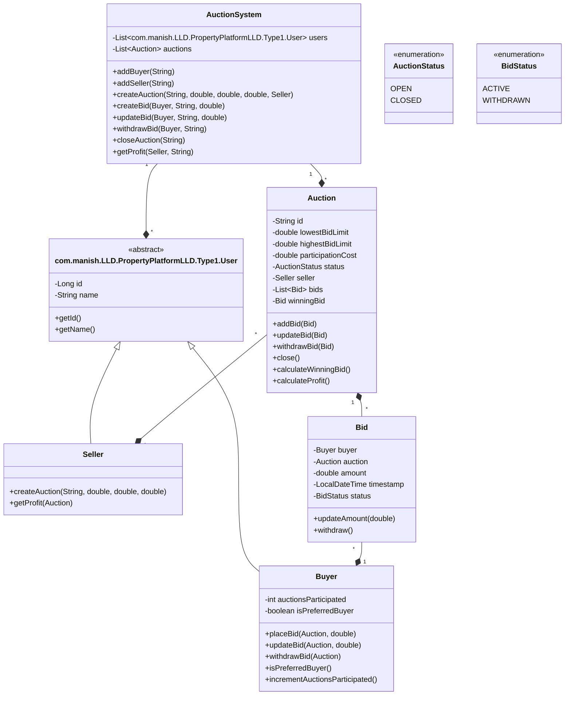

```mermaid
classDiagram
    class com.manish.LLD.PropertyPlatformLLD.Type1.User {
        <<abstract>>
        -Long id
        -String name
        +getId()
        +getName()
    }

    class Buyer {
        -int auctionsParticipated
        -boolean isPreferredBuyer
        +placeBid(Auction, double)
        +updateBid(Auction, double)
        +withdrawBid(Auction)
        +isPreferredBuyer()
        +incrementAuctionsParticipated()
    }

    class Seller {
        +createAuction(String, double, double, double)
        +getProfit(Auction)
    }

    class Auction {
        -String id
        -double lowestBidLimit
        -double highestBidLimit
        -double participationCost
        -AuctionStatus status
        -Seller seller
        -List~Bid~ bids
        -Bid winningBid
        +addBid(Bid)
        +updateBid(Bid)
        +withdrawBid(Bid)
        +close()
        +calculateWinningBid()
        +calculateProfit()
    }

    class Bid {
        -Buyer buyer
        -Auction auction
        -double amount
        -LocalDateTime timestamp
        -BidStatus status
        +updateAmount(double)
        +withdraw()
    }

    class AuctionSystem {
        -List~com.manish.LLD.PropertyPlatformLLD.Type1.User~ users
        -List~Auction~ auctions
        +addBuyer(String)
        +addSeller(String)
        +createAuction(String, double, double, double, Seller)
        +createBid(Buyer, String, double)
        +updateBid(Buyer, String, double)
        +withdrawBid(Buyer, String)
        +closeAuction(String)
        +getProfit(Seller, String)
    }

    class AuctionStatus {
        <<enumeration>>
        OPEN
        CLOSED
    }

    class BidStatus {
        <<enumeration>>
        ACTIVE
        WITHDRAWN
    }

    com.manish.LLD.PropertyPlatformLLD.Type1.User <|-- Buyer
    com.manish.LLD.PropertyPlatformLLD.Type1.User <|-- Seller
    Auction "1" *-- "*" Bid
    Auction "*" --* "1" Seller
    Bid "*" --* "1" Buyer
    AuctionSystem "1" --* "*" com.manish.LLD.PropertyPlatformLLD.Type1.User
    AuctionSystem "1" --* "*" Auction
```
