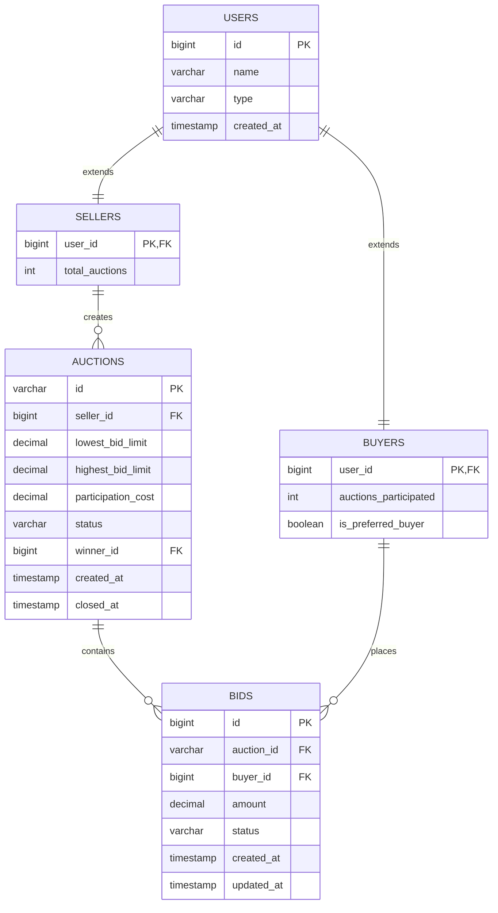

```mermaid
erDiagram
    USERS ||--|| BUYERS : extends
    USERS ||--|| SELLERS : extends
    SELLERS ||--o{ AUCTIONS : creates
    AUCTIONS ||--o{ BIDS : contains
    BUYERS ||--o{ BIDS : places

    USERS {
        bigint id PK
        varchar name
        varchar type
        timestamp created_at
    }

    BUYERS {
        bigint user_id PK, FK
        int auctions_participated
        boolean is_preferred_buyer
    }

    SELLERS {
        bigint user_id PK, FK
        int total_auctions
    }

    AUCTIONS {
        varchar id PK
        bigint seller_id FK
        decimal lowest_bid_limit
        decimal highest_bid_limit
        decimal participation_cost
        varchar status
        bigint winner_id FK
        timestamp created_at
        timestamp closed_at
    }

    BIDS {
        bigint id PK
        varchar auction_id FK
        bigint buyer_id FK
        decimal amount
        varchar status
        timestamp created_at
        timestamp updated_at
    }
```
