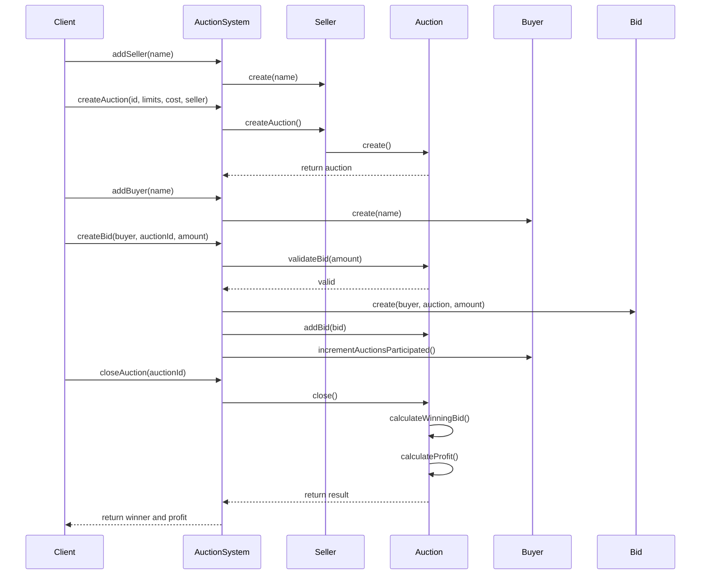

```mermaid
sequenceDiagram
    participant Client
    participant AuctionSystem
    participant Seller
    participant Auction
    participant Buyer
    participant Bid

    %% Create Auction Flow
    Client->>AuctionSystem: addSeller(name)
    AuctionSystem->>Seller: create(name)
    Client->>AuctionSystem: createAuction(id, limits, cost, seller)
    AuctionSystem->>Seller: createAuction()
    Seller->>Auction: create()
    Auction-->>AuctionSystem: return auction

    %% Bidding Flow
    Client->>AuctionSystem: addBuyer(name)
    AuctionSystem->>Buyer: create(name)
    Client->>AuctionSystem: createBid(buyer, auctionId, amount)
    AuctionSystem->>Auction: validateBid(amount)
    Auction-->>AuctionSystem: valid
    AuctionSystem->>Bid: create(buyer, auction, amount)
    AuctionSystem->>Auction: addBid(bid)
    AuctionSystem->>Buyer: incrementAuctionsParticipated()

    %% Close Auction Flow
    Client->>AuctionSystem: closeAuction(auctionId)
    AuctionSystem->>Auction: close()
    Auction->>Auction: calculateWinningBid()
    Auction->>Auction: calculateProfit()
    Auction-->>AuctionSystem: return result
    AuctionSystem-->>Client: return winner and profit
```
