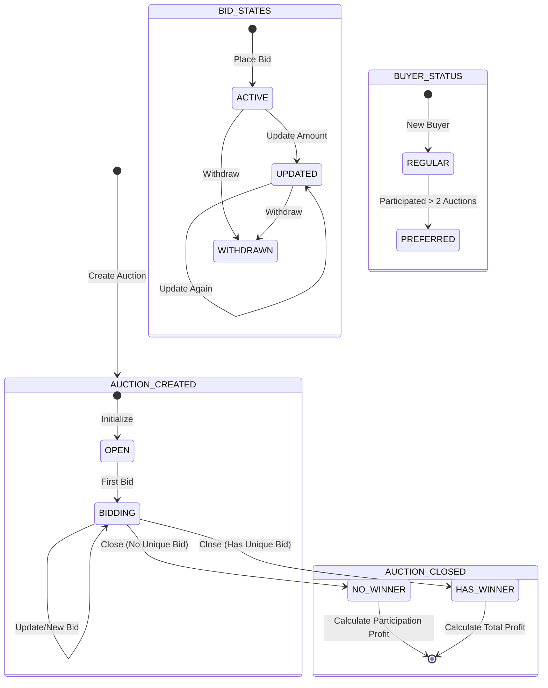

```mermaid
stateDiagram-v2
    [*] --> AUCTION_CREATED: Create Auction

    state AUCTION_CREATED {
        [*] --> OPEN: Initialize
        OPEN --> BIDDING: First Bid
        BIDDING --> BIDDING: Update/New Bid
        BIDDING --> NO_WINNER: Close (No Unique Bid)
        BIDDING --> HAS_WINNER: Close (Has Unique Bid)
    }

    state BID_STATES {
        [*] --> ACTIVE: Place Bid
        ACTIVE --> UPDATED: Update Amount
        UPDATED --> UPDATED: Update Again
        ACTIVE --> WITHDRAWN: Withdraw
        UPDATED --> WITHDRAWN: Withdraw
    }

    state AUCTION_CLOSED {
        NO_WINNER --> [*]: Calculate Participation Profit
        HAS_WINNER --> [*]: Calculate Total Profit
    }

    state BUYER_STATUS {
        [*] --> REGULAR: New Buyer
        REGULAR --> PREFERRED: Participated > 2 Auctions
    }
```
