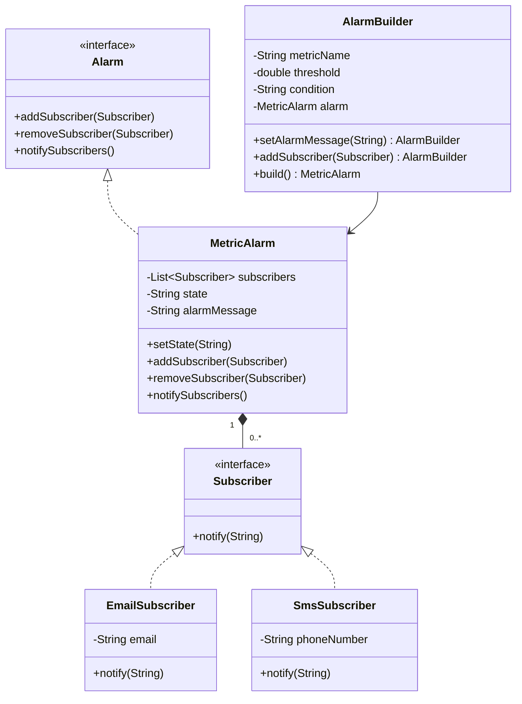
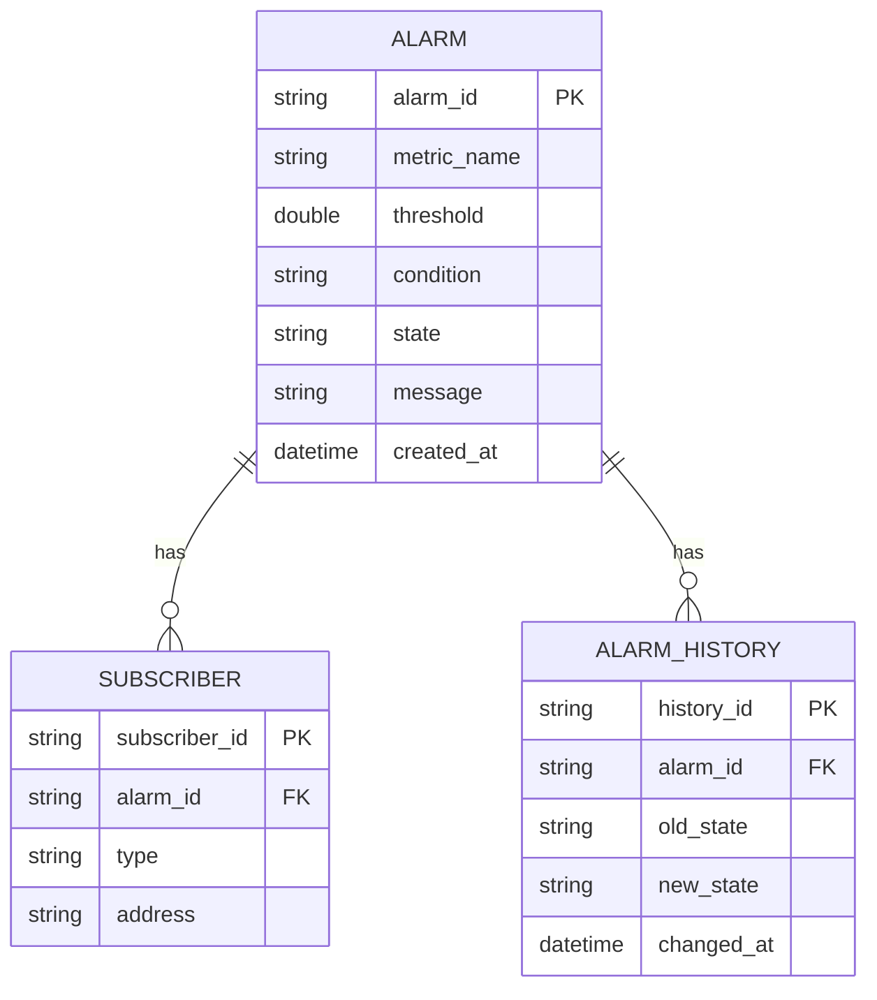
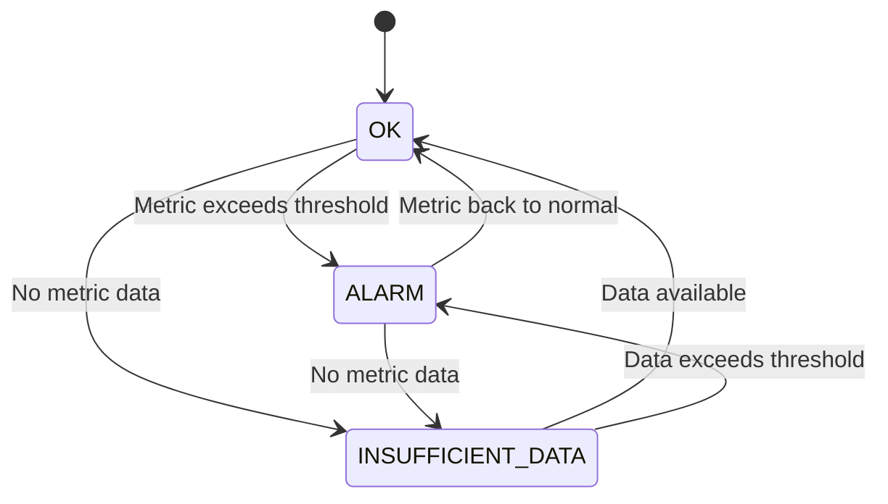
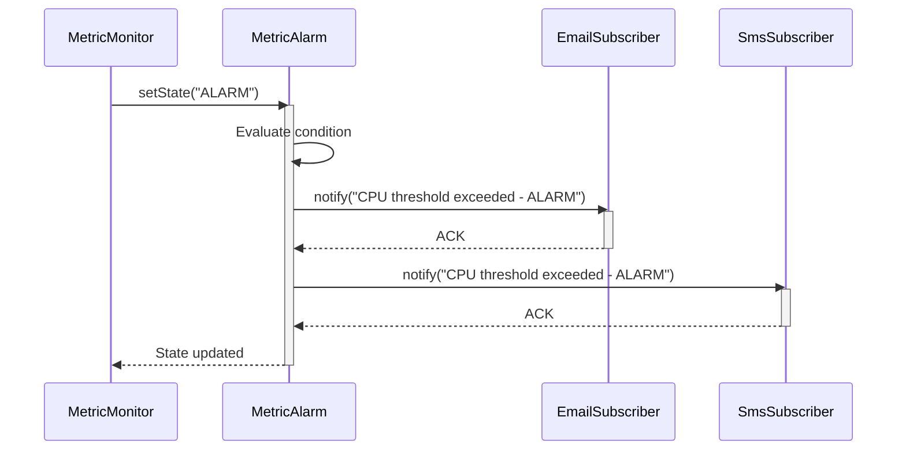
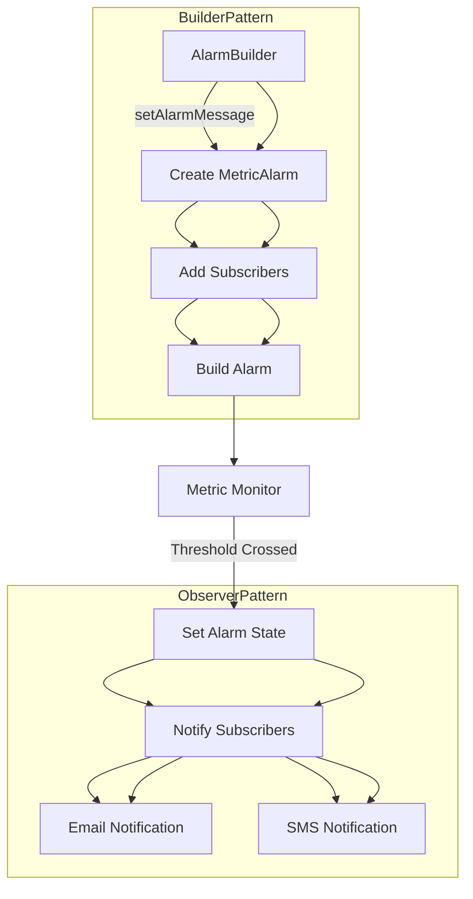

# Alarm Management System - Feature Specification & Interview Readiness

## 1. Alarm Creation & Configuration
- Users can create alarms based on configurable conditions (e.g., `CPU > 80%`, `Memory < 20%`).
- Support for:
    - One-time alarms
    - Recurring alarms
- Alarms can monitor metrics across various AWS services.

## 2. Multi-Metric Monitoring
- Support alarms that monitor multiple metrics simultaneously.
    - Example: Trigger if `CPU > 80%` **AND** `Memory < 20%`
- Composite Alarms:
    - Combine multiple alarm conditions using AND, OR logic.

## 3. Notification Mechanism
- Notify users when alarms trigger through:
    - Email
    - SMS
    - Push notifications
- Integration with **AWS SNS (Simple Notification Service)** for scalable notifications.

## 4. Alarm State Management
- Maintain and track the state of each alarm:
    - `OK`
    - `ALARM`
    - `INSUFFICIENT_DATA`
- State transitions handled based on metric data and threshold evaluations.

## 5. Custom Actions
- Users can define specific actions when an alarm is triggered:
    - Terminate EC2 instances
    - Scale ECS/EKS services
    - Send custom webhook triggers
    - Invoke AWS Lambda functions

## 6. Persistence Layer
- Store user-defined alarm configurations in a durable database.
    - Suggested: **AWS DynamoDB** for scalable and serverless storage.
- Ensure high availability and quick retrieval of alarm definitions.

## 7. Scalability & Performance
- Designed to handle **millions of alarms** with low latency.
- Techniques:
    - Sharded storage
    - Efficient metric polling/evaluation
    - Lazy loading of alarm states
    - Batch processing for evaluations

## 8. Extensibility & Cloud-Native Readiness
- Easily extensible to support:
    - Custom metrics
    - Additional AWS services
- Cloud-native design:
    - Serverless components (Lambda, DynamoDB)
    - Event-driven workflows using SNS, SQS
    - Monitoring and observability using CloudWatch Logs and Metrics

## 9. Security & Access Control
- Role-based access to alarm management (admin, viewer).
- Encryption at rest and in transit (e.g., DynamoDB KMS).
- Audit logs for alarm actions and user modifications.

## 10. UX Considerations (Optional for Product Design Rounds)
- Dashboard to view:
    - Alarm status
    - Metric trends
    - Historical triggers
- Filters by service, state, and severity.
- Group alarms by resource or tag.

---

## 1. Class Diagram

## 2. Database Schema Diagram

## 3. State Diagram (Alarm Lifecycle)

## 4. Sequence Diagram (Alarm Trigger Flow)

## 5. Code Flow Diagram

---

## Potential Interview Questions

---

## 1. Design

- **How would you add support for composite alarms (AND/OR conditions)?**
- **How would you prevent notification storms during flapping states?**

---

## 2. Scalability

- **How would you handle 1M+ alarms with real-time evaluation?**
- **Would you use a push or pull model for metric evaluation? Why?**

---

## 3. Concurrency

- **How would you make subscriber notifications thread-safe?**
- **What happens if a subscriber's `notify()` method blocks?**

---

## 4. Cloud Integration

- **How would you integrate this with AWS CloudWatch metrics?**
- **What AWS services would you use for production deployment?**

---

## 5. Testing

- **How would you test state transition edge cases?**
- **How would you mock external dependencies in subscriber tests?**
