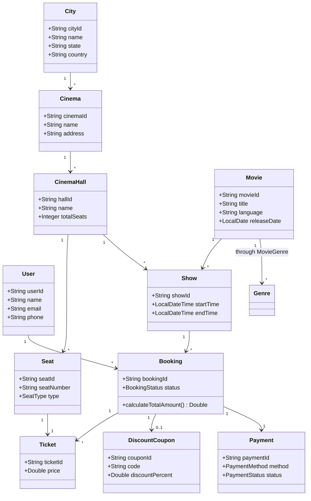
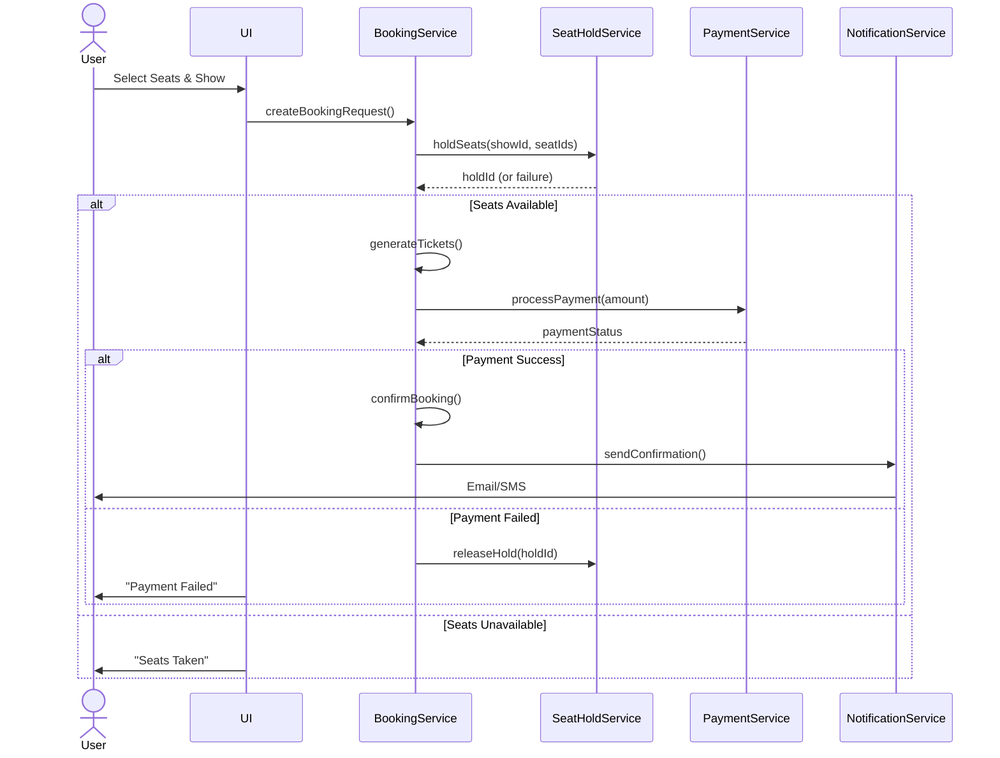
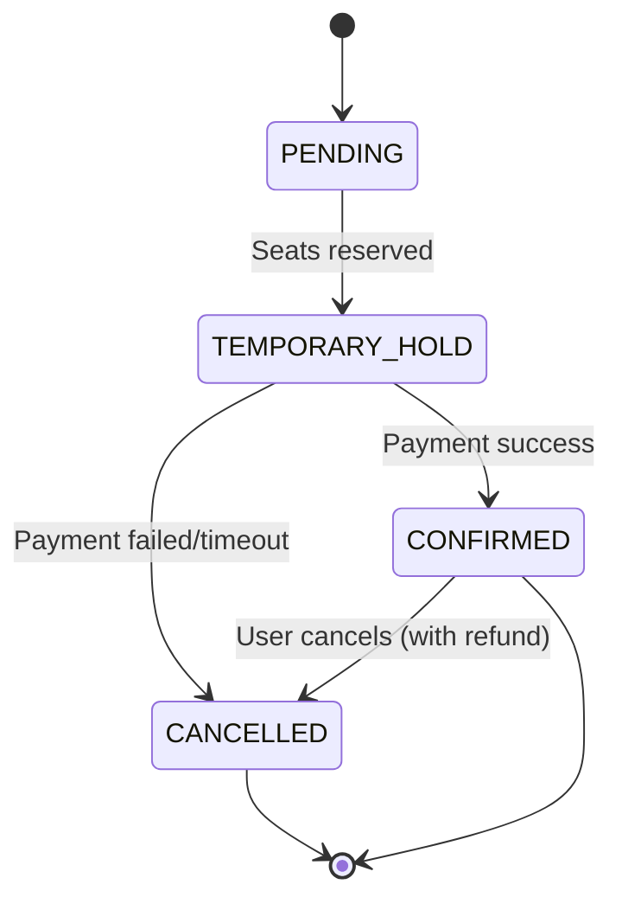
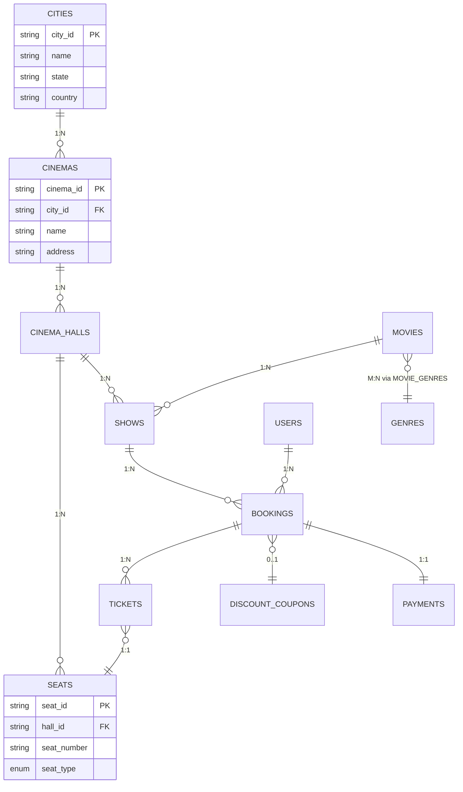

BookMyShow Or Movie Ticket Booking System - Low Level Design
---
Requirements
1. Our ticket booking service should be able to list down different cities where its
   affiliate cinemas are located.
2. Each cinema can have multiple halls and each hall can run a movie show at a time.
3. Each Movie will have multiple shows.
4. Customers should be able to search movies by their title, language, genre, release
   date, and city name.
5. Once the user selects the movie, the service should display the cinemas running that
   movie and its available shows.
6. The user should be able to select the show at a particular cinema and book their
   tickets.
7. The service should be able to show the user the seating arrangement of the cinema
   hall. The user should be able to select multiple seats according to their preference.
8. The user should be able to distinguish between available seats and booked ones.
10. Customers of our system should be able to pay through credit cards or cash.
11. The system should ensure that no two users can reserve the same seat.
12. Customers should be able to add a discount coupon to their payment.

---

### Actors
1. Customer - Uses the system to search movies, book tickets, and make payments
2. Admin - Manages cinemas, halls, movies, and shows
3. Payment Gateway - Handles payment processing
4. Notification Service - Sends booking confirmations
   
### Core Classes

1. Movie

2. Cinema

3. CinemaHall

4. Show

5. Seat

6. Booking

7. Ticket

8. Payment

9. User/Customer

10. DiscountCoupon

11. City

12. Genre


### Database Schema
#### Tables

1. City (1:M) Cinema
    - city_id (PK)
    - name 
    - state 
    - country

2. Cinema (1:M) CinemaHall
    - cinema_id(PK)
    - city_id(FK)
    - name
    - address

3. CinemaHall (1:M) Seat
    - hall_id (PK)
    - cinema_id (FK)
    - name
    - total_seats

4. Movie (M:M) Genre (through MovieGenre)
    - movie_id (PK)
    - title
    - description
    - duration_minutes
    - language
    - release_date
    - rating

5. Genre
    - genre_id (PK)
    - name

6. MovieGenre (junction table)
    - movie_id (FK)
    - genre_id (FK)

7. Show (connects Movie, CinemaHall)
    - show_id (PK)
    - movie_id (FK)
    - hall_id (FK)
    - start_time
    - end_time

8. Seat
    - seat_id (PK)
    - hall_id (FK)
    - seat_number
    - seat_type (normal/premium)

9. User
    - user_id (PK)
    - name
    - email
    - phone

10. Booking
    - booking_id (PK)
    - user_id (FK to users)
    - show_id (FK to show)
    - booking_time 
    - status (confirmed/pending/cancelled)

11. Ticket (1 booking can have multiple tickets)
    - ticket_id (PK)
    - booking_id (FK)
    - seat_id (FK)
    - price

12. Payment
    - booking_id (FK)
    - booking_id (FK)
    - amount
    - payment_method
    - status
    - transaction_time

13. DiscountCoupon
    - coupon_id (PK)
    - code
    - discount_percent
    - valid_until
    - max_discount

14. BookingCoupon (junction table)
    - booking_id (FK)
    - coupon_id (FK)

---

## Class Diagram



### Sequence Diagram for Booking Flow


### State Diagram for Booking



### Database Schema Diagram



---

Key Diagrams Explained:
1. Class Diagram:
   - Shows core entities and relationships 
   - Highlights composition (e.g., Cinema → CinemaHall → Seat)
   - Includes enums like SeatType, PaymentMethod
   
2. Booking Sequence Diagram:
   - End-to-end flow from seat selection to confirmation 
   - Error handling for payment failures 
   - Integration with external services

3. Booking State Diagram:
   - Lifecycle of a booking (pending → confirmed/canceled)
   - Temporary holds with TTL (timeout transitions)
   
4. ER Diagram:
   - Database tables with PK/FK relationships
   - Junction tables for M:N relationships (e.g., Movie-Genre)
   - Critical constraints (e.g., unique show+seat in tickets)

5. Customization Tips:
   - For microservices, split into multiple diagrams per service 
   - Add retry logic arrows in sequence diagrams 
   - Show cache interactions with Redis/Memcached 
   - Include dead-letter queues for failed payments

---

1. Design Deep-Dive Questions
   - How would you handle seat selection for different seat types (normal, premium, VIP)? 
   - How would you design the system to handle bulk bookings (e.g., for corporate events)? 
   - How would you implement dynamic pricing (e.g., higher prices for weekends or popular shows)? 
   - How would you handle partial booking failures (e.g., some seats get booked, others don't)? 
   - How would you design the system to recommend movies based on user preferences?

2. Concurrency & Scalability
   - How would you handle thousands of concurrent users trying to book the same show? 
   - What happens if the payment succeeds but the seat booking fails? How do you recover? 
   - How would you prevent race conditions when multiple users try to book the last few seats? 
   - How would you scale this system for a global audience (e.g., different regions, languages)? 
   - How would you handle database deadlocks during high-traffic booking scenarios?

3. Database & Performance
   - How would you optimize database queries for seat availability checks? 
   - What indexing strategy would you use for faster movie searches? 
   - How would you handle database replication and failover for high availability? 
   - Would you use caching for frequently accessed data (e.g., popular movies)? How? 
   - How would you design the system to handle peak loads (e.g., blockbuster movie releases)?

4. Payment & Transactions
   - How would you handle payment refunds if a show gets canceled? 
   - How would you ensure ACID properties during the booking-payment process? 
   - How would you handle failed payments after seats are temporarily reserved? 
   - How would you integrate third-party payment gateways (e.g., PayPal, Stripe)? 
   - How would you prevent fraud (e.g., fake bookings, credit card scams)?

5. User Experience (UX) & Edge Cases
   - How would you notify users if their selected seats are no longer available? 
   - How would you handle users who abandon their booking midway? 
   - How would you allow seat swapping after a booking is confirmed? 
   - How would you handle seat disputes (e.g., two users claim the same seat)? 
   - How would you implement a waiting list if a show is fully booked?

6. Microservices & Architecture
   - Would you design this as a monolith or microservices? Why? 
   - How would you decompose services if using microservices? 
   - How would services communicate (REST, gRPC, Kafka)? 
   - How would you handle service failures (e.g., payment service down)? 
   - How would you implement idempotency for booking requests?

7. Testing & Fault Tolerance
   - How would you test seat concurrency issues? 
   - How would you simulate high traffic to test system limits? 
   - How would you handle database outages during bookings? 
   - How would you ensure data consistency across services? 
   - How would you roll back a failed transaction across multiple services?

8. Real-World Scenarios
   - How would you handle a cinema hall being suddenly closed (e.g., technical issues)? 
   - How would you manage bookings during a server crash? 
   - How would you prioritize bookings during a flash sale? 
   - How would you prevent bots from bulk-booking and reselling tickets? 
   - How would you handle regional pricing and currency differences?

9. Extensions & Advanced Features
   - How would you add a loyalty program for frequent users? 
   - How would you implement group bookings with discounts? 
   - How would you allow users to transfer tickets to others? 
   - How would you add a feature for seat reviews (e.g., "this seat has a bad view")? 
   - How would you integrate with food & beverage ordering for cinemas?

### These questions test:

- System design skills (scalability, concurrency, DB optimizations)
- Problem-solving (edge cases, failure handling)
- Real-world applicability (payments, UX, fraud prevention)
- Architecture decisions (monolith vs. microservices, caching, transactions)
- Would you like detailed answers to any of these?


---
| Concept	| Definition                                                 |
|-----------|------------------------------------------------------------|
|Cinema	| Physical theater with multiple halls (PVR, INOX)           |
|CinemaHall | A single screen/auditorium inside a cinema|
|Movie	| The film being played (Inception, Avatar)                  |
|Show	| A screening of a movie at a specific time in a cinema hall |

### Flow in the System
👉 ✅ User → City → Movie (Search by Genre) → Showtime → Seats → Booking → Discount → Payment → Ticket


---
### How seats are stored ? 
- In a real-world system, seats are not just a list but are arranged in a grid format based on rows and columns. Each CinemaHall has a unique seat layout depending on its size and configuration.
- ✅ Seats are stored as a 2D array (Seat[][]) instead of a flat list.
- ✅ Row (A, B, C, ...) and Column (1, 2, 3, ...) are used to label seats.
- ✅ Each CinemaHall can have a different layout (rows × columns can vary).

```python-repl
A1  A2  A3  A4  A5  A6  A7  A8  A9  A10 A11 A12 A13 A14 A15
B1  B2  B3  B4  B5  B6  B7  B8  B9  B10 B11 B12 B13 B14 B15
...
J1  J2  J3  J4  J5  J6  J7  J8  J9  J10 J11 J12 J13 J14 J15
```
- Row 'A' (row=0), Column '10' (col=9) → Seat A10 
- Row 'J' (row=9), Column '15' (col=14) → Seat J15

### 🎯 When a User Selects a Seat
- 1️⃣ User selects "B5"
- 2️⃣ Convert "B5" → (row=1, col=4)
- 3️⃣ Fetch from seats[1][4]
- 4️⃣ Check availability & proceed with booking
