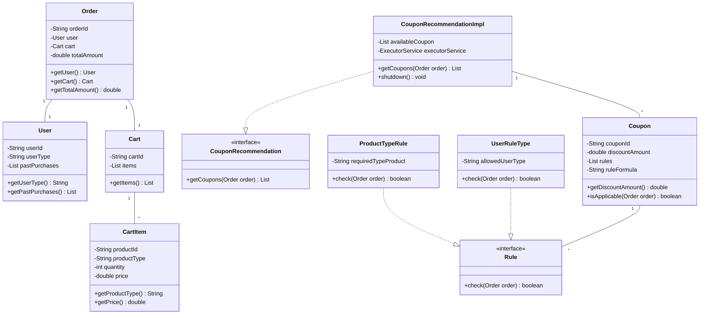
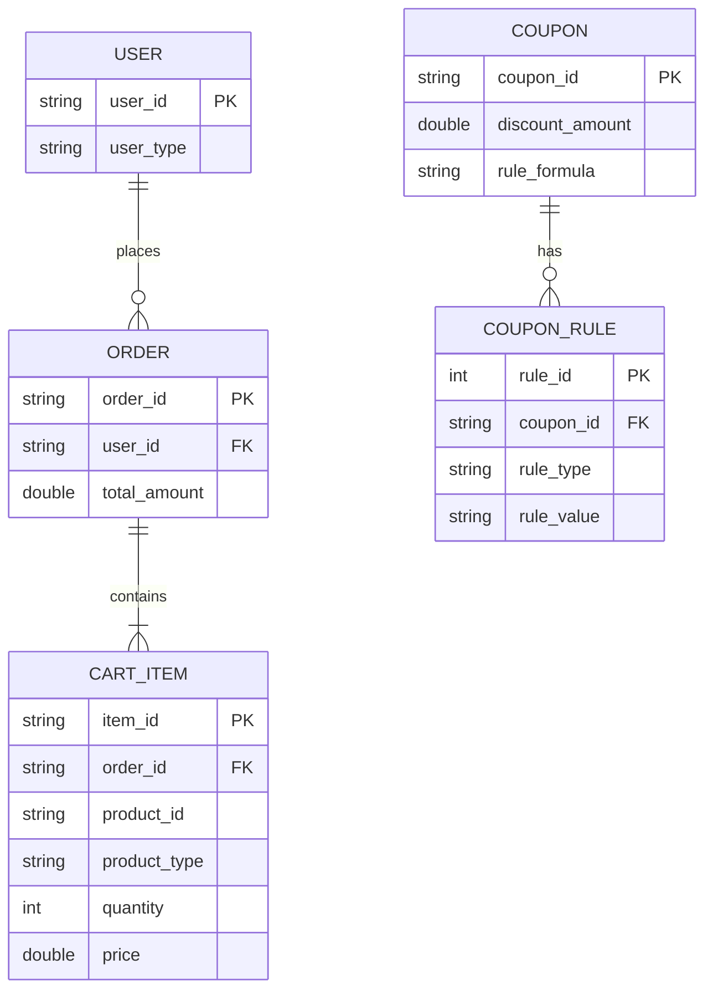
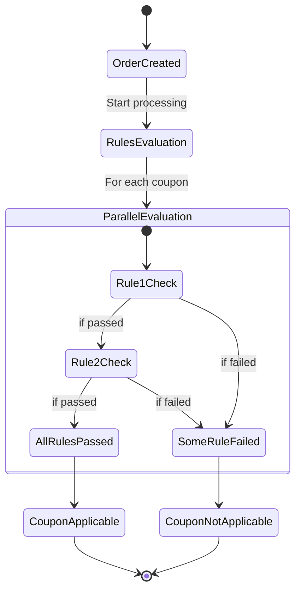
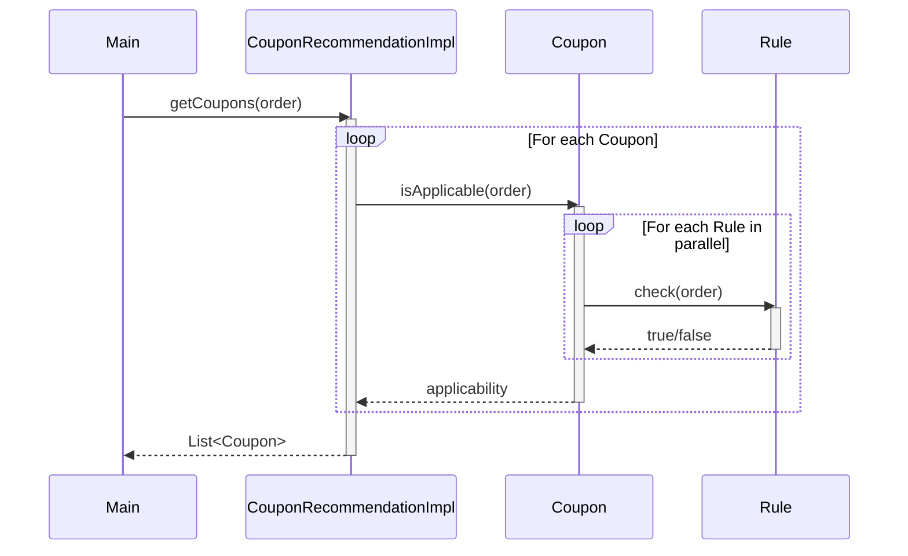
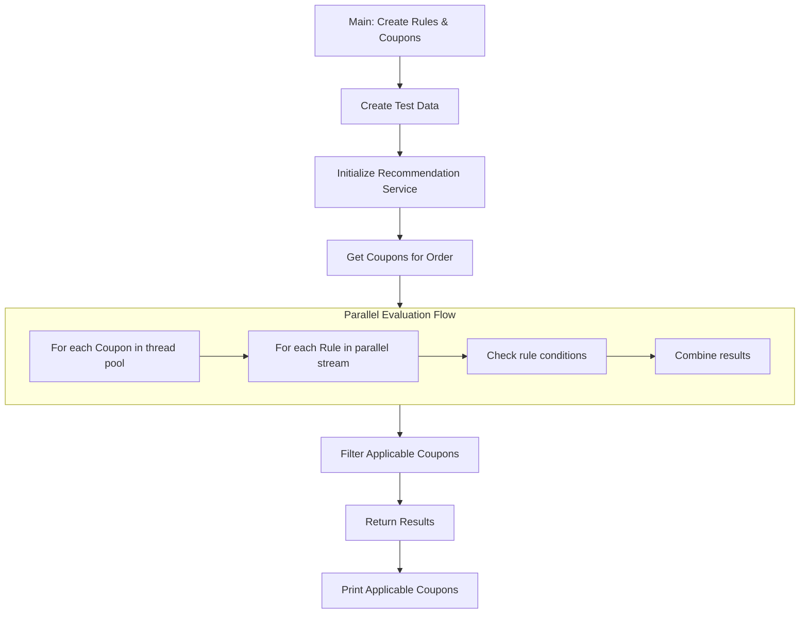

# Coupon System Code Structure

## 1. Class Diagram (Mermaid)

## 2. Database Schema Diagram

## 3. State Diagram (Coupon Application Flow)

## 4. Sequence Diagram (Main Flow)

## 5. Code Flow Diagram

---

# Coupon Recommendation System - Interview Questions

## 1. Design & Architecture
- How would you scale this system for 10 million daily users?
- What design patterns are used in this implementation? (Builder, Strategy, etc.)
- How would you modify this system to support real-time coupon updates?
- What are the trade-offs between `parallelStream()` vs. `ThreadPoolExecutor`?
- How would you make this system cloud-native?

## 2. Concurrency & Multithreading
- Why did you choose `parallelStream()` over traditional threading for rule evaluation?
- How does `ForkJoinPool` differ from `FixedThreadPool` in this use case?
- What happens if a rule evaluation throws an exception in parallel processing?
- How would you handle thread starvation in the coupon recommendation service?
- Explain how you would implement a circuit breaker for rule evaluation.

## 3. Performance Optimization
- How would you cache rule evaluation results? (e.g., Guava Cache, Redis)
- What metrics would you track to monitor system performance?
- How could you optimize the `ProductTypeRule` for large carts (e.g., 1000+ items)?
- Would database indexing help if rules were querying a database? How?
- How would you implement bulk coupon evaluation for batch processing?

## 4. Object-Oriented Principles
- Why is `Rule` an interface instead of an abstract class?
- How does polymorphism manifest in this design?
- What SOLID principles are demonstrated in the `CouponRecommendationImpl`?
- How would you extend this system to support composite rules (OR/NOT conditions)?
- Why are the model classes (User, Order) immutable? What are the advantages?

## 5. Testing
- How would you unit test `UserRuleType.check()`?
- What edge cases would you test for in `ProductTypeRule`?
- How would you simulate high load in integration tests?
- How would you mock dependencies for `CouponRecommendationImpl` tests?
- What test coverage metrics would you aim for in this system?

## 6. Error Handling & Resilience
- How would you handle a slow-running third-party rule evaluation?
- What retry strategies would you implement for flaky rules?
- How would you ensure coupon recommendations are consistent during partial failures?
- Would you implement a dead-letter queue for failed evaluations? How?
- How would you alert on anomalous rule evaluation times?

## 7. Database & Persistence
- How would you model these entities in a relational database?
- What NoSQL database would you use for this system? Why?
- How would you shard the coupon data if it grew to 1TB?
- What caching strategy would you use for frequently accessed coupons?
- How would you handle schema migrations for new rule types?

## 8. API Design (if exposed as service)
- How would you design a REST API for this coupon system?
- What HTTP status codes would you return for invalid coupon applications?
- How would you version the recommendation API?
- Would you use GraphQL for the coupon recommendation query? Why?
- How would you document the API for external consumers?

## 9. Advanced Java Concepts
- How does `CompletableFuture` improve upon the current thread pool approach?
- What Java memory management concerns exist in this implementation?
- How could Project Loom's virtual threads benefit this system?
- Would Java Records be suitable for any of these model classes? Which ones?
- How could you use the Java Flow API for reactive coupon recommendations?

## 10. Behavioral / System Design
- How would you explain this system to a non-technical stakeholder?
- If you had to rebuild this in 3 months, what would you do differently?
- How would you prioritize features if the product team requested:
    - Personalized coupons
    - Geo-based restrictions
    - Time-bound coupons
- What would you do if the business wanted to add AI-based dynamic pricing rules?
- How would you convince management to invest in a rule engine like Drools?

## Bonus: Scenario-Based Questions
- **At 3AM, the system slows down despite low traffic. What could be wrong?**  
  → Check scheduled jobs, DB maintenance, cache eviction policies.

- **Users report seeing applicable coupons disappear when refreshing. How to debug?**  
  → Race condition in parallel evaluation, add request correlation IDs.

- **A new rule type requires calling an external service with 500ms latency. How to adapt?**  
  → Implement async evaluation, caching, timeout fallbacks.

- **Business wants coupon fraud detection. Where would you add this logic?**  
  → As a pre-processing rule or post-recommendation filter.

- **How would you make this system GDPR-compliant for user data in rules?**  
  → Pseudonymization in logging, right-to-erasure support.
