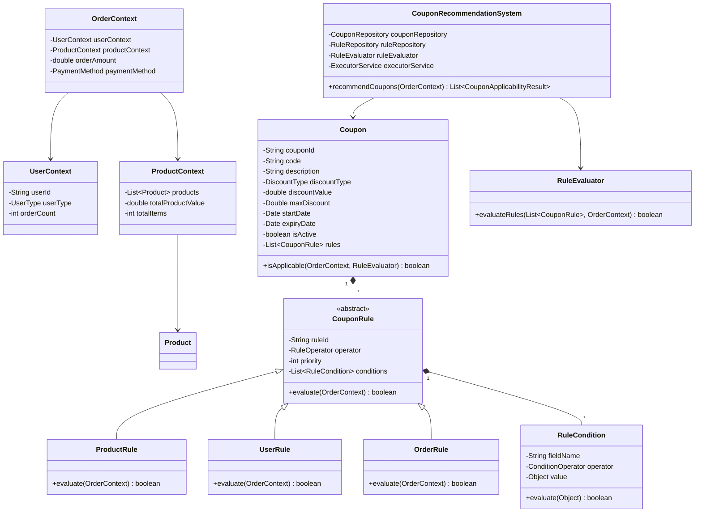
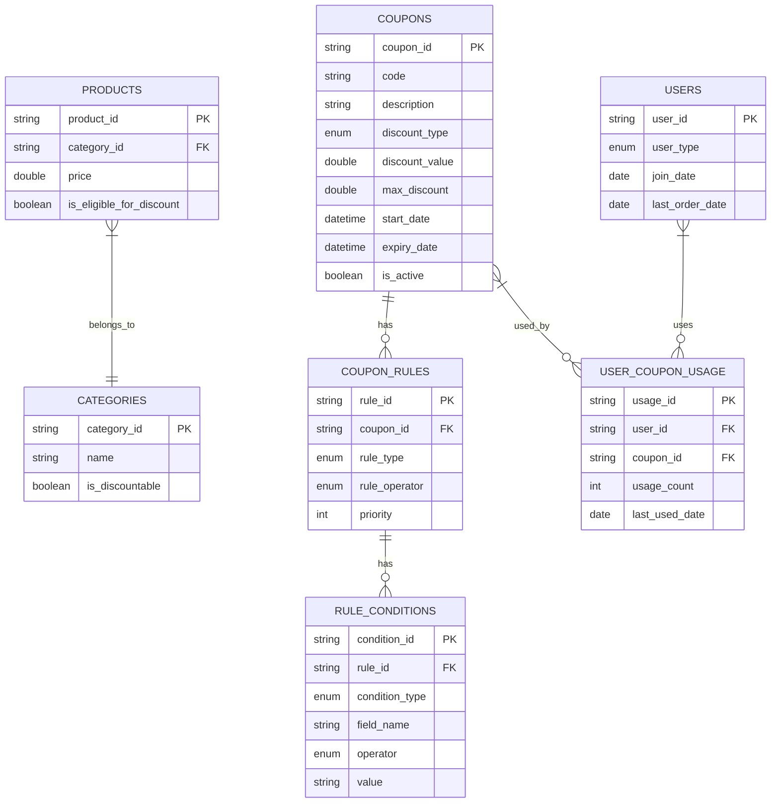
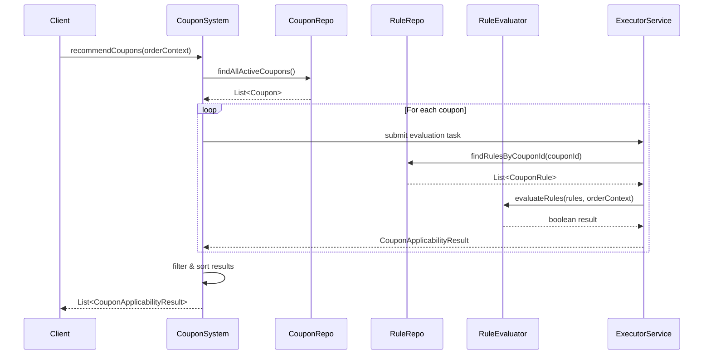
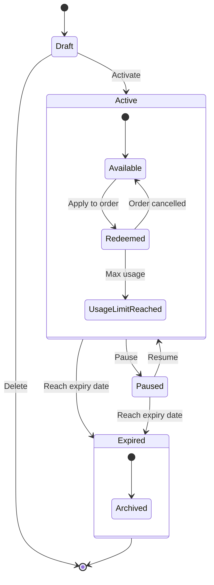

# Coupon Recommendation System - LLD for Zepto

## 🎭 Actors
- **Customer**: Places orders and receives coupon recommendations.
- **Admin**: Manages coupon rules and configurations.
- **Coupon Engine**: Core system that evaluates and recommends coupons.
- **Order Service**: Provides order details for evaluation.
- **com.manish.LLD.PropertyPlatformLLD.Type1.User Service**: Provides user information (type, history, etc.).
- **Product Service**: Provides product information (categories, prices, etc.).

## 🧱 Core Classes

### 1. `CouponRecommendationSystem`
- Main controller class orchestrating the evaluation and recommendation process.

### 2. `Coupon`
- Represents a coupon with:
    - ID, Code, Description
    - Discount type and value
    - Max discount, Validity dates
    - Active status

### 3. `CouponRule`
- Abstract base class for defining different rule types.

### 4. `RuleEvaluator`
- Evaluates rules against the given order context.

### 5. `CouponRepository`
- Handles data access operations for coupons.

### 6. `RuleRepository`
- Handles data access for rules and conditions.

### 7. `OrderContext`
- Captures all order-related data for evaluation.

### 8. `UserContext`
- Contains user-related information (type, history, etc.).

### 9. `ProductContext`
- Holds product data relevant to the order.

### 10. `CouponApplicabilityResult`
- Encapsulates the result of rule evaluation and recommendation.

# Database Schema - Coupon Recommendation System

## 🗃️ Tables

### 📄 Coupons
| Field         | Type      | Description                    |
|---------------|-----------|--------------------------------|
| coupon_id (PK)| UUID      | Primary key                    |
| code          | VARCHAR   | Unique coupon code             |
| description   | TEXT      | Description of the coupon      |
| discount_type | ENUM      | 'percentage' or 'fixed'        |
| discount_value| DECIMAL   | Value of discount              |
| max_discount  | DECIMAL   | Maximum discount allowed       |
| start_date    | DATETIME  | Coupon validity start          |
| expiry_date   | DATETIME  | Coupon validity end            |
| is_active     | BOOLEAN   | Coupon activation status       |

---

### 📄 CouponRules
| Field         | Type      | Description                    |
|---------------|-----------|--------------------------------|
| rule_id (PK)  | UUID      | Primary key                    |
| coupon_id (FK)| UUID      | References Coupons             |
| rule_type     | VARCHAR   | 'product', 'user', 'payment'...|
| rule_operator | ENUM      | Logical operator (AND/OR)      |
| priority      | INT       | Rule evaluation priority       |

---

### 📄 RuleConditions
| Field           | Type      | Description                     |
|-----------------|-----------|---------------------------------|
| condition_id (PK)| UUID     | Primary key                     |
| rule_id (FK)     | UUID     | References CouponRules          |
| condition_type   | VARCHAR  | e.g., 'min_amount', 'category'  |
| field_name       | VARCHAR  | Field to evaluate               |
| operator         | ENUM     | ==, >, <, in, etc.              |
| value            | TEXT     | Value to compare against        |

---

### 📄 Users
| Field           | Type      | Description              |
|-----------------|-----------|--------------------------|
| user_id (PK)    | UUID      | Primary key              |
| user_type       | ENUM      | 'new', 'regular', 'premium'|
| join_date       | DATETIME  | Account creation date    |
| last_order_date | DATETIME  | Date of last order       |

---

### 📄 Products
| Field              | Type      | Description                   |
|--------------------|-----------|-------------------------------|
| product_id (PK)    | UUID      | Primary key                   |
| category_id (FK)   | UUID      | References Categories         |
| price              | DECIMAL   | Product price                 |
| is_eligible_for_discount | BOOLEAN | Discount eligibility   |

---

### 📄 Categories
| Field            | Type      | Description              |
|------------------|-----------|--------------------------|
| category_id (PK) | UUID      | Primary key              |
| name             | VARCHAR   | Category name            |
| is_discountable  | BOOLEAN   | Can products be discounted|

---

### 📄 UserCouponUsage
| Field            | Type      | Description              |
|------------------|-----------|--------------------------|
| usage_id (PK)    | UUID      | Primary key              |
| user_id (FK)     | UUID      | References Users         |
| coupon_id (FK)   | UUID      | References Coupons       |
| usage_count      | INT       | Times coupon used        |
| last_used_date   | DATETIME  | Last usage timestamp     |

---

## 🔁 Relationships

- `1:M` - Coupons → CouponRules
- `1:M` - CouponRules → RuleConditions
- `M:1` - Products → Categories
- `M:M` - Users ↔ Coupons through UserCouponUsage

---

## Class Diagram

## 2. Database Schema Diagram

## 3. Sequence Diagram (Coupon Recommendation)

## 4. State Diagram (Coupon Lifecycle)

---

# Coupon Recommendation System - Interview Questions

A categorized list of potential interview questions for designing and analyzing a Coupon Recommendation System.

---

## 1. 🏗️ System Design & Architecture

- How would you scale this system for 10x more users?
- What improvements would you make for real-time coupon recommendations?
- How would you handle flash sales with limited coupon availability?
- Design the system to prevent coupon abuse (e.g., multiple accounts, bots).
- How would you make the rule engine more flexible for marketing teams?

---

## 2. 👨‍💻 OOP & Design Principles

- Why did you choose abstract classes for rules instead of interfaces?
- How does the Strategy pattern apply to your rule evaluation design?
- How would you extend this to support composite rules (AND/OR nested conditions)?
- Explain how you achieved Open/Closed Principle in rule evaluation.
- Why did you separate `ProductContext` / `UserContext` from `OrderContext`?

---

## 3. ⚙️ Concurrency & Performance

- How does your thread pool sizing work? What factors would you consider?
- What happens if a rule evaluation takes too long? How would you handle timeouts?
- How would you prevent thread starvation in the executor service?
- Design a caching layer for frequently used coupons/rules.
- How would you optimize for bulk orders (e.g., business customers)?

---

## 4. 🛢️ Database & Persistence

- How would you shard the coupon database as it grows?
- Design a solution for atomic coupon redemption (prevent double-spending).
- How would you track coupon usage limits per user?
- What indexes would you add to optimize rule queries?
- How would you archive expired coupons without impacting performance?

---

## 5. 🌐 API & Integration

- Design a REST API for this system with proper versioning.
- How would you expose rule configuration to an admin dashboard?
- How would you integrate with the payment gateway for automatic discounts?
- Design a webhook system for notifying users about new coupons.
- How would you handle backward compatibility if rule semantics change?

---

## 6. 🚨 Edge Cases & Failure Handling

- How would you handle concurrent coupon applications for the same order?
- What happens if the rule evaluation service goes down?
- How would you detect and prevent infinite loops in rule conditions?
- Design a solution for regional coupon restrictions (geofencing).
- How would you handle timezone differences in coupon validity periods?

---

## 7. 🧪 Testing & Observability

- How would you unit test the `RuleEvaluator` with complex conditions?
- What metrics would you monitor in production?
- How would you simulate load for performance testing?
- Design a canary rollout strategy for new rule types.
- How would you debug a coupon that's not applying correctly?

---

## 8. 🚀 Advanced Scenarios

- How would you implement "coupon stacking" (multiple coupons per order)?
- Design a machine learning system to personalize coupon recommendations.
- How would you handle dynamic pricing with coupons?
- Extend the system for B2B coupon codes with bulk discounts.
- How would you implement A/B testing for coupon effectiveness?

---

## 9. 💬 Behavioral Questions

- Walk me through your thought process in designing the rule engine.
- What trade-offs did you make between flexibility and performance?
- If you had 2 more weeks to work on this, what would you improve?
- How would you explain this system to a non-technical stakeholder?
- What part of your design are you most/least confident about?

---

## 10. 🌍 Real-world Adaptations

- How would this design change for physical stores vs e-commerce?
- Adapt this for subscription services with recurring discounts.
- How would you handle cryptocurrency as a payment method?
- Design for offline coupon validation (e.g., in-store via mobile app).
- How would you comply with GDPR for coupon data retention?
