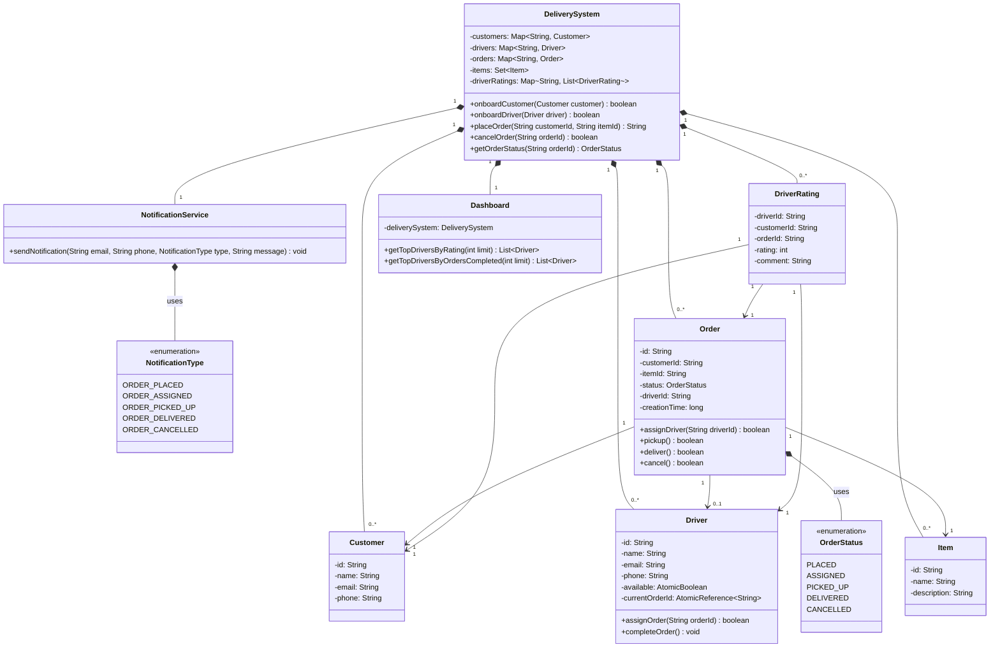
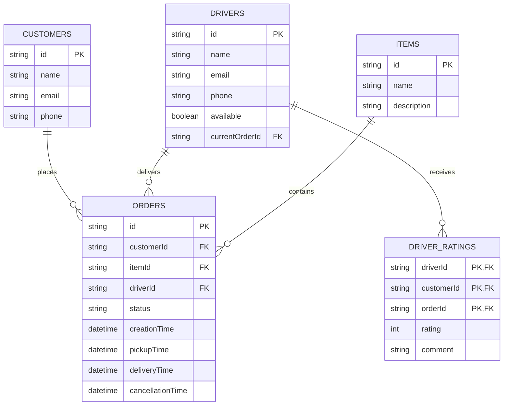
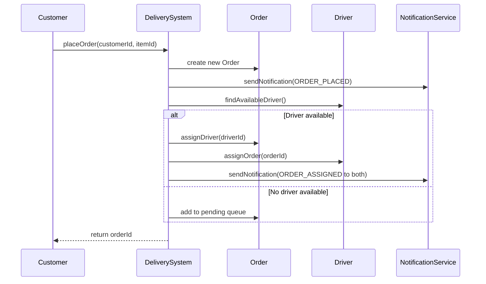
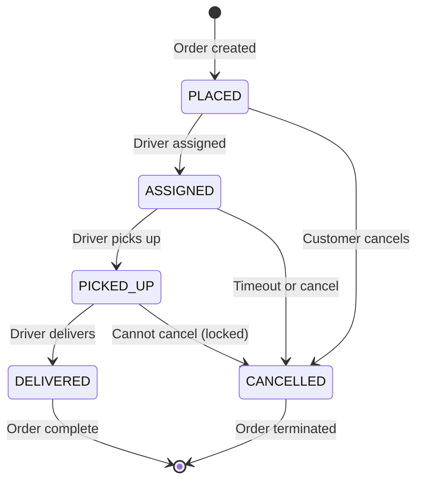

# Peer-to-Peer Delivery System - Low Level Design

## Core Features

### 1. Customer and Driver Onboarding
- The system should allow new customers and drivers to register.
- Customers can place and cancel orders.
- Drivers can accept and complete deliveries.

### 2. Predefined Item List
- Only preconfigured items can be delivered.
- The list of deliverable items remains fixed in the system.

### 3. Order Management
- Customers should be able to place orders for parcel deliveries.
- Orders can be canceled before assignment or pickup.
- If an assigned order is canceled, it should be removed from the driver’s queue.

### 4. Driver Order Handling
- A driver can pick up only one order at a time.
- Drivers should be auto-assigned to orders based on availability.
- Orders can exist in the system without immediate driver assignment.
- If no driver is available, the system should queue the order for later assignment.
- Once an order is picked up, it cannot be canceled.

### 5. Order Status Tracking
- The system should maintain and display order statuses.
- It should track whether an order is pending, assigned, picked up, or delivered.
- The system should also display driver statuses.

### 6. Concurrency and Thread Safety
- Multiple customers and drivers should be able to interact with the system concurrently.
- The system must ensure thread safety for critical operations like order assignment.

## Bonus Features

### 1. Notifications
- Customers and drivers should receive email and SMS updates about order status.
- A vendor class should simulate email/SMS processing by logging notification events.

### 2. Customer Ratings for Drivers
- Customers can rate drivers after successful deliveries.
- The ratings should be stored and used for analytics.

### 3. Dashboard Analytics
- A dashboard should display top-performing drivers based on order count and ratings.

### 4. Order Timeout Mechanism
- If an order remains unpicked for 30 minutes, it should be canceled automatically.

## Development Guidelines

- **Time Limit:** 120 minutes
- **Code Quality:** Ensure clean, modular, and well-documented code.
- **Thread Safety:** Implement necessary concurrency mechanisms.
- **Design Patterns:** Use relevant patterns (e.g., Strategy, Observer).
- **Testing:** Include test cases to validate core functionalities.
- **Data Management:** Use in-memory data structures (no external databases).
- **Standalone Application:** No UI or HTTP APIs are required.

## Sample Test Cases

- **Onboard a customer:** `onboardCustomer(id, name)`
- **Onboard a driver:** `onboardDriver(id, name)`
- **Place an order:** `placeOrder(customer_id, item_id)`
- **Cancel an order:** `cancelOrder(order_id)`
- **Check order status:** `showOrderStatus(order_id)`
- **Check driver status:** `showDriverStatus(driver_id)`


## Sample Test Cases

### Onboard customers and drivers
```
onboard_customer(1, "Alice")
onboard_customer(2, "Bob")
onboard_driver(1, "John")
onboard_driver(2, "Emma")
```

### Place orders
```
place_order(1, "item_1")
place_order(2, "item_2")
```

### Cancel an order before pickup
> cancel_order(1)

### Check order and driver status
```
show_order_status(1)
show_driver_status(1)
```

---
This document serves as a problem statement and functional requirements guide for implementing a Peer-to-Peer Delivery System.

---

# Peer-to-Peer Delivery System - Low Level Design

## Actors

1. **Customer** - Places and cancels orders.

2. **Driver** - Accepts and delivers orders.

3. **System Admin** - Manages the system configuration.

4. **Notification Service** - Sends notifications to customers and drivers.

---

## Core Classes

### `DeliverySystem`
- **Description**: Main system class that orchestrates all operations.

### `Customer`
- **Description**: Represents a customer who can place orders.
- **Attributes**: `id`, `name`, `orders` (List of placed orders).

### `Driver`
- **Description**: Represents a driver who can deliver orders.
- **Attributes**: `id`, `name`, `currentOrder` (Only one active order at a time).

### `Order`
- **Description**: Represents a delivery order.
- **Attributes**: `id`, `customer`, `items`, `status`, `assignedDriver`, `createdAt`.
- **Methods**: `markPickedUp()`, `markDelivered()`, `cancelOrder()`.

### `Item`
- **Description**: Represents a deliverable item.
- **Attributes**: `id`, `name`.

### `NotificationService`
- **Description**: Handles sending notifications.
- **Methods**: `sendEmail()`, `sendSMS()`.

### `Dashboard`
- **Description**: Provides analytics about drivers and orders.
- **Methods**: `getTopDriversByOrders()`, `getTopDriversByRating()`.

### `OrderAssignmentStrategy`
- **Description**: Strategy for assigning orders to drivers.
- **Methods**: `assignOrder(List<Driver>, Order)`.

### `DriverRating`
- **Description**: Stores ratings given by customers to drivers.
- **Attributes**: `driverId`, `customerId`, `rating`, `comment`.

---

## Relationships

1. **`DeliverySystem` → Customers**: `1:M`
2. **`DeliverySystem` → Drivers**: `1:M`
3. **`DeliverySystem` → Orders**: `1:M`
4. **`DeliverySystem` → Items**: `1:M`
5. **`Customer` → Orders**: `1:M`
6. **`Driver` → Orders**: `1:M` (but only one active at a time)
7. **`Order` → Items**: `M:1`
8. **`Order` → Driver**: `M:1` (optional, only when assigned)
9. **`Order` → Customer**: `M:1`
10. **`Driver` → DriverRatings**: `1:M`

---

## Database Schema (In-Memory)

### **Customers**
- `Map<CustomerId, Customer>`

### **Drivers**
- `Map<DriverId, Driver>`

### **Orders**
- `Map<OrderId, Order>`

### **Items**
- `Set<Item>`

### **DriverRatings**
- `Map<DriverId, List<DriverRating>>`

### **AvailableDrivers**
- `Concurrent Queue`

### **PendingOrders**
- `Concurrent Queue`

---


## Key Design Considerations

### Thread Safety
- Used `ConcurrentHashMap`, Atomic variables, and synchronized blocks where needed

### Concurrency
- Used `BlockingQueue` for pending orders and available drivers

### Extensibility
- Used **Strategy Pattern** for order assignment

### Separation of Concerns
- Separate classes for different responsibilities

### Error Handling
- Proper checks before operations

### Notification System
- Abstracted notification service

### Dashboard
- Separate class for analytics

### Order Timeout
- Background thread checking for expired orders

---

## System Features

✔ Customer and driver onboarding

✔ Order placement and cancellation

✔ Driver assignment and order lifecycle

✔ Notifications

✔ Ratings

✔ Dashboard analytics

✔ Order timeout cancellation

---

## Class Diagram



## Database Schema Diagram (In-Memory Structure)


## Sequence Diagram (Order Placement Flow)



## State Diagram (Order Lifecycle)


---
# Peer-to-Peer Delivery System - Interview Questions

## System Design Questions
1. **Scalability**: How would you scale this system if the number of orders increased 100x?
2. **Database Choice**: If we moved from in-memory to a real database, which would you choose and why?
3. **Concurrency**: How does your design prevent race conditions when multiple drivers try to accept the same order?
4. **Fault Tolerance**: What happens if a driver's app crashes after picking up an order but before delivery?

## Behavioral Questions
5. **Trade-offs**: What trade-offs did you make in your design between consistency and availability?
6. **Improvements**: If you had more time, what improvements would you make to this system?
7. **Real-world**: How would your design change if drivers had limited working hours instead of being 24/7?

## Technical Deep Dive
8. **Scheduling**: How does your order timeout mechanism work? Would you implement it differently in production?
9. **Notifications**: How would you ensure notifications are reliably delivered in case of network failures?
10. **Metrics**: What metrics would you track to monitor this system's health?

## Code Implementation
11. **Thread Safety**: Why did you use `AtomicBoolean` and `ConcurrentHashMap` in the Driver class?
12. **Synchronization**: Explain your use of `synchronized` blocks vs concurrent collections.
13. **Testing**: How would you write unit tests for the order assignment logic?

## Design Patterns
14. **Patterns Used**: Which design patterns are implemented in this solution? (Observer, Strategy, etc.)
15. **Alternative Patterns**: Would the Observer pattern be better for notifications? Why/why not?

## API Design
16. **REST API**: How would you expose this system as RESTful APIs?
17. **Webhooks**: Would you consider webhooks instead of polling for order status updates?

## Advanced Scenarios
18. **Payment Integration**: How would you integrate a payment system into this design?
19. **Dynamic Pricing**: How would you implement surge pricing during peak hours?
20. **Fraud Prevention**: What measures would you add to prevent fake orders/drivers?

## Real-world Adaptations
21. **Location Tracking**: How would you modify this to handle real-time location tracking?
22. **Multi-city**: How would the design change for operations across multiple cities?
23. **Batching**: Would you implement order batching for drivers? How?

## Bonus Features
24. **AI Suggestions**: How could machine learning optimize driver assignments?
25. **Chat System**: Design a chat system between customers and drivers.

## Example Follow-up Questions
- *For Q3*: "What if two drivers simultaneously try to pick up the same order?"
- *For Q8*: "How would you handle system clock changes with your timeout implementation?"
- *For Q19*: "Would you make pricing dynamic per order or per area?"

### Key Evaluation Areas
These questions test:
- ✅ System design fundamentals
- ✅ Concurrency understanding
- ✅ Real-world adaptation skills
- ✅ Edge case anticipation
- ✅ Distributed systems concepts
- ✅ Practical coding decisions

