# Gamification Service for E-Commerce Platform - Low-Level Design (LLD)

---

## 🎭 Actors

- **User**:  
  Interacts with the system to make purchases and view stats.

- **GamificationService**:  
  Core service handling all gamification logic.

- **UserRepository**:  
  Stores and retrieves user data.

- **PurchaseService**:  
  Handles purchase transactions.

- **PointsCalculator**:  
  Calculates points based on user level and purchase amount.

- **RedemptionValidator**:  
  Validates redemption requests.

- **DiscountCalculator** *(Bonus Feature)*:  
  Calculates personalized discounts.

---

## 🧱 Core Classes

### ✅ `User`
- Represents a customer/user in the system.

### ✅ `GamificationService`
- Coordinates all logic for point awarding, redemption, and user level updates.

### ✅ `UserRepository`
- Interface to persist and fetch user data.

### ✅ `InMemoryUserRepository` *(Implements UserRepository)*
- In-memory storage using a HashMap.

### ✅ `PointsCalculator`
- Calculates points earned per purchase based on `UserLevel`.

### ✅ `RedemptionValidator`
- Checks if redemption criteria are satisfied.

### ✅ `DiscountCalculator` *(Bonus Feature)*
- Applies discounts based on custom business rules.

### ✅ `UserLevel` (Enum)
- `BRONZE`, `SILVER`, `GOLD`

### ✅ `CommandProcessor`
- Handles command-line interface input/output.

---

## 🗃️ Database Schema (In-Memory)

### 📄 Users Table
- Represented using: `HashMap<String, User>`

| Field         | Type     | Description        |
|---------------|----------|--------------------|
| `userId`      | String   | Primary Key        |
| `name`        | String   | Name of the user   |
| `points`      | double   | Current points     |
| `totalOrders` | int      | Total purchases    |
| `totalSpent`  | double   | Total amount spent |

---

## 🔗 Relationships

- **User 1:1 UserLevel**
    - Level is dynamically calculated based on user points.

- **User 1:M Purchases**
    - Represented via `totalOrders` and `totalSpent`.

- **GamificationService**:
    - `1:1` with `UserRepository`
    - `1:1` with `PointsCalculator`
    - `1:1` with `RedemptionValidator`
    - `1:1` with `DiscountCalculator` *(Optional/Bonus)*

---


## 1. Class Diagram


---

## 2. Database Schema Diagram


---

## 3. Sequence Diagram (Purchase Flow)


## 4. State Diagram

```mermaid
stateDiagram-v2
    [*] --> NotOnboarded
    NotOnboarded --> Onboarded: onboard <username>
    
    state Onboarded {
        [*] --> Bronze: 0-499 points
        Bronze --> Silver: points ≥ 500
        Silver --> Gold: points ≥ 1000
        Silver --> Bronze: points < 500
        Gold --> Silver: points < 1000
        
        state Bronze {
            state "Earning:\n10 pts/₹100" as bronzeEarn
            state "Redemption:\n5% or 200 pts" as bronzeRedeem
            bronzeEarn --> bronzeRedeem
        }
        
        state Silver {
            state "Earning:\n12.5 pts/₹100" as silverEarn
            state "Redemption:\n10% or 500 pts" as silverRedeem
            silverEarn --> silverRedeem
        }
        
        state Gold {
            state "Earning:\n15 pts/₹100" as goldEarn
            state "Redemption:\n15% or 1000 pts" as goldRedeem
            goldEarn --> goldRedeem
        }
        
        state Discount {
            [*] --> Inactive
            Inactive --> Active: orders > 3\nOR spent > ₹10k
            Active --> Used: discount applied
            Used --> Inactive: conditions no longer met
            Active --> Inactive: conditions no longer met
            
            state Active {
                state "Eligible For:" as rules
                state "5% if orders>3" as rule1
                state "10% if spent>10k" as rule2
                state "12% if both" as rule3
                rules --> rule1
                rules --> rule2
                rules --> rule3
            }
        }
    }
    
    note left of Onboarded
        Key Rules:
        1. Points calculated AFTER redemption
        2. Discount applied AFTER redemption
        3. Discount capped at ₹750
        4. Levels auto-update after each transaction
    end note
```



---

## Primary Patterns

### 1. State Pattern
**Purpose**: Manage dynamic user level transitions  
**Components**:
- `UserLevel` (Enum)
    - `BRONZE`, `SILVER`, `GOLD` states
    - `getPointsPer100()`
    - `getMaxRedemptionPercentage()`
    - `getMaxRedeemablePoints()`
- `User.getLevel()` (Context)

### 2. Strategy Pattern
**Purpose**: Interchangeable business rules  
**Components**:
- `PointsCalculator.calculatePoints()`
- `RedemptionValidator.validateRedemption()`
- `DiscountCalculator.calculateDiscount()`

### 3. Repository Pattern
**Purpose**: Abstract data access  
**Components**:
- `UserRepository` (Interface)
    - `save()`
    - `findByName()`
    - `exists()`
- `InMemoryUserRepository` (Concrete)

## Secondary Patterns

### 4. Command Pattern
**Purpose**: Handle CLI operations  
**Components**:
- `CommandProcessor.processCommand()`

### 5. Factory Method Pattern
**Purpose**: Create discount variants  
**Components**:
- `User.calculateDiscount()` (Factory method)

### 6. Observer Pattern (Implied)
**Purpose**: State change propagation  
**Components**:
- `User.addPoints()`
- `User.deductPoints()`

### 7. Singleton Pattern
**Purpose**: Single service instances  
**Components**:
- Spring `@Bean` declarations

## Pattern Responsibilities Matrix

| Pattern          | Main Responsibility               | Key Methods/Components              |
|------------------|-----------------------------------|--------------------------------------|
| State            | Level transitions                 | `UserLevel`, `User.getLevel()`       |
| Strategy         | Business rule variations          | `PointsCalculator`, `RedemptionValidator` |
| Repository       | Data access abstraction           | `UserRepository` interface           |
| Command          | CLI operation handling            | `CommandProcessor`                   |
| Factory Method   | Discount type creation            | `User.calculateDiscount()`           |
| Observer         | State change notification         | Point modification methods           |
| Singleton        | Single instance management        | Spring bean configurations           |

## Key Benefits
1. **State Pattern**: Clean handling of tiered user levels
2. **Strategy Pattern**: Swappable business rules without modification
3. **Repository Pattern**: Persistence layer independence
4. **Command Pattern**: Unified command processing
5. **Factory Method**: Flexible discount creation
6. **Observer**: Automatic state synchronization
7. **Singleton**: Controlled service access

## Pattern Relationships
```mermaid
flowchart TD
    A[State Pattern] -->|Manages| B(User Levels)
    C[Strategy Pattern] -->|Implements| D(Business Rules)
    E[Repository] -->|Abstracts| F(Data Access)
    B --> G[User]
    D --> G
    F --> G