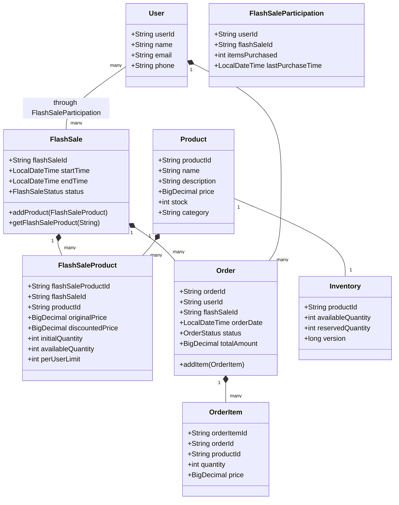
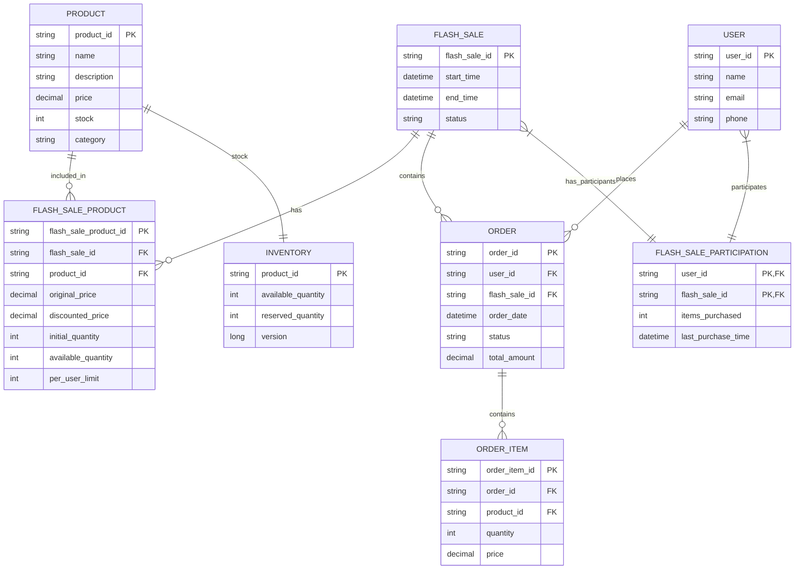
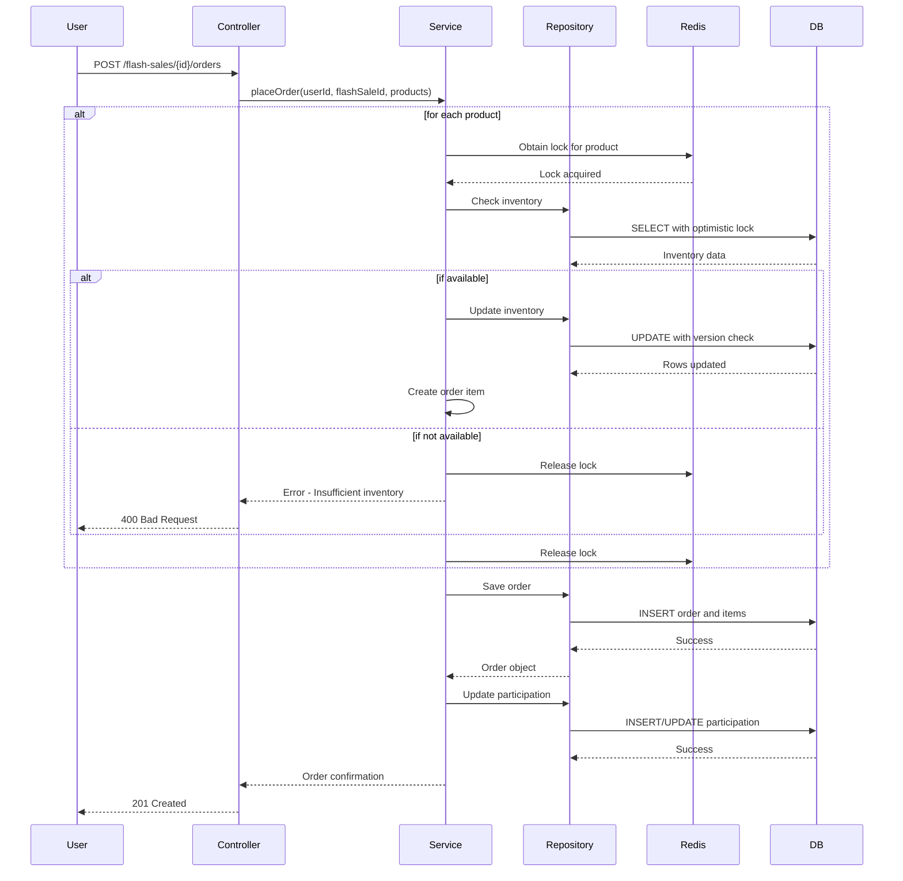

# Flash Sale System Design

---

## Requirements

- The system should manage the inventory of products available for flash sale.
- Users should be able to place orders for products during the flash sale.
- Implement mechanisms to handle concurrent access to shared data entities such as product inventory and user orders.
- Ensure transactional integrity to prevent data inconsistencies during order processing.
- Handle scenarios such as overselling and race conditions to ensure fairness and accuracy in inventory management.
- Employ strategies to optimize system performance and minimize response times during high-traffic flash sale events.
- Provide a detailed low-level design (LLD) for the Flash Sale System, including:
    - **Class Diagrams**
    - **Data Structures**
    - **Algorithms**
    - **Relevant Design Patterns**  


---

## Actors
1. **Customer** - Places orders during flash sales.
2. **Admin** - Manages products, inventory, and flash sale events.
3. **System** - Handles background processes like order processing and inventory updates.

## Core Classes

### 1. FlashSale
- `flashSaleId`: String (UUID)
- `startTime`: DateTime
- `endTime`: DateTime
- `status`: Enum (UPCOMING, ACTIVE, ENDED)
- `productList`: List<FlashSaleProduct>

### 2. FlashSaleProduct
- `productId`: String
- `flashSaleId`: String
- `originalPrice`: BigDecimal
- `discountedPrice`: BigDecimal
- `initialQuantity`: int
- `availableQuantity`: int
- `perUserLimit`: int

### 3. Product
- `productId`: String (UUID)
- `name`: String
- `description`: String
- `price`: BigDecimal
- `stock`: int
- `category`: String

### 4. Order
- `orderId`: String (UUID)
- `userId`: String
- `flashSaleId`: String
- `orderDate`: DateTime
- `status`: Enum (PENDING, CONFIRMED, CANCELLED)
- `totalAmount`: BigDecimal
- `items`: List<OrderItem>

### 5. OrderItem
- `orderItemId`: String (UUID)
- `orderId`: String
- `productId`: String
- `quantity`: int
- `price`: BigDecimal

### 6. User
- `userId`: String (UUID)
- `name`: String
- `email`: String
- `phone`: String

### 7. Inventory
- `productId`: String
- `availableQuantity`: int
- `reservedQuantity`: int
- `version`: long (for optimistic locking)

### 8. FlashSaleParticipation
- `userId`: String
- `flashSaleId`: String
- `itemsPurchased`: int
- `lastPurchaseTime`: DateTime  

---
## Database Schema
### Tables

### 1. flash_sale
- `flash_sale_id` (PK)
- `start_time`
- `end_time`
- `status`

### 2. flash_sale_product
- `flash_sale_product_id` (PK)
- `flash_sale_id` (FK)
- `product_id` (FK)
- `original_price`
- `discounted_price`
- `initial_quantity`
- `available_quantity`
- `per_user_limit`

### 3. product
- `product_id` (PK)
- `name`
- `description`
- `price`
- `stock`
- `category`

### 4. order
- `order_id` (PK)
- `user_id` (FK)
- `flash_sale_id` (FK)
- `order_date`
- `status`
- `total_amount`

### 5. order_item
- `order_item_id` (PK)
- `order_id` (FK)
- `product_id` (FK)
- `quantity`
- `price`

### 6. user
- `user_id` (PK)
- `name`
- `email`
- `phone`

### 7. inventory
- `product_id` (PK)
- `available_quantity`
- `reserved_quantity`
- `version`

### 8. flash_sale_participation
- `user_id` (PK, FK)
- `flash_sale_id` (PK, FK)
- `items_purchased`
- `last_purchase_time`  

## Relationships

- **FlashSale 1:M FlashSaleProduct** - One flash sale can have many products
- **FlashSale 1:M Order** - One flash sale can have many orders
- **Product 1:M FlashSaleProduct** - One product can be part of many flash sales
- **User 1:M Order** - One user can place many orders
- **Order 1:M OrderItem** - One order can have many items
- **Product 1:1 Inventory** - One product has one inventory record
- **User M:M FlashSale (through FlashSaleParticipation)** - Many users can participate in many flash sales

## Concurrency Control Strategies

- **Optimistic Locking**: For inventory updates using version numbers
- **Pessimistic Locking**: For critical operations like order placement
- **Distributed Locks**: Using Redis for cluster-wide synchronization
- **Database Constraints**: Unique constraints to prevent duplicate orders
- **Queue-based Processing**: To handle high traffic spikes 

---
## Class Diagram



## Database Schema Diagram


## Sequence Diagram (Order Placement)


---

# Key Design Considerations

## Concurrency Control
- **Optimistic locking** with `@Version` for inventory updates
- **Distributed locks** using Redis for cluster-wide synchronization
- **Database-level constraints** to prevent overselling

## Performance Optimization
- **Caching** of flash sale data in Redis
- **Asynchronous processing** of non-critical path operations
- **Database connection pooling** for efficient resource utilization

## Fairness
- **Per-user limits** enforced at application and database levels
- **Queue-based processing** during peak loads
- **Randomized delays** to prevent the thundering herd problem

## Scalability
- **Microservices architecture** for independent scaling
- **Read replicas** for order history queries
- **Sharding** of order data by flash sale ID

## Resilience
- **Circuit breakers** for dependent services
- **Retry mechanisms** for transient failures
- **Dead letter queues** for failed orders

This design provides a **comprehensive solution** for a high-traffic flash sale system while ensuring **fairness, accuracy, and transactional integrity**.


---

## Java Code

```java
import java.math.BigDecimal;
import java.time.LocalDateTime;
import java.util.*;
import java.util.concurrent.*;
import java.util.concurrent.locks.*;

public class FlashSaleSystem {
    // Database simulation
    private Map<String, Product> products = new ConcurrentHashMap<>();
    private Map<String, FlashSale> flashSales = new ConcurrentHashMap<>();
    private Map<String, Inventory> inventories = new ConcurrentHashMap<>();
    private Map<String, User> users = new ConcurrentHashMap<>();
    private List<Order> orders = new CopyOnWriteArrayList<>();
    
    // Distributed lock simulation
    private Map<String, Lock> productLocks = new ConcurrentHashMap<>();
    
    public FlashSaleSystem() {
        initializeData();
    }
    
    private void initializeData() {
        // Initialize some products
        Product p1 = new Product("p1", "Smartphone", "Latest model", new BigDecimal("999.99"), 100, "Electronics");
        Product p2 = new Product("p2", "Laptop", "High performance", new BigDecimal("1499.99"), 50, "Electronics");
        
        products.put(p1.getProductId(), p1);
        products.put(p2.getProductId(), p2);
        
        // Initialize inventory
        inventories.put(p1.getProductId(), new Inventory(p1.getProductId(), 100, 0, 0));
        inventories.put(p2.getProductId(), new Inventory(p2.getProductId(), 50, 0, 0));
        
        // Initialize a flash sale
        FlashSale fs = new FlashSale("fs1", 
            LocalDateTime.now().plusMinutes(1), 
            LocalDateTime.now().plusMinutes(31), 
            FlashSaleStatus.UPCOMING);
            
        fs.addProduct(new FlashSaleProduct("fp1", "fs1", "p1", 
            new BigDecimal("999.99"), new BigDecimal("799.99"), 10, 10, 2));
        fs.addProduct(new FlashSaleProduct("fp2", "fs1", "p2", 
            new BigDecimal("1499.99"), new BigDecimal("1199.99"), 5, 5, 1));
            
        flashSales.put(fs.getFlashSaleId(), fs);
        
        // Initialize some users
        users.put("u1", new User("u1", "Alice", "alice@example.com", "1234567890"));
        users.put("u2", new User("u2", "Bob", "bob@example.com", "0987654321"));
        
        // Initialize locks for products
        productLocks.put("p1", new ReentrantLock());
        productLocks.put("p2", new ReentrantLock());
    }
    
    public boolean placeOrder(String userId, String flashSaleId, Map<String, Integer> productQuantities) {
        User user = users.get(userId);
        FlashSale flashSale = flashSales.get(flashSaleId);
        
        if (user == null || flashSale == null || flashSale.getStatus() != FlashSaleStatus.ACTIVE) {
            return false;
        }
        
        // Check if user has already participated in this flash sale
        if (hasUserExceededLimit(userId, flashSaleId, productQuantities)) {
            return false;
        }
        
        // Create order
        Order order = new Order(UUID.randomUUID().toString(), userId, flashSaleId, LocalDateTime.now(), OrderStatus.PENDING, BigDecimal.ZERO);
        List<OrderItem> items = new ArrayList<>();
        
        try {
            // Sort product IDs to prevent deadlocks
            List<String> productIds = new ArrayList<>(productQuantities.keySet());
            Collections.sort(productIds);
            
            // Acquire locks in order
            for (String productId : productIds) {
                Lock lock = productLocks.get(productId);
                if (lock != null) {
                    lock.lock();
                }
            }
            
            // Check inventory and reserve items
            for (Map.Entry<String, Integer> entry : productQuantities.entrySet()) {
                String productId = entry.getKey();
                int quantity = entry.getValue();
                
                FlashSaleProduct flashSaleProduct = flashSale.getFlashSaleProduct(productId);
                if (flashSaleProduct == null || flashSaleProduct.getAvailableQuantity() < quantity) {
                    throw new RuntimeException("Product not available or insufficient quantity");
                }
                
                // Update inventory
                flashSaleProduct.setAvailableQuantity(flashSaleProduct.getAvailableQuantity() - quantity);
                
                // Add to order
                OrderItem item = new OrderItem(
                    UUID.randomUUID().toString(), 
                    order.getOrderId(), 
                    productId, 
                    quantity, 
                    flashSaleProduct.getDiscountedPrice());
                items.add(item);
                
                order.setTotalAmount(order.getTotalAmount().add(
                    flashSaleProduct.getDiscountedPrice().multiply(new BigDecimal(quantity))));
            }
            
            order.setItems(items);
            orders.add(order);
            order.setStatus(OrderStatus.CONFIRMED);
            
            // Update user participation
            updateUserParticipation(userId, flashSaleId, productQuantities);
            
            return true;
        } catch (Exception e) {
            order.setStatus(OrderStatus.CANCELLED);
            // Rollback inventory changes
            for (Map.Entry<String, Integer> entry : productQuantities.entrySet()) {
                String productId = entry.getKey();
                int quantity = entry.getValue();
                
                FlashSaleProduct flashSaleProduct = flashSale.getFlashSaleProduct(productId);
                if (flashSaleProduct != null) {
                    flashSaleProduct.setAvailableQuantity(flashSaleProduct.getAvailableQuantity() + quantity);
                }
            }
            return false;
        } finally {
            // Release locks in reverse order
            List<String> productIds = new ArrayList<>(productQuantities.keySet());
            Collections.sort(productIds, Collections.reverseOrder());
            
            for (String productId : productIds) {
                Lock lock = productLocks.get(productId);
                if (lock != null) {
                    lock.unlock();
                }
            }
        }
    }
    
    private boolean hasUserExceededLimit(String userId, String flashSaleId, Map<String, Integer> productQuantities) {
        // In a real system, this would check the database
        // For simulation, we'll just return false
        return false;
    }
    
    private void updateUserParticipation(String userId, String flashSaleId, Map<String, Integer> productQuantities) {
        // In a real system, this would update the database
    }
    
    // Other methods for managing flash sales, products, etc.
    
    public static void main(String[] args) {
        FlashSaleSystem system = new FlashSaleSystem();
        
        // Simulate flash sale starting
        FlashSale fs = system.flashSales.get("fs1");
        fs.setStatus(FlashSaleStatus.ACTIVE);
        
        // Simulate users placing orders
        ExecutorService executor = Executors.newFixedThreadPool(10);
        
        for (int i = 0; i < 20; i++) {
            final int userIdNum = i % 2 + 1;
            executor.submit(() -> {
                Map<String, Integer> orderItems = new HashMap<>();
                orderItems.put("p1", 1); // Try to buy 1 smartphone
                
                boolean success = system.placeOrder("u" + userIdNum, "fs1", orderItems);
                System.out.println("User u" + userIdNum + " order " + (success ? "successful" : "failed"));
            });
        }
        
        executor.shutdown();
        try {
            executor.awaitTermination(1, TimeUnit.MINUTES);
        } catch (InterruptedException e) {
            e.printStackTrace();
        }
        
        // Print results
        System.out.println("Remaining inventory for p1: " + 
            system.flashSales.get("fs1").getFlashSaleProduct("p1").getAvailableQuantity());
        System.out.println("Total orders placed: " + system.orders.size());
    }
}

// Enums and model classes
enum FlashSaleStatus {
    UPCOMING, ACTIVE, ENDED
}

enum OrderStatus {
    PENDING, CONFIRMED, CANCELLED
}

class Product {
    private String productId;
    private String name;
    private String description;
    private BigDecimal price;
    private int stock;
    private String category;
    
    // Constructor, getters, setters
}

class FlashSale {
    private String flashSaleId;
    private LocalDateTime startTime;
    private LocalDateTime endTime;
    private FlashSaleStatus status;
    private List<FlashSaleProduct> productList = new ArrayList<>();
    
    // Constructor, getters, setters, addProduct method
}

class FlashSaleProduct {
    private String flashSaleProductId;
    private String flashSaleId;
    private String productId;
    private BigDecimal originalPrice;
    private BigDecimal discountedPrice;
    private int initialQuantity;
    private int availableQuantity;
    private int perUserLimit;
    
    // Constructor, getters, setters
}

class Order {
    private String orderId;
    private String userId;
    private String flashSaleId;
    private LocalDateTime orderDate;
    private OrderStatus status;
    private BigDecimal totalAmount;
    private List<OrderItem> items;
    
    // Constructor, getters, setters
}

class OrderItem {
    private String orderItemId;
    private String orderId;
    private String productId;
    private int quantity;
    private BigDecimal price;
    
    // Constructor, getters, setters
}

class User {
    private String userId;
    private String name;
    private String email;
    private String phone;
    
    // Constructor, getters, setters
}

class Inventory {
    private String productId;
    private int availableQuantity;
    private int reservedQuantity;
    private long version;
    
    // Constructor, getters, setters
}
```

