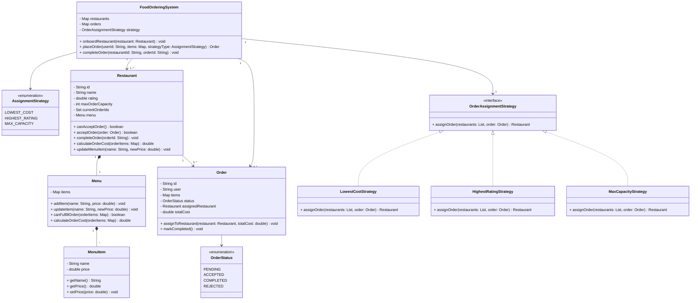
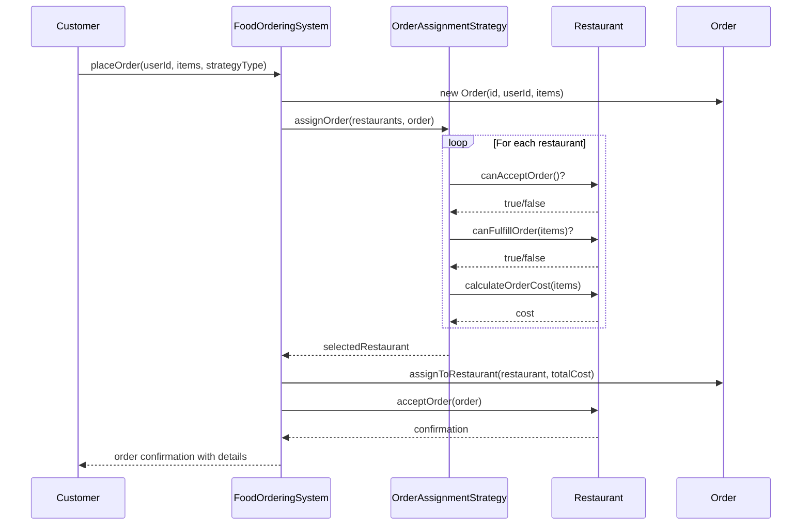
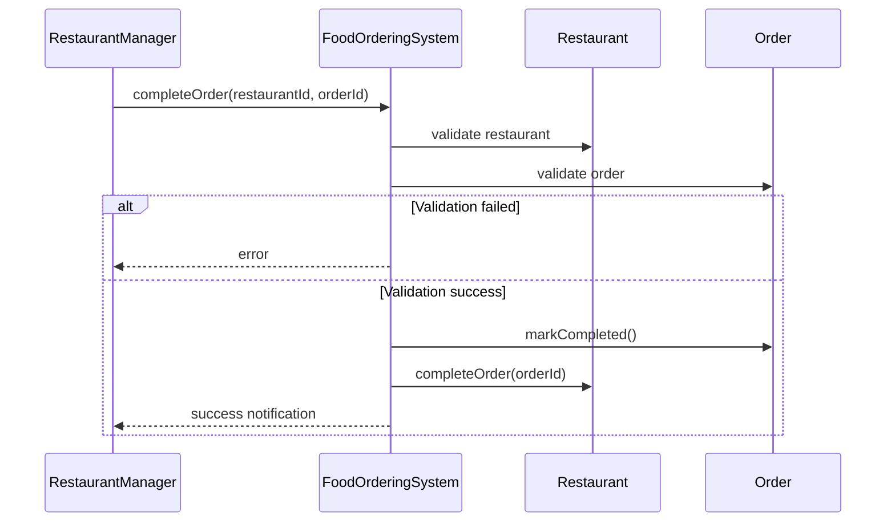
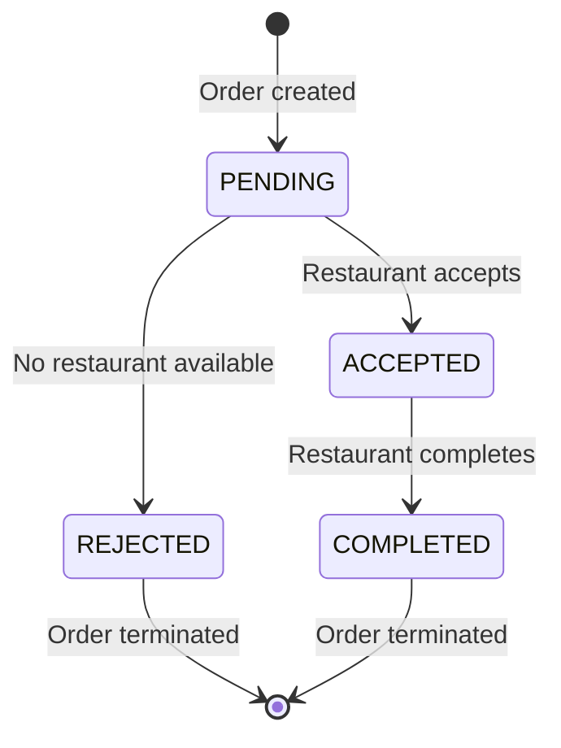

# Food Ordering System - Low Level Design

## Actors

### Customer
- Places orders and specifies selection criteria

### Restaurant
- Provides menu, processes orders, updates order status

### Food Processing System
- Manages restaurants, assigns orders, handles order lifecycle

## Core Classes

### Restaurant
- **Attributes:**
    - `id`: String
    - `name`: String
    - `rating`: double
    - `maxOrderCapacity`: int
    - `currentOrders`: Set<String>
- **Methods:**
    - `updateMenu()`: void
    - `markOrderCompleted()`: void
    - `canAcceptOrder()`: boolean

### MenuItem
- **Attributes:**
    - `name`: String
    - `price`: double

### Menu
- **Attributes:**
    - `items`: Map<String, MenuItem>
- **Methods:**
    - `addItem(name: String, price: double)`: void
    - `updateItem(name: String, newPrice: double)`: void

### Order
- **Attributes:**
    - `id`: String
    - `user`: String
    - `items`: Map<String, Integer>
    - `status`: OrderStatus
    - `assignedRestaurant`: Restaurant
- **Methods:**
    - `calculateTotal()`: double

### OrderItem
- **Attributes:**
    - `itemName`: String
    - `quantity`: int

## Order Assignment Strategy (Interface)
- **Method:**
    - `assignOrder(restaurants: List<Restaurant>, order: Order)`: Restaurant

### Strategy Implementations
- **LowestCostStrategy**
- **HighestRatingStrategy**
- **MaxCapacityStrategy**

### FoodOrderingSystem
- **Attributes:**
    - `restaurants`: Map<String, Restaurant>
    - `orderAssignmentStrategy`: OrderAssignmentStrategy
- **Methods:**
    - `onboardRestaurant(restaurant: Restaurant)`: void
    - `placeOrder(userId: String, items: Map<String, Integer>, strategyType: AssignmentStrategy)`: Order
    - `updateOrderStatus(orderId: String, status: OrderStatus)`: void

## Relationships

### One-to-One (1:1)
- Order belongs to one Restaurant
- Menu belongs to one Restaurant

### One-to-Many (1:M)
- Restaurant has many Orders (current and historical)
- Menu has many MenuItems
- Order has many OrderItems

### Many-to-Many (M:M)
- None in this system

---

## Class Diagram



## Database Schema Diagram (Conceptual)
````mermaid
erDiagram
    RESTAURANT ||--o{ MENU : has
    MENU ||--o{ MENU_ITEM : contains
    RESTAURANT ||--o{ ORDER : processes
    ORDER ||--o{ ORDER_ITEM : contains

    RESTAURANT {
        string id PK
        string name
        float rating
        int max_order_capacity
    }

    MENU {
        string id PK
        string restaurant_id FK
    }

    MENU_ITEM {
        string id PK
        string menu_id FK
        string name
        float price
    }

    ORDER {
        string id PK
        string restaurant_id FK
        string user_id
        string status
        float total_cost
        datetime created_at
    }

    ORDER_ITEM {
        string id PK
        string order_id FK
        string item_name
        int quantity
    }
````

## Sequence Diagram (Order Placement)


## Sequence Diagram (Order Completion)


## State Diagram (Order Lifecycle)




---

# Interview Questions

## 1. Design & Architecture Questions
- How would you extend this system to support multiple location branches for the same restaurant?
- How would you modify the design to handle partial order fulfillment when items come from different restaurants?
- How would you design a notification system to inform customers about order status changes?
- How would you implement a discount/promo code system?
- How would you add support for scheduled/delayed orders?

## 2. Scalability & Performance Questions
- How would your design change if you needed to support 10x more restaurants and orders?
- How would you optimize the restaurant assignment algorithm for faster order processing?
- How would you handle peak load times (like lunch/dinner rushes)?
- What caching strategies would you implement to improve performance?

## 3. Database & Storage Questions
- How would you persist this in-memory data structure to a database?
- What indexing would you add to optimize query performance?
- How would you design the schema to track order history for customers?
- How would you handle database sharding if the system grows globally?

## 4. Concurrency & Thread Safety Questions
- How would you prevent race conditions when multiple orders compete for the same restaurant's capacity?
- How would you implement a locking mechanism for order assignment?
- How would you handle concurrent menu updates while orders are being placed?
- What would happen if two customers try to place orders with the last available capacity at a restaurant?

## 5. API Design Questions
- Design the REST API endpoints for this system
- How would you version your APIs?
- How would you implement idempotency for order placement?
- How would you design a polling vs webhook system for order status updates?

## 6. Testing Questions
- How would you unit test the restaurant assignment strategies?
- What test cases would you write for the order placement flow?
- How would you simulate high load to test system performance?
- How would you test edge cases in menu updates and order fulfillment?

## 7. Real-world Scenario Questions
- How would you handle a situation where a restaurant becomes unavailable after accepting an order?
- How would you implement a system for customers to rate their orders after delivery?
- How would you design a recommendation system to suggest restaurants to users?
- How would you detect and prevent fraudulent orders?

## 8. System Failure & Recovery Questions
- How would your system handle a restaurant's system going offline?
- What would happen if the order assignment service crashes mid-process?
- How would you implement retry logic for failed order placements?
- How would you design a reconciliation system if orders get stuck in "accepted" state?

## 9. Monitoring & Observability Questions
- What metrics would you track to monitor system health?
- How would you implement logging for debugging order issues?
- What alerts would you set up for operational incidents?
- How would you trace an order through the entire system flow?

## 10. Bonus/Advanced Questions
- How would you implement a bidding system where restaurants compete for orders?
- How would you design a real-time order tracking system with delivery ETA?
- How would you add support for dietary restrictions and allergen information?
- How would you implement A/B testing for different assignment algorithms?
