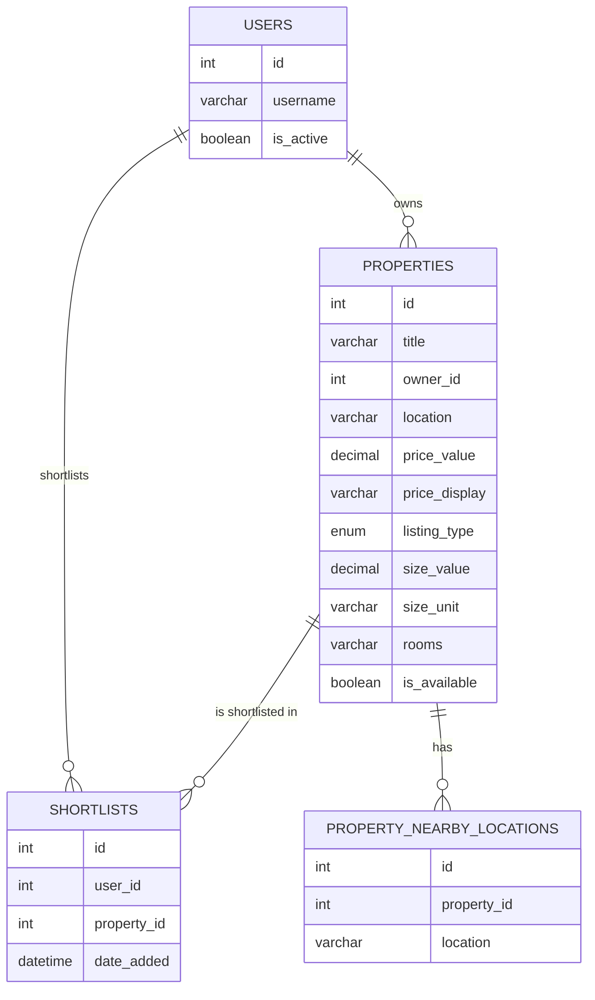
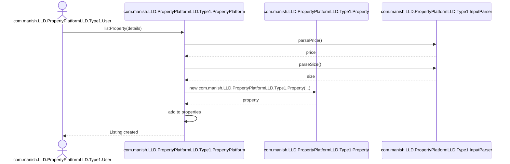
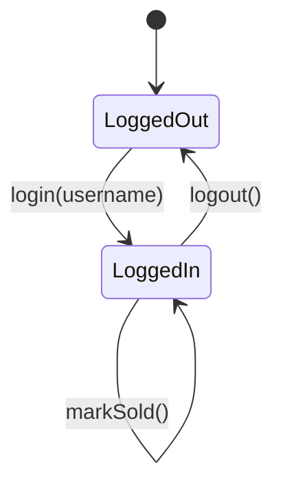
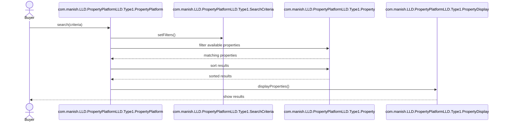

# com.manish.LLD.PropertyPlatformLLD.Type1.Property Platform Console Application

## Objective

Build a console-based real estate platform where users can:
- Register and login
- List properties for rent or sale
- Search for properties using various filters
- com.manish.LLD.PropertyPlatformLLD.Type1.Shortlist properties
- Mark listed properties as sold
- View their listed or shortlisted properties

---

## Core Features

### 🔐 Register, Login, and Logout
- A user can sign up and log in.
- No authentication required—usernames are unique identifiers.
- Logging in sets the user as active.
- Logging out sets the user as inactive.

### 🏡 ListProperty
- Logged-in users can list properties for sale or rent on the portal.

### 🔍 Search
Users can search available (unsold) properties using a combination of filters:
- **Location** (case-insensitive exact match)
- **Price Range**
- **Listing Type**: Sell or Rent
- **Size Range**
- **Rooms**: e.g., 1BHK, 2BHK, 3BHK
- **Sort By**: `price` or `size` (ascending only)

### 📌 com.manish.LLD.PropertyPlatformLLD.Type1.Shortlist
- Users can shortlist any property they wish to rent/buy.

### 👁️ ViewShortlisted
- Displays all shortlisted properties.
- Includes sold properties, but shows their status as "sold".

### 📄 ViewListed
- Displays properties listed by the current user.

### ✅ MarkSold
- Lets the property owner mark their listed property as sold.

---

## Bonus Features

- ✅ **Size Units**: Accept sizes in sq. ft., sq. meter, or sq. yard.
- ✅ **Nearby Locations**: Sellers can add nearby locations to a listing.
    - Search results include nearby location matches, appearing **after** exact matches.
    - Sorting by location is optional.
- ✅ **Price Formats**: Accept diverse formats: `40000`, `40k`, `2Cr`, `60L`, etc.
- ✅ **Multi-Location & Rooms in Search**:
    - Accept `,` separated location and room values.

---

## Console Input/Output Format

Use:
- `→` for **input**
- `←` for **output**

```text
→ ListProperty  
← Enter the property details:  
→ title A 3BHK for sale, location bellandur, price 90L, type sell, size 1800sqft, rooms 3BHK  
← Listing created successfully.  

→ ListProperty  
← Enter the property details:  
→ title A 2BHK for rent, location sarjapur, price 40k, type rent, size 1500sqft, rooms 2BHK, nearby bellandur|kadubeesanahalli|marathahalli  
← Listing created successfully.  

→ login aashish  
← Welcome aashish  

→ search location bellandur, pricerange 30000-50000, type rent, sizerange 150sqft, rooms 2BHK, sort price  
← Id	Title			Location	Price	Size	Rooms	AvailableFor  
← 2	A 2BHK for rent 	sarjapur 	40k 	1500sqf 2BHK	Rent  

→ ShortList 2  
← Shortlisted  

→ ViewShortlisted  
← Id	Title			Location	Price	Size	Rooms	AvailableFor	Status  
← 2	A 2BHK for rent 	sarjapur 	40k 	1500sqf 2BHK	Rent		Available  

→ search  
← Id	Title			Location	Price	Size	Rooms	AvailableFor  
← 1	A 3BHK for sale	bellandur	90L	1800sqf 3BHK	Sale  
← 2	A 2BHK for rent 	sarjapur 	40k 	1500sqf 2BHK	Rent  
```


# Guidelines

- Input can be read from:
    - STDIN
    - A file
    - Hardcoded in a driver method

- Output can be written to:
    - STDOUT
    - A file

- All data must be stored **in-memory**.
    - ❌ Usage of databases is **not allowed**

- Internet usage is only permitted for **syntax lookup**

- You are free to use **any programming language** of your choice

- Save your project by your **name**
    - Email it along with clearly specified **dependencies** (if any)

- The program should be able to run independently on another machine

# Expectations

- ✅ The code should be **demo-able** (very important)

- ✅ The code should be **functionally correct** and **complete**

- ✅ It should work correctly with **multiple inputs** provided during testing

- ✅ The code should handle **edge cases** properly and **fail gracefully**
    - Add suitable **exception handling**, wherever applicable
    - Example: Display an error like:
        - `You aren’t logged in.`
        - when a user tries to list a property without logging in

- ✅ The code should follow **Object-Oriented Design**

- ✅ The code should be:
    - **Readable**
    - **Modular**
    - **Testable**
    - **Extensible**
    - Use **intuitive names** for variables, methods, and classes

- ✅ It should be **easy to add or remove functionality** without rewriting a lot of code

- ❌ **Do not write monolithic code**

- ❌ **Do not use databases**

---
# com.manish.LLD.PropertyPlatformLLD.Type1.Property Platform - Low Level Design (LLD)

## Actors

### com.manish.LLD.PropertyPlatformLLD.Type1.User
- Can:
    - Register
    - Login / Logout
    - List properties
    - Search properties
    - com.manish.LLD.PropertyPlatformLLD.Type1.Shortlist properties
    - View shortlisted properties
    - View their listed properties
    - Mark listed properties as sold

### System
- Responsibilities:
    - Manage user sessions
    - Manage property listings
    - Manage property searches
    - Handle user shortlists

# Core Classes

## com.manish.LLD.PropertyPlatformLLD.Type1.User
- `username` (Unique identifier)
- `isActive` (Boolean login status)

## com.manish.LLD.PropertyPlatformLLD.Type1.Property
- `id` (Unique identifier)
- `title`
- `owner` (com.manish.LLD.PropertyPlatformLLD.Type1.User)
- `location`
- `nearbyLocations`: `List<String>`
- `price`: Numeric + display format
- `listingType`: `SELL` or `RENT`
- `size`: Numeric + unit (`sqft`, `sqyd`, `sqm`)
- `rooms`: `1BHK`, `2BHK`, `3BHK`
- `isAvailable`: Boolean

## com.manish.LLD.PropertyPlatformLLD.Type1.Shortlist
- `user`: com.manish.LLD.PropertyPlatformLLD.Type1.User who shortlisted
- `property`: com.manish.LLD.PropertyPlatformLLD.Type1.Property being shortlisted
- `dateAdded`: Timestamp

## com.manish.LLD.PropertyPlatformLLD.Type1.PropertyPlatform (Main System Class)
- `users`: `Map<String, com.manish.LLD.PropertyPlatformLLD.Type1.User>`
- `properties`: `List<com.manish.LLD.PropertyPlatformLLD.Type1.Property>`
- `shortlists`: `List<com.manish.LLD.PropertyPlatformLLD.Type1.Shortlist>`
- `currentUser`: Currently logged-in `com.manish.LLD.PropertyPlatformLLD.Type1.User`

## com.manish.LLD.PropertyPlatformLLD.Type1.InputParser (Helper)
- Parses inputs like:
    - Price: `40k`, `2Cr`, `60L`
    - Size: `1800sqft`, `100sqm`, etc.

## com.manish.LLD.PropertyPlatformLLD.Type1.SearchCriteria
- Holds user search parameters

## com.manish.LLD.PropertyPlatformLLD.Type1.PropertyDisplay
- Displays properties in a tabular format


# Relationships

- **com.manish.LLD.PropertyPlatformLLD.Type1.User 1:M com.manish.LLD.PropertyPlatformLLD.Type1.Property**
    - One user can list multiple properties

- **com.manish.LLD.PropertyPlatformLLD.Type1.User 1:M com.manish.LLD.PropertyPlatformLLD.Type1.Shortlist**
    - One user can shortlist multiple properties

- **com.manish.LLD.PropertyPlatformLLD.Type1.Property 1:M com.manish.LLD.PropertyPlatformLLD.Type1.Shortlist**
    - One property can be shortlisted by many users


# In-Memory Database Schema

## Users
- Type: `Map<String, com.manish.LLD.PropertyPlatformLLD.Type1.User>`
- Key: `username`

## Properties
- Type: `List<com.manish.LLD.PropertyPlatformLLD.Type1.Property>`

## Shortlists
- Type: `List<com.manish.LLD.PropertyPlatformLLD.Type1.Shortlist>`

---
# 🏢 com.manish.LLD.PropertyPlatformLLD.Type1.Property Platform – Normalized Database Schema

## 📦 users

| Column Name | Data Type   | Constraints                  |
|-------------|-------------|------------------------------|
| id          | INT         | PRIMARY KEY, AUTO_INCREMENT  |
| username    | VARCHAR(50) | UNIQUE, NOT NULL             |
| is_active   | BOOLEAN     | DEFAULT FALSE                |

---

## 🏠 properties

| Column Name     | Data Type     | Constraints                              |
|------------------|---------------|------------------------------------------|
| id               | INT           | PRIMARY KEY, AUTO_INCREMENT              |
| title            | VARCHAR(100)  | NOT NULL                                 |
| owner_id         | INT           | FOREIGN KEY REFERENCES users(id)         |
| location         | VARCHAR(100)  | NOT NULL                                 |
| price_value      | DECIMAL(15,2) | NOT NULL                                 |
| price_display    | VARCHAR(20)   | e.g., "40L", "2Cr", "15K"                |
| listing_type     | ENUM          | ('SELL', 'RENT')                         |
| size_value       | DECIMAL(10,2) | e.g., 1200                               |
| size_unit        | VARCHAR(10)   | e.g., "sqft", "sqm"                      |
| rooms            | VARCHAR(10)   | e.g., "2BHK", "3BHK"                     |
| is_available     | BOOLEAN       | DEFAULT TRUE                             |

---

## 📍 property_nearby_locations

| Column Name | Data Type     | Constraints                            |
|-------------|---------------|----------------------------------------|
| id          | INT           | PRIMARY KEY, AUTO_INCREMENT            |
| property_id | INT           | FOREIGN KEY REFERENCES properties(id)  |
| location    | VARCHAR(100)  | NOT NULL                               |

---

## 📌 shortlists

| Column Name | Data Type     | Constraints                            |
|-------------|---------------|----------------------------------------|
| id          | INT           | PRIMARY KEY, AUTO_INCREMENT            |
| user_id     | INT           | FOREIGN KEY REFERENCES users(id)       |
| property_id | INT           | FOREIGN KEY REFERENCES properties(id)  |
| date_added  | DATETIME      | DEFAULT CURRENT_TIMESTAMP              |

---

## 🔄 Relationships Summary

- **users → properties**: One-to-Many (One user can list many properties)
- **users → shortlists**: One-to-Many (One user can shortlist many properties)
- **properties → shortlists**: One-to-Many (One property can be shortlisted by many users)
- **properties → property_nearby_locations**: One-to-Many (One property can have multiple nearby locations)


---
## 1. Class Diagram

```mermaid
classDiagram
    class com.manish.LLD.PropertyPlatformLLD.Type1.User {
        -String username
        -boolean isActive
        +com.manish.LLD.PropertyPlatformLLD.Type1.User(username: String)
        +getUsername() String
        +isActive() boolean
        +setActive(active: boolean) void
    }

    class com.manish.LLD.PropertyPlatformLLD.Type1.Property {
        -int id
        -String title
        -com.manish.LLD.PropertyPlatformLLD.Type1.User owner
        -String location
        -List~String~ nearbyLocations
        -double price
        -String priceDisplay
        -com.manish.LLD.PropertyPlatformLLD.Type1.ListingType listingType
        -double size
        -String sizeDisplay
        -int rooms
        -boolean isAvailable
        +com.manish.LLD.PropertyPlatformLLD.Type1.Property(...)
        +getters/setters()
    }

    class com.manish.LLD.PropertyPlatformLLD.Type1.Shortlist {
        -com.manish.LLD.PropertyPlatformLLD.Type1.User user
        -com.manish.LLD.PropertyPlatformLLD.Type1.Property property
        -Date dateAdded
        +com.manish.LLD.PropertyPlatformLLD.Type1.Shortlist(user: com.manish.LLD.PropertyPlatformLLD.Type1.User, property: com.manish.LLD.PropertyPlatformLLD.Type1.Property)
        +getters()
    }

    class com.manish.LLD.PropertyPlatformLLD.Type1.SearchCriteria {
        -List~String~ locations
        -Double minPrice
        -Double maxPrice
        -com.manish.LLD.PropertyPlatformLLD.Type1.ListingType listingType
        -Double minSize
        -Double maxSize
        -List~Integer~ rooms
        -String sortBy
        +getters/setters()
    }

    class com.manish.LLD.PropertyPlatformLLD.Type1.PropertyPlatform {
        -Map~String, com.manish.LLD.PropertyPlatformLLD.Type1.User~ users
        -List~com.manish.LLD.PropertyPlatformLLD.Type1.Property~ properties
        -List~com.manish.LLD.PropertyPlatformLLD.Type1.Shortlist~ shortlists
        -com.manish.LLD.PropertyPlatformLLD.Type1.User currentUser
        +register(username: String) void
        +login(username: String) void
        +logout() void
        +listProperty(...) void
        +search(criteria: com.manish.LLD.PropertyPlatformLLD.Type1.SearchCriteria) void
        +shortlist(propertyId: int) void
        +viewShortlisted() void
        +viewListed() void
        +markSold(propertyId: int) void
    }

    class com.manish.LLD.PropertyPlatformLLD.Type1.InputParser {
        +parsePrice(priceStr: String) double
        +parseSize(sizeStr: String) double
        +parseLocations(locationsStr: String) List~String~
        +parseNearbyLocations(nearbyStr: String) List~String~
        +parseRooms(roomsStr: String) int
    }

    class com.manish.LLD.PropertyPlatformLLD.Type1.PropertyDisplay {
        +displayProperties(properties: List~com.manish.LLD.PropertyPlatformLLD.Type1.Property~, showStatus: boolean) void
    }

    class com.manish.LLD.PropertyPlatformLLD.Type1.ListingType {
        <<enumeration>>
        SELL
        RENT
    }

    com.manish.LLD.PropertyPlatformLLD.Type1.User "1" -- "*" com.manish.LLD.PropertyPlatformLLD.Type1.Property : owns
    com.manish.LLD.PropertyPlatformLLD.Type1.User "1" -- "*" com.manish.LLD.PropertyPlatformLLD.Type1.Shortlist : has
    com.manish.LLD.PropertyPlatformLLD.Type1.Property "1" -- "*" com.manish.LLD.PropertyPlatformLLD.Type1.Shortlist : isShortlisted
    com.manish.LLD.PropertyPlatformLLD.Type1.PropertyPlatform --> com.manish.LLD.PropertyPlatformLLD.Type1.User
    com.manish.LLD.PropertyPlatformLLD.Type1.PropertyPlatform --> com.manish.LLD.PropertyPlatformLLD.Type1.Property
    com.manish.LLD.PropertyPlatformLLD.Type1.PropertyPlatform --> com.manish.LLD.PropertyPlatformLLD.Type1.Shortlist
    com.manish.LLD.PropertyPlatformLLD.Type1.PropertyPlatform --> com.manish.LLD.PropertyPlatformLLD.Type1.SearchCriteria
    com.manish.LLD.PropertyPlatformLLD.Type1.PropertyPlatform --> com.manish.LLD.PropertyPlatformLLD.Type1.InputParser
    com.manish.LLD.PropertyPlatformLLD.Type1.PropertyPlatform --> com.manish.LLD.PropertyPlatformLLD.Type1.PropertyDisplay
    com.manish.LLD.PropertyPlatformLLD.Type1.Property --> com.manish.LLD.PropertyPlatformLLD.Type1.ListingType

```


---

## 2. DB Schema

## 3. Sequence Diagram - com.manish.LLD.PropertyPlatformLLD.Type1.Property Listing



---

## 4. State Diagram - com.manish.LLD.PropertyPlatformLLD.Type1.User Session



---

## Sequence Diagram - com.manish.LLD.PropertyPlatformLLD.Type1.Property Search

