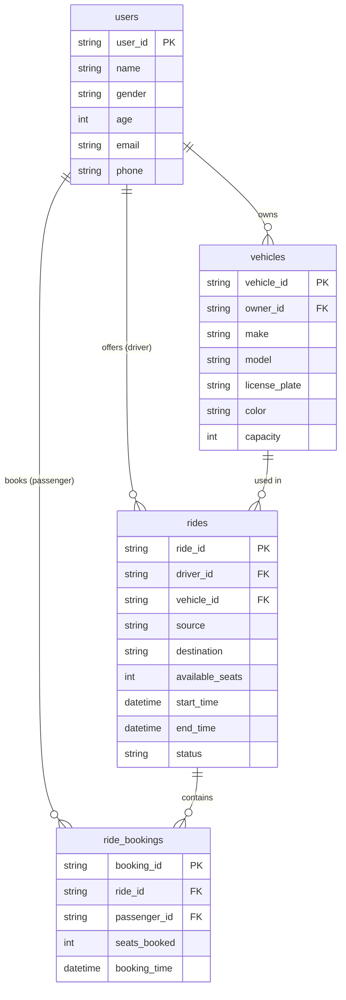
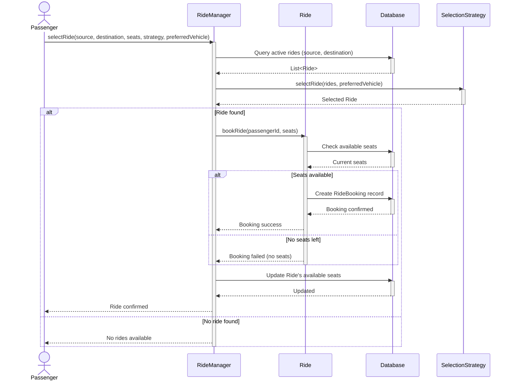
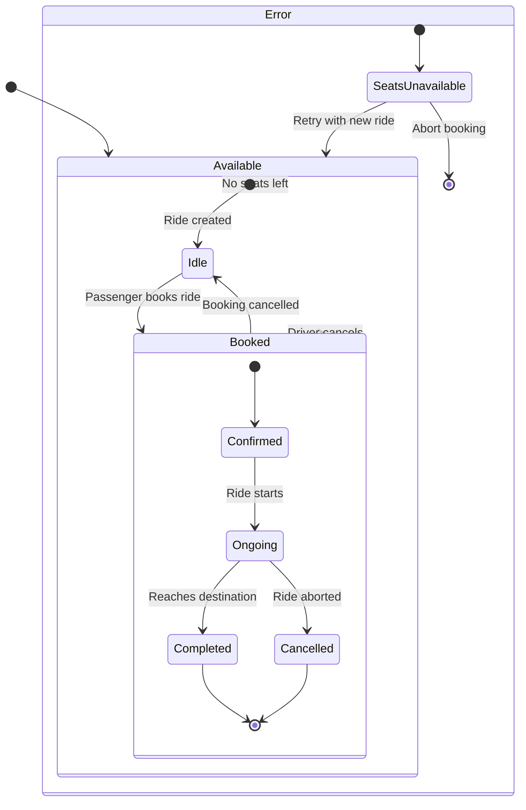
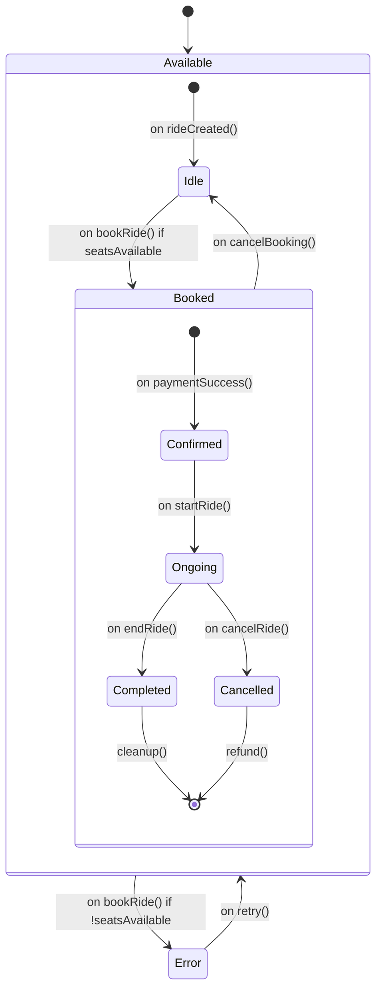
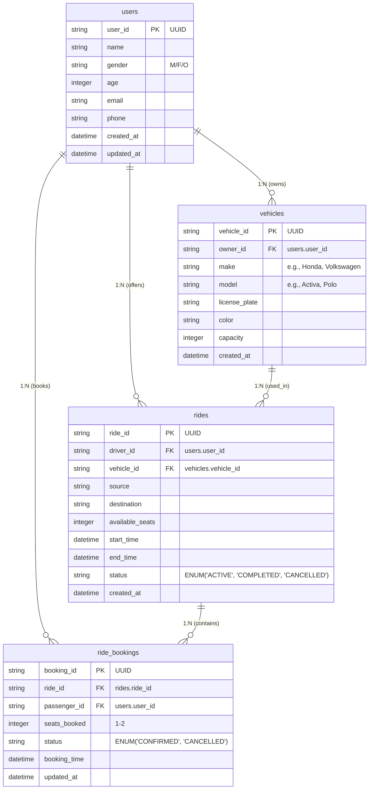
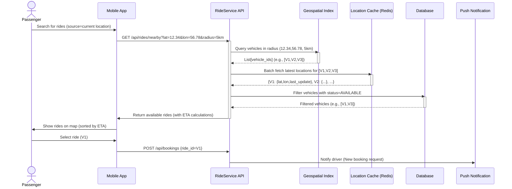

Ride Sharing Application - Low Level Design
---

## Features:
- The application allows users to share rides on a route.
- Users can either offer a shared ride (Driver) or consume a shared ride (Passenger).
- Users can search and select one from multiple available rides on a route with the same source and destination.

## Requirements:
Application should allow user onboarding.
1. add_user(user_detail) : Add basic user details
2. add_vehicle(vehicle_detail) : Add the user’s vehicle(s) details
   User should be able to offer a shared ride on a route with details.
3. offer_ride(ride_detail)
   Ride will have details like vehicle, origin, destination, available seats. (A ride will have no intermediate
   stops.)
   Users can select a ride from multiple offered rides using a selection strategy.
   (A user can only request a ride (only for 1 or 2 people))
4. select_ride(source, destination, seats, selection_strategy)
   Preferred Vehicle (Activa/Polo/XUV)
   Most Vacant.
   System should be able to end the ride. User can only offer a ride for a given
   vehicle, once there are no active offered rides for that vehicle.
5. end_ride(ride_details)
   Find total rides offered/taken by all users.
6. print_ride_stats()

---

### Actors
1. User - Can be either a Driver or Passenger
2. Driver - Special type of User who offers rides
3. Passenger - Special type of User who consumes rides
4. System - Manages ride matching, statistics, and operations

### Core Classes
1. User
   - `Attributes`: userld, name, gender, age, email, phone 
   - `Methods`: adVehicle(), offerRide(), selectRide(), endRide)
2. Vehicle
   - `Attributes`: vehicleld, ownerld, make, model, licensePlate, color, capacity
3. Ride
   - `Attributes`: rideld, driverld, vehicleld, source, destination, availableSeats, startTime, endTime, status (ACTIVE/COMPLETED)
4. RideBooking
   - `Attributes`: bookingid, rideld, passengerld, seatsBooked, bookingTime
5. RideManager
   - `Methods`: offerRide(), selectRide, endRide, getRideStats)
6. SelectionStrategy (Interface)
   - `Implementations`: PreferredVehicleStrategy, MostVacantStrategy

---

### Database Schema
#### Tables

1. User
    - user_id (PK)
    - name
    - gender
    - age
    - email
    - phone
    - created_at

2. vehicles
    - vehicle_id (PK)
    - owner_id (FK to users.user_id)
    - make
    - model
    - license_plate
    - color
    - capacity
    - created_at
   
3. rides
   - ride_id (PK)
   - driver_id (FK to users.user_id)
   - vehicle_id (FK to vehicles.vehicle_id)
   - source 
   - destination 
   - available_seats 
   - start_time 
   - end_time 
   - status (ENUM: 'ACTIVE, 'COMPLETED')
   - created_at
   
4. ride_bookings
   - booking_ id (PK)
   - ride_id (FK to rides.ride_id)
   - passenger_ id (FK to users.user_id)
   - seats_booked 
   - booking_time 
   - created_at

### Relationships
1. User 1:M Vehicle (One user can have many vehicles)
2. User 1:M Ride (One user can offer many rides as driver)
3. Ride M:1 Vehicle (One ride is associated with one vehicle)
4. Ride 1:M RideBooking (One ride can have many bookings)
5. User M:M Ride through RideBooking (Many users can book many rides)


---

### Class Diagram

```mermaid
classDiagram
    class User {
        -String userId
        -String name
        -String gender
        -int age
        -String email
        -String phone
        -List~Vehicle~ vehicles
        -int ridesOffered
        -int ridesTaken
        +addVehicle()
        +incrementRidesOffered()
        +incrementRidesTaken()
    }

    class Vehicle {
        -String vehicleId
        -String ownerId
        -String make
        -String model
        -String licensePlate
        -String color
        -int capacity
    }

    class Ride {
        -String rideId
        -String driverId
        -String vehicleId
        -String source
        -String destination
        -int availableSeats
        -Date startTime
        -Date endTime
        -RideStatus status
        -List~RideBooking~ bookings
        +bookRide()
        +endRide()
    }

    class RideBooking {
        -String bookingId
        -String rideId
        -String passengerId
        -int seatsBooked
        -Date bookingTime
    }

    class RideManager {
        -Map~String, User~ users
        -Map~String, Vehicle~ vehicles
        -Map~String, Ride~ rides
        -Map~String, List~RideBooking~~ rideBookings
        +addUser()
        +addVehicle()
        +offerRide()
        +selectRide()
        +endRide()
        +printRideStats()
    }

    interface RideSelectionStrategy {
        <<interface>>
        +selectRide(List~Ride~, String preferredVehicle)
    }

    class PreferredVehicleStrategy {
        +selectRide(List~Ride~, String preferredVehicle)
    }

    class MostVacantStrategy {
        +selectRide(List~Ride~, String preferredVehicle)
    }

    enum RideStatus {
        ACTIVE
        COMPLETED
    }

    enum SelectionStrategy {
        PREFERRED_VEHICLE
        MOST_VACANT
    }

    User "1" *-- "0..*" Vehicle : owns
    User "1" --o "0..*" Ride : offers (as driver)
    Ride "1" *-- "0..*" RideBooking : contains
    User "1" --o "0..*" RideBooking : books (as passenger)
    Ride "1" --* "1" Vehicle : uses
    RideManager -- Ride : manages
    RideManager -- User : manages
    RideManager -- Vehicle : manages
    RideSelectionStrategy <|-- PreferredVehicleStrategy
    RideSelectionStrategy <|-- MostVacantStrategy
    RideManager --> RideSelectionStrategy : uses
    Ride --> RideStatus : has
```

### Database Schema



### Sequence Diagram



### State Diagram for Booking



### Expanded Version (With Guards/Actions):



### Database Schema Diagram



### Real-Time map query



### Key Components Explained:
1. Geospatial Index (Geo):
   - Uses R-tree or Geohash to quickly find vehicles within a radius.
   - Example: Redis GEO or PostGIS.
2. Location Cache (Cache):
   - Stores real-time vehicle locations (updated every 5-10 sec via WebSocket).
   - Structure: vehicle_id → {latitude, longitude, timestamp} •
3. ETA Calculation:
    ```python
    def calculate_eta(passenger_loc, vehicle_loc):
        # Uses map APIs (Google Maps/OSRM) or Haversine formula
        return distance_in_minutes
    ```
3. Database Filtering:
    ```sql
    SELECT * FROM vehicles 
    WHERE id IN ([V1,V2,V3]) 
    AND status = 'AVAILABLE'
    AND last_activity > NOW() - INTERVAL '5 minutes';
    ```

### Real-Time Flow:
1. Passenger's app sends current GPS coordinates.
2. System finds vehicles in radius using geospatial index.
3. Filters only available vehicles from DB.
4. Returns results with ETAs based on cached locations.
5. Updates map in real-time via WebSocket (not shown).
   
### Optimizations:
   - Caching: Vehicle locations are ephemeral (volatile data).
   - Batching: Fetch locations for multiple vehicles in one call.
   - Geofencing: Reject queries outside service areas early.

---


25+ advanced interview questions that could be asked about the Ride-Sharing LLD, categorized by design aspects, scalability, and real-world scenarios:

1. Core Design & Architecture
   How would you modify the system to support ride-pooling (multiple passengers with different pick-up/drop points)?

Design a dynamic pricing model (like Uber’s surge pricing). What factors would you consider?

How would you handle inter-city rides with different regulations and pricing?

How would you design the system to support scheduled rides (bookings for future times)?

2. Scalability & Performance
   How would your system handle 10x more concurrent bookings during peak hours?

Design a geospatial sharding strategy for the rides database to optimize location-based queries.

How would you reduce latency in real-time vehicle tracking for 1M+ active rides?

How would you cache frequently accessed ride data without staleness?

3. Database & Consistency
   How would you ensure no overbooking of seats when 100 passengers try to book the last seat simultaneously?

How would you design the database schema to support intermediate stops in a ride?

How would you handle database failover if the primary rides database crashes?

4. Concurrency & Edge Cases
   What happens if a driver cancels after a passenger books? How would you handle reassignment?

How would you prevent fraudulent drivers from gaming the system (e.g., fake rides)?

How would you handle a passenger no-show after the driver arrives?

How would you detect and resolve GPS spoofing by drivers?

5. Real-World Scenarios
   How would you implement an emergency SOS button for passengers/drivers?

How would you design a lost & found feature for items left in vehicles?

How would you support multi-language interfaces for drivers/passengers?

How would you handle disputes between drivers and passengers (e.g., route deviations)?

6. API & System Design
   Design a WebSocket-based real-time tracking system for ride updates.

How would you version your API to ensure backward compatibility?

How would you throttle API requests to prevent abuse?

7. Testing & Observability
   How would you load test the ride-booking endpoint to handle 10K RPM?

What metrics would you monitor to detect fraudulent ride patterns?

How would you design an A/B testing framework for a new ride-matching algorithm?

8. Security & Compliance
   How would you ensure GDPR compliance for storing user location data?

How would you prevent SQL injection in ride-search queries?

How would you anonymize ride data for analytics without leaking PII?

9. Behavioral & System Trade-offs
   If you had to choose between strong consistency (no overbooking) and high availability (no downtime), which would you prioritize for the booking system? Justify.

How would you convince a driver to stop accepting cash payments and use only in-app transactions?

What Interviewers Look For
For Junior Engineers: Focus on class diagrams, API contracts, and basic concurrency.

For Senior Engineers: Expect deep dives into scalability, fault tolerance, and trade-offs.

For Staff/Architects: Questions on multi-region deployment, compliance, and cost optimization.

How to Answer
Clarify requirements (e.g., "Should we optimize for latency or consistency in ride matching?").

Draw diagrams (e.g., sequence flows for booking).

Discuss trade-offs (e.g., SQL vs. NoSQL for ride metadata).

---

20+ database-specific interview questions that could be asked about the Ride-Sharing LLD, covering schema design, queries, performance, and real-world scenarios:

1. Schema Design
   How would you design tables to support intermediate stops in a ride?
   (Hint: Junction table with stop_sequence and estimated_time)

How would you modify the schema to track ride cancellations and refunds?
(Hint: Add cancelled_by and refund_status columns)

How would you store driver/passenger ratings while avoiding bias?
(Hint: Separate ratings table with anonymized IDs)

Design a schema for surge pricing (dynamic fares based on demand).

2. Query Optimization
   Write a SQL query to find all active rides within 5 km of a user’s location.
   (Tests knowledge of geospatial queries: ST_DWithin in PostGIS)

How would you optimize a query that searches rides by source, destination, and available_seats?
(Composite index on (source, destination, available_seats, status))

How would you find the top 5 most profitable drivers this month?
(Join rides, payments, and users with aggregation)

3. Transactions & Concurrency
   How would you prevent overbooking when 100 users try to book the last seat simultaneously?
   (Pessimistic locking: SELECT ... FOR UPDATE)

Explain how you’d handle a race condition where a driver cancels while a passenger is booking.
(Optimistic locking with version column or retry logic)

How would you design a ride-booking transaction that involves deducting seats, creating a booking, and processing payment?
(ACID transaction with rollback on failure)

4. Performance & Scaling
   The rides table has 100M rows. How would you optimize queries for active rides?
   (Partitioning by status + index on active rides)

How would you shard the database to distribute load across regions?
(Shard by region_id or geohash)

How would you cache frequently accessed ride data without serving stale results?
(Cache invalidation via Redis pub/sub on ride updates)

5. Real-World Scenarios
   A driver reports their ride history is missing. How would you debug?
   (Check replication lag, soft-delete flags, audit logs)

How would you anonymize ride data for analytics while preserving utility?
(Data masking, k-anonymity via geohash generalization)

How would you backfill historical ride data after adding a new column (e.g., vehicle_type)?
(Batch update with WHERE clauses to avoid locks)

6. Advanced Database Concepts
   When would you choose NoSQL over SQL for ride-sharing data?
   (MongoDB for driver location logs, Postgres for transactions)

How would you implement full-text search for ride destinations (e.g., "Airport Terminal 1")?
(Postgres tsvector or Elasticsearch)

Design a data warehouse schema for analyzing ride patterns (peak hours, popular routes).
(Star schema with fact_rides, dim_time, dim_location)

7. Data Consistency & Replication
   How would you ensure consistent ride availability across read replicas?
   (Read-your-writes consistency via replica sync checks)

How would you handle a payment failure after deducting seats from a ride?
(Saga pattern with compensating transaction: UPDATE rides SET seats = seats + 1)

How would you detect and resolve duplicate bookings due to network retries?
(Idempotency keys in bookings table)

8. Security & Compliance
   How would you encrypt sensitive passenger data (e.g., phone numbers) at rest?
   (Column-level encryption with AWS KMS or PostgreSQL pgcrypto)

How would you implement GDPR-compliant deletion of user data?
(Soft-delete + background hard-delete process)

What Interviewers Evaluate
For Juniors: Basic CRUD queries, index usage.

For Mid-Level: Transactions, query optimization.

For Seniors: Partitioning, replication, trade-offs between consistency models.

---

```Sql
BEGIN TRANSACTION;
-- 1. Lock the ride row to prevent concurrent bookings
SELECT * FROM rides WHERE ride_id = 'R1' AND status = 'ACTIVE' FOR UPDATE;

-- 2. Check seat availability
UPDATE rides 
SET available_seats = available_seats - 1 
WHERE ride_id = 'R1' AND available_seats >= 1;

-- 3. If update affected 1 row, proceed to book
INSERT INTO ride_bookings (...) VALUES (...);
COMMIT;
```


Key Points:

Use FOR UPDATE to lock the row.

Check seat availability in the same transaction.

Rollback if seats are unavailable.