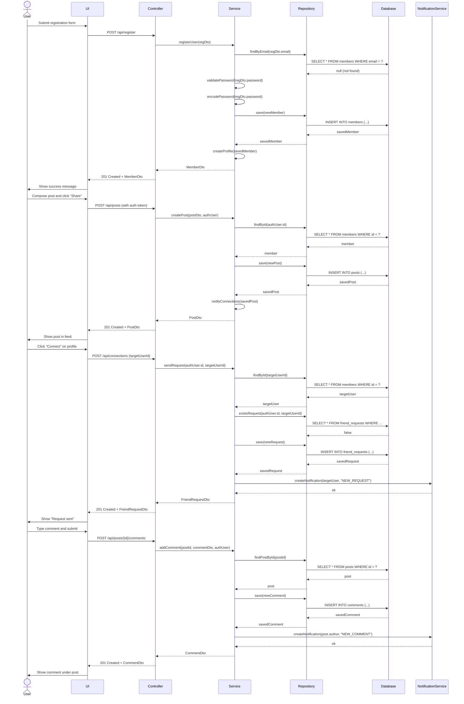
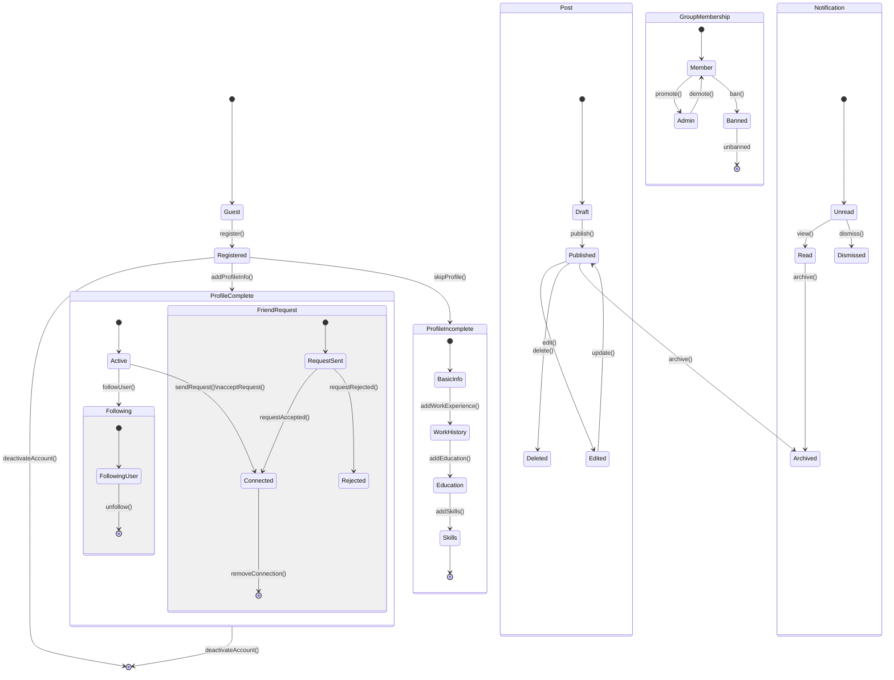
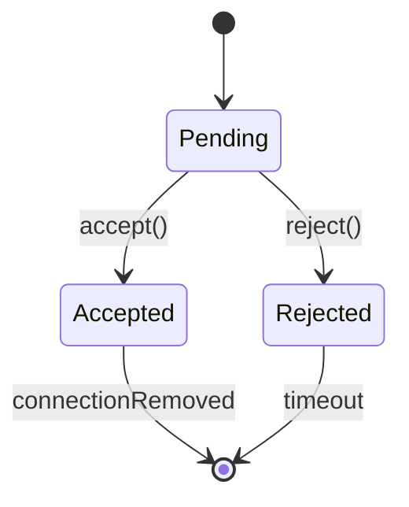
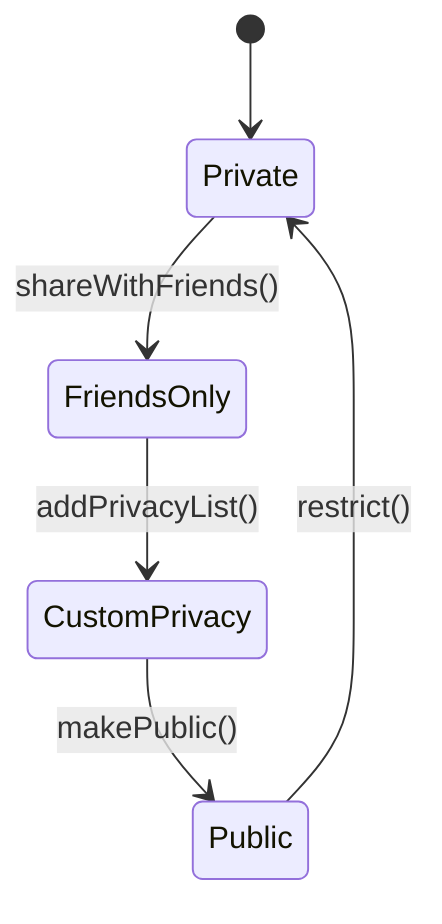
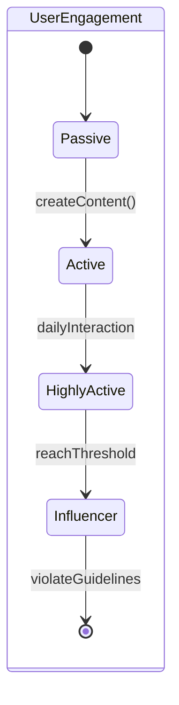
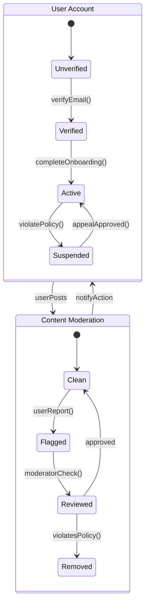
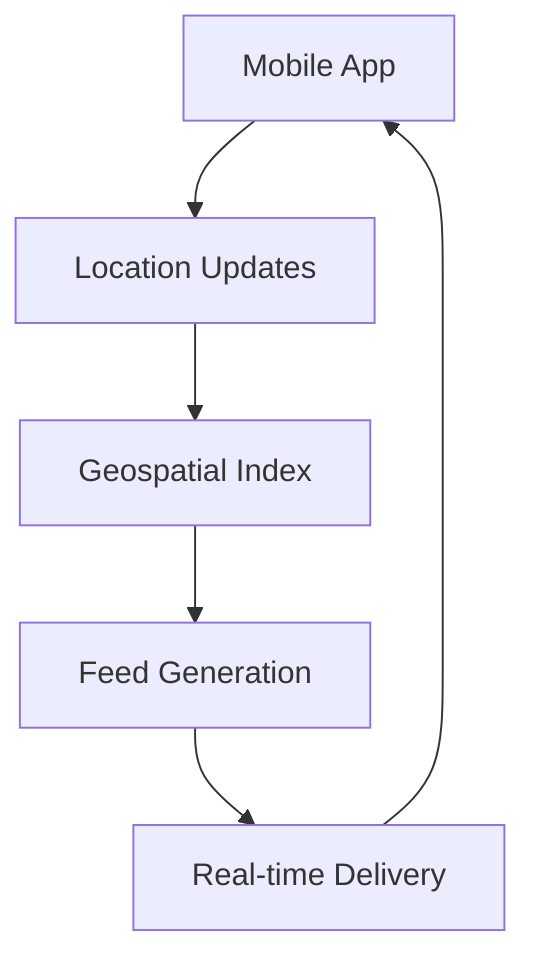
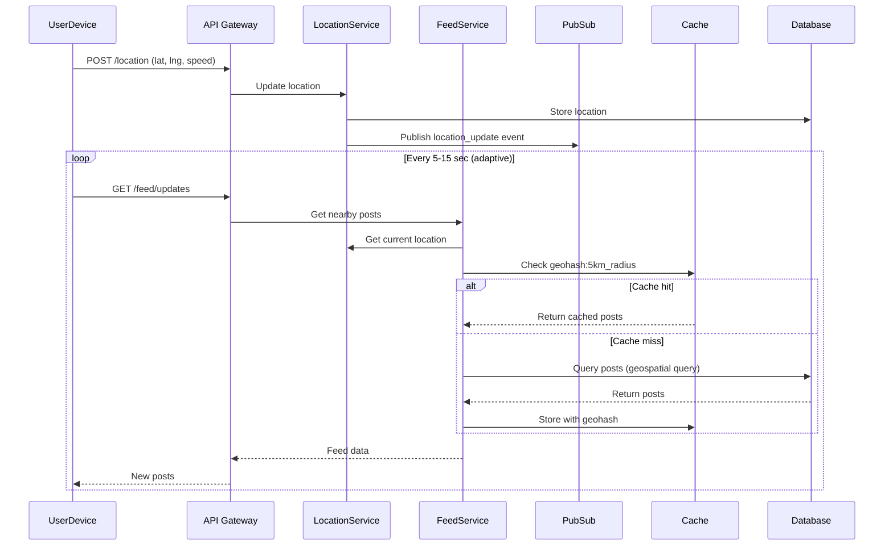

LinkedIn-like System - Low Level Design
---
Requirements
- Each member should be able to add information about their basic profile, work experience,
education, etc. 
- Any user of our system should be able to search other members, groups or pages by their
name. 
- Members should be able to send and accept/reject friend requests from other members. 
- Members should be able to follow other members without becoming their friend. 
- Members should be able to create groups and pages, as well as join already created groups,
and follow pages. 
- Members should be able to create new posts to share with their friends. 
- Members should be able to add comments to posts, as well as like or share a post or
comment. 
- Members should be able to create privacy lists containing their friends. Members can link any
post with a privacy list to make the post visible only to the members of that list. 
- Any member should be able to send messages to other members. 
- Any member should be able to add a recommendation for any page. 
- The system should send a notification to a member whenever there is a new message or
friend request or comment on their post. 
- Members should be able to search through posts, group for a word.

---

### Actors
1. Member (Regular User)
2. Admin (Special type of member with additional privileges)
3. System (Background processes for notifications, etc.)

### Core Classes
1. User/Member
2. Profile
3. WorkExperience
4. Education
5. FriendRequest
6. Connection
7. Group
8. Page
9. Post
10. Comment
11. Like
12. Share
13. PrivacyList
14. Message
15. Recommendation
16. Notification
17. Search


## Database Schema
### Tables and Relationships
1. Member (1:1 with Profile)
   - member_id (PK)
   - email 
   - password_hash
   - date_joined 
   - last_login 
   - is_active

2. Profile (1:M with WorkExperience, 1:M with Education)
   - profile_id (PK)
   - member_id (FK)
   - first_name
   - last_name
   - headline
   - summary
   - profile_picture_url
   - location

3. WorkExperience (M:1 with Profile)
   - work_experience_id (PK)
   - profile_id (FK)
   - company_name
   - position
   - start_date
   - end_date
   - description
   - is_current

4. Education (M:1 with Profile)
    - education_id (PK)
    - profile_id (FK)
    - institution
    - degree
    - field_of_study
    - start_year
    - end_year

5. FriendRequest (M:1 with Member for sender/receiver)
    - request_id (PK)
    - sender_id (FK to Member)
    - receiver_id (FK to Member)
    - status (PENDING/ACCEPTED/REJECTED)
    - created_at

6. Connection (M:M between Members)
    - connection_id (PK)
    - member_id (FK to Member)
    - member2_id (FK to Member)
    - created_at
    - description
    - is_current

7. Follow (M:M between Members)
    - follow_id (PK)
    - follower_id (FK to Member)
    - following_id (FK to Member)
    - created_at

8. Group (1:M with GroupMember)
    - group_id (PK)
    - creator_id (FK to Member)
    - name
    - description
    - created_at

9. GroupMember (M:1 with Group, M:1 with Member)
    - group_member_id (PK)
    - group_id (FK)
    - member_id (FK)
    - joined_at
    - role (MEMBER/ADMIN)

10. Page (1:M with PageFollower)
    - page_id (PK)
    - creator_id (FK to Member)
    - name
    - description
    - created_at

11. PageFollower (M:1 with Page, M:1 with Member)
    - page_follower_id (PK)
    - page_id (FK)
    - member_id (FK)
    - followed_at

12. Post (1:M with Comment, 1:M with Like, 1:M with Share)
    - post_id (PK)
    - author_id (FK to Member)
    - content
    - created_at
    - updated_at
    - privacy_setting (PUBLIC/FRIENDS/PRIVACY_LIST)

13. PostPrivacyList (M:M between Post and PrivacyList)
    - post_privacy_id (PK)
    - post_id (FK)
    - privacy_list_id (FK)

14. PrivacyList (1:M with PrivacyListMember)
    - privacy_list_id (PK)
    - creator_id (FK to Member)
    - name
    - created_at

15. PrivacyListMember (M:1 with PrivacyList, M:1 with Member)
    - privacy_list_member_id (PK)
    - privacy_list_id (FK)
    - member_id (FK)

16. Comment (1:M with Like)
    - comment_id (PK)
    - post_id (FK)
    - author_id (FK to Member)
    - content
    - created_at
    - parent_comment_id (FK, nullable) (for nested comments)

17. Like (M:1 with Member, M:1 with Post/Comment)
    - like_id (PK)
    - member_id (FK)
    - post_id (FK, nullable)
    - comment_id (FK, nullable)
    - created_at

18. Share (M:1 with Member, M:1 with Post)
    - share_id (PK)
    - member_id (FK)
    - post_id (FK)
    - shared_at
    - shared_content (optional additional text)


19. Message (M:1 with Member for sender/receiver)
    - message_id (PK)
    - sender_id (FK to Member)
    - receiver_id (FK to Member)
    - content
    - sent_at
    - read_at
    - is_read

20. Recommendation (M:1 with Member for giver/receiver, M:1 with Page)
    - recommendation_id (PK)
    - giver_id (FK to Member)
    - receiver_id (FK to Member, nullable)
    - page_id (FK, nullable)
    - content
    - created_at

21. Notification (M:1 with Member)
    - notification_id (PK)
    - recipient_id (FK to Member)
    - sender_id (FK to Member, nullable)
    - type (FRIEND_REQUEST/MESSAGE/COMMENT/LIKE/etc.)
    - reference_id (ID of the related entity)
    - message
    - created_at
    - is_read

### Relationships

1. Member 1:1 Profile (One member has one profile)
2. Profile 1:M WorkExperience (One profile can have multiple work experiences)
3. Profile 1:M Education (One profile can have multiple education records)
4. Member M:M Member through Connection (Members can be connected to multiple members)
5. Member M:M Member through Follow (Members can follow multiple members and be followed by multiple members)
6. Member M:M Member through FriendRequest (Members can send and receive multiple friend requests)
7. Member 1:M Group (One member can create multiple groups)
8. Member M:M Group through GroupMember (Many members can join many groups)
9. Group 1:M GroupMember (One group can have multiple members)
10. Member 1:M Page (One member can create multiple pages)
11. Member M:M Page through PageFollower (Many members can follow many pages)
12. Page 1:M PageFollower (One page can have multiple followers)
13. Member 1:M Post (One member can create multiple posts)
14. Post 1:M Comment (One post can have multiple comments)
15. Post 1:M Like (One post can have multiple likes)
16. Post 1:M Share (One post can be shared multiple times)
17. Post M:M PrivacyList through PostPrivacyList (One post can belong to multiple privacy lists)
18. Member 1:M PrivacyList (One member can create multiple privacy lists)
19. PrivacyList 1:M PrivacyListMember (One privacy list can have multiple members)
20. Member M:M PrivacyList through PrivacyListMember (Many members can be part of multiple privacy lists)
21. Comment 1:M Like (One comment can have multiple likes)
22. Comment 1:M Comment (One comment can have multiple nested comments)
23. Member 1:M Like (One member can like multiple posts/comments)
24. Member 1:M Share (One member can share multiple posts)
25. Member M:M Post through Like (Many members can like many posts)
26. Member M:M Comment through Like (Many members can like many comments)
27. Member 1:M Message (One member can send multiple messages)
28. Message M:1 Member for sender/receiver (Each message has a sender and receiver)
29. Member 1:M Recommendation (One member can give multiple recommendations)
30. Recommendation M:1 Page (Each recommendation is associated with a page or a member)
31. Member 1:M Notification (One member can receive multiple notifications)
32. Member M:M Member through Notification (Many members can send notifications to multiple members)

---

### Class Diagram


### Database schema


### Sequence Diagram



### State Diagram


1. **User States**:
    - Guest → Registered (Upon account creation)
    - ProfileIncomplete → ProfileComplete (After adding profile details)
    - AnyState → Deactivated (Account deactivation)

2. **Connection States**:
    - FriendRequest: Pending → Accepted / Rejected
    - Follow: NotFollowing → Following → Unfollowed

3. **Post States**:
    - Draft → Published → Edited / Deleted / Archived
    - ContentModeration: Pending → Approved / Rejected

4. **Notification States**:
    - Unread → Read / Dismissed → Archived
    - NotificationLifecycle: Created → Notified → Expired

5. **Group Membership States**:
    - Member → Admin (Promotion)
    - Admin → Member (Demotion)
    - Member → Banned (Banning workflow)
    - Banned → Reinstated (Unbanning process)


### Important State Machines:

1. Friend Request State Machine:

2. Post Visibility State Machine:


3. User Engagement State Machine:


4. Alternative View (Nested States):

---

```java
import java.util.*;
import java.time.*;

// Enums
enum FriendRequestStatus {
    PENDING, ACCEPTED, REJECTED
}

enum PrivacySetting {
    PUBLIC, FRIENDS, PRIVACY_LIST
}

enum NotificationType {
    FRIEND_REQUEST, MESSAGE, COMMENT, LIKE, SHARE
}

enum GroupRole {
    MEMBER, ADMIN
}

// Classes
class Member {
    private String memberId;
    private String email;
    private String passwordHash;
    private LocalDateTime dateJoined;
    private LocalDateTime lastLogin;
    private boolean isActive;
    private Profile profile;
    
    // Constructor, getters, setters
}

class Profile {
    private String profileId;
    private Member member;
    private String firstName;
    private String lastName;
    private String headline;
    private String summary;
    private String profilePictureUrl;
    private String location;
    private List<WorkExperience> workExperiences;
    private List<Education> educations;
    
    // Constructor, getters, setters
}

class WorkExperience {
    private String workExperienceId;
    private Profile profile;
    private String companyName;
    private String position;
    private LocalDate startDate;
    private LocalDate endDate;
    private String description;
    private boolean isCurrent;
    
    // Constructor, getters, setters
}

class Education {
    private String educationId;
    private Profile profile;
    private String institution;
    private String degree;
    private String fieldOfStudy;
    private int startYear;
    private int endYear;
    
    // Constructor, getters, setters
}

class FriendRequest {
    private String requestId;
    private Member sender;
    private Member receiver;
    private FriendRequestStatus status;
    private LocalDateTime createdAt;
    
    // Constructor, getters, setters
}

class Connection {
    private String connectionId;
    private Member member1;
    private Member member2;
    private LocalDateTime createdAt;
    
    // Constructor, getters, setters
}

class Follow {
    private String followId;
    private Member follower;
    private Member following;
    private LocalDateTime createdAt;
    
    // Constructor, getters, setters
}

class Group {
    private String groupId;
    private Member creator;
    private String name;
    private String description;
    private LocalDateTime createdAt;
    private List<GroupMember> members;
    
    // Constructor, getters, setters
}

class GroupMember {
    private String groupMemberId;
    private Group group;
    private Member member;
    private LocalDateTime joinedAt;
    private GroupRole role;
    
    // Constructor, getters, setters
}

class Page {
    private String pageId;
    private Member creator;
    private String name;
    private String description;
    private LocalDateTime createdAt;
    private List<PageFollower> followers;
    private List<Recommendation> recommendations;
    
    // Constructor, getters, setters
}

class PageFollower {
    private String pageFollowerId;
    private Page page;
    private Member member;
    private LocalDateTime followedAt;
    
    // Constructor, getters, setters
}

class Post {
    private String postId;
    private Member author;
    private String content;
    private LocalDateTime createdAt;
    private LocalDateTime updatedAt;
    private PrivacySetting privacySetting;
    private List<Comment> comments;
    private List<Like> likes;
    private List<Share> shares;
    private List<PrivacyList> privacyLists;
    
    // Constructor, getters, setters
}

class PrivacyList {
    private String privacyListId;
    private Member creator;
    private String name;
    private LocalDateTime createdAt;
    private List<Member> members;
    
    // Constructor, getters, setters
}

class Comment {
    private String commentId;
    private Post post;
    private Member author;
    private String content;
    private LocalDateTime createdAt;
    private Comment parentComment;
    private List<Like> likes;
    private List<Comment> replies;
    
    // Constructor, getters, setters
}

class Like {
    private String likeId;
    private Member member;
    private Post post;
    private Comment comment;
    private LocalDateTime createdAt;
    
    // Constructor, getters, setters
}

class Share {
    private String shareId;
    private Member member;
    private Post post;
    private LocalDateTime sharedAt;
    private String sharedContent;
    
    // Constructor, getters, setters
}

class Message {
    private String messageId;
    private Member sender;
    private Member receiver;
    private String content;
    private LocalDateTime sentAt;
    private LocalDateTime readAt;
    private boolean isRead;
    
    // Constructor, getters, setters
}

class Recommendation {
    private String recommendationId;
    private Member giver;
    private Member receiver;
    private Page page;
    private String content;
    private LocalDateTime createdAt;
    
    // Constructor, getters, setters
}

class Notification {
    private String notificationId;
    private Member recipient;
    private Member sender;
    private NotificationType type;
    private String referenceId;
    private String message;
    private LocalDateTime createdAt;
    private boolean isRead;
    
    // Constructor, getters, setters
}

class Search {
    public List<Member> searchMembers(String query) {
        // Implementation
        return new ArrayList<>();
    }
    
    public List<Group> searchGroups(String query) {
        // Implementation
        return new ArrayList<>();
    }
    
    public List<Page> searchPages(String query) {
        // Implementation
        return new ArrayList<>();
    }
    
    public List<Post> searchPosts(String query) {
        // Implementation
        return new ArrayList<>();
    }
}

// Service Classes
class MemberService {
    public Member registerMember(String email, String password) {
        // Implementation
        return null;
    }
    
    public Profile updateProfile(Member member, Profile profile) {
        // Implementation
        return null;
    }
    
    public void addWorkExperience(Profile profile, WorkExperience workExperience) {
        // Implementation
    }
    
    public void addEducation(Profile profile, Education education) {
        // Implementation
    }
}

class ConnectionService {
    public FriendRequest sendFriendRequest(Member sender, Member receiver) {
        // Implementation
        return null;
    }
    
    public void respondToFriendRequest(FriendRequest request, boolean accept) {
        // Implementation
    }
    
    public void followMember(Member follower, Member following) {
        // Implementation
    }
    
    public List<Member> getConnections(Member member) {
        // Implementation
        return new ArrayList<>();
    }
    
    public List<Member> getFollowers(Member member) {
        // Implementation
        return new ArrayList<>();
    }
}

class GroupService {
    public Group createGroup(Member creator, String name, String description) {
        // Implementation
        return null;
    }
    
    public void joinGroup(Member member, Group group) {
        // Implementation
    }
    
    public void leaveGroup(Member member, Group group) {
        // Implementation
    }
}

class PageService {
    public Page createPage(Member creator, String name, String description) {
        // Implementation
        return null;
    }
    
    public void followPage(Member member, Page page) {
        // Implementation
    }
    
    public Recommendation addRecommendation(Member giver, Page page, String content) {
        // Implementation
        return null;
    }
}

class PostService {
    public Post createPost(Member author, String content, PrivacySetting privacySetting) {
        // Implementation
        return null;
    }
    
    public Comment addComment(Member author, Post post, String content) {
        // Implementation
        return null;
    }
    
    public Like likePost(Member member, Post post) {
        // Implementation
        return null;
    }
    
    public Share sharePost(Member member, Post post, String sharedContent) {
        // Implementation
        return null;
    }
    
    public void addPostToPrivacyList(Post post, PrivacyList privacyList) {
        // Implementation
    }
}

class MessageService {
    public Message sendMessage(Member sender, Member receiver, String content) {
        // Implementation
        return null;
    }
    
    public List<Message> getConversation(Member member1, Member member2) {
        // Implementation
        return new ArrayList<>();
    }
}

class NotificationService {
    public void sendNotification(Member recipient, Member sender, NotificationType type, String referenceId, String message) {
        // Implementation
    }
    
    public List<Notification> getUnreadNotifications(Member member) {
        // Implementation
        return new ArrayList<>();
    }
    
    public void markAsRead(Notification notification) {
        // Implementation
    }
}

class PrivacyService {
    public PrivacyList createPrivacyList(Member creator, String name) {
        // Implementation
        return null;
    }
    
    public void addMemberToPrivacyList(PrivacyList privacyList, Member member) {
        // Implementation
    }
}

// Main Application
public class SocialNetworkApp {
    private MemberService memberService;
    private ConnectionService connectionService;
    private GroupService groupService;
    private PageService pageService;
    private PostService postService;
    private MessageService messageService;
    private NotificationService notificationService;
    private PrivacyService privacyService;
    private Search search;
    
    public SocialNetworkApp() {
        // Initialize services
        memberService = new MemberService();
        connectionService = new ConnectionService();
        groupService = new GroupService();
        pageService = new PageService();
        postService = new PostService();
        messageService = new MessageService();
        notificationService = new NotificationService();
        privacyService = new PrivacyService();
        search = new Search();
    }
    
    public static void main(String[] args) {
        SocialNetworkApp app = new SocialNetworkApp();
        // Example usage
        Member member1 = app.memberService.registerMember("user1@example.com", "password123");
        Member member2 = app.memberService.registerMember("user2@example.com", "password456");
        
        // Update profiles
        Profile profile1 = new Profile();
        profile1.setFirstName("John");
        profile1.setLastName("Doe");
        app.memberService.updateProfile(member1, profile1);
        
        // Send friend request
        FriendRequest request = app.connectionService.sendFriendRequest(member1, member2);
        app.connectionService.respondToFriendRequest(request, true);
        
        // Create post
        Post post = app.postService.createPost(member1, "Hello world!", PrivacySetting.PUBLIC);
        
        // Add comment
        app.postService.addComment(member2, post, "Nice post!");
        
        // Search
        List<Member> results = app.search.searchMembers("John");
    }
}
```


---
### How the real-time feed is updated in a radius of 5KM for a user of other users that they are connected with if that user is constantly moving in car?

# **Real-Time Location-Based Social Feed System Design**

## **Step 1: Clarify Requirements (2-3 mins)**

### **Questions to Ask:**
- "Should we show posts only from connected users, or all nearby users?"
- "What's the acceptable latency for feed updates while moving?"
- "Are there privacy controls for location sharing?"

### **Assumptions:**
- Only posts from connected users will be shown.
- Maximum feed freshness is 10 seconds at highway speeds.
- Users must opt-in to location sharing.

---

## **Step 2: High-Level Design (5 mins)**

### **Key Components:**
1. **User Service** (Manages authentication, connections, and preferences)
2. **Location Service** (Real-time GPS updates and geofencing logic)
3. **Feed Service** (Fetches and prioritizes relevant posts)
4. **Post Service** (Stores and retrieves user posts)
5. **Notification Service** (Alerts users about new posts or interactions)
6. **Privacy & Permissions Module** (Handles opt-in location sharing)

### **Data Flow:**
1. User shares location → Location Service updates position
2. Feed Service fetches posts from connected users near the location
3. Post Service retrieves content and applies sorting/filtering
4. Updates are pushed to the user with a 10-second freshness guarantee

### **Scalability Considerations:**
- **Caching**: Use Redis to cache frequently accessed posts.
- **Streaming Updates**: Utilize WebSockets for real-time feed updates.
- **Rate Limiting**: Implement API rate limits to prevent abuse.

---

## **Next Steps**
- Define database schema for users, posts, and locations.
- Choose technology stack for real-time updates (Kafka, WebSockets, etc.).
- Implement prototype for testing feed latency and scalability.


### Step 3: Deep Dive Components

1. Location Tracking System
```java
// Adaptive polling based on speed
public void updateLocation(User user, Location newLoc) {
    // Store in Redis Geospatial Index
    redis.geoadd("user:locations", newLoc.lng, newLoc.lat, user.id);
    
    // Calculate next update interval (5-15s)
    int interval = Math.max(5000, 15000 - (newLoc.speed * 200));
    scheduler.scheduleUpdate(user.id, interval);
}
```
2. Geospatial Query

```shell
-- PostgreSQL with PostGIS
SELECT posts.* FROM posts
JOIN user_locations ON posts.user_id = user_locations.user_id
WHERE ST_DWithin(
    user_locations.location::geography,
    ST_MakePoint(?, ?)::geography,
    5000 -- 5KM radius
)
AND EXISTS (
    SELECT 1 FROM connections 
    WHERE (user1 = ? AND user2 = posts.user_id)
    OR (user2 = ? AND user1 = posts.user_id)
)
ORDER BY posts.created_at DESC
LIMIT 50;
```

3. Real-time Feed Assembly

```java
import java.util.List;
import java.util.Set;

public class FeedService {

    private final LocationService locationService;
    private final ConnectionService connectionService;
    private final SpatialIndex spatialIndex;
    private final PostService postService;
    private final CacheService cacheService;

    public FeedService(LocationService locationService, ConnectionService connectionService,
                       SpatialIndex spatialIndex, PostService postService, CacheService cacheService) {
        this.locationService = locationService;
        this.connectionService = connectionService;
        this.spatialIndex = spatialIndex;
        this.postService = postService;
        this.cacheService = cacheService;
    }

    public List<Post> getFeed(String userId) {
        // Get current location
        Location currentLoc = locationService.getLocation(userId);

        // Get connected users in 5KM radius
        Set<String> connectedUsers = connectionService.getConnectedUsers(userId);
        Set<String> nearbyUsers = spatialIndex.radiusQuery(currentLoc, 5000, connectedUsers);

        // Fetch their posts
        List<Post> posts = postService.getLatestPosts(nearbyUsers);

        // Cache for 10 seconds with motion prediction
        Location futureLoc = predictNextLocation(currentLoc);
        cacheService.set("feed:" + userId, posts, 10, futureLoc);

        return posts;
    }

    private Location predictNextLocation(Location currentLoc) {
        // Dummy implementation: Extend this with actual motion prediction logic
        return new Location(currentLoc.getLatitude() + 0.001, currentLoc.getLongitude() + 0.001);
    }
}

/*----------------------------------*/

import java.util.List;
import java.util.Set;

interface LocationService {
    Location getLocation(String userId);
}

interface ConnectionService {
    Set<String> getConnectedUsers(String userId);
}

interface SpatialIndex {
    Set<String> radiusQuery(Location center, int radius, Set<String> userIds);
}

interface PostService {
    List<Post> getLatestPosts(Set<String> userIds);
}

interface CacheService {
    void set(String key, List<Post> value, int ttl, Location futureLocation);
}

class Location {
    private final double latitude;
    private final double longitude;

    public Location(double latitude, double longitude) {
        this.latitude = latitude;
        this.longitude = longitude;
    }

    public double getLatitude() { return latitude; }
    public double getLongitude() { return longitude; }
}

class Post {
    private String content;
    private String authorId;
    private long timestamp;

    // Constructor, Getters, and Setters
}


```
4. Step4 : Optimization Strategies
```java
public Location predictNextLocation(Location current, Vector velocity) {
    return new Location(
        current.lat + (velocity.y * PREDICTION_SECONDS),
        current.lng + (velocity.x * PREDICTION_SECONDS)
    );
}
```
2. Hierarchical Geohashing
```java
Original Geohash: u4pruyd
5KM Coverage: 
- u4pruy (parent)
- Adjacent: u4pruy, u4prub, u4pru6...
```

3. Connection-Aware Caching

```py
# Cache key incorporates location + connections
def get_cache_key(user_id, location):
    connections = connection_service.get_connected(user_id)
    geo_part = geohash.encode(location, precision=6)
    return f"feed:{geo_part}:{hash(tuple(sorted(connections))}"
```

5. Step 5: Failure Handling
   - Scenario: User loses network in tunnel
   
```java
fun handleOfflineScenario() {
    val cachedFeed = cache.getLastFeed()
    val predictedPosts = predictPostsBasedOnRoute()
    showHybridFeed(cachedFeed + predictedPosts)
    
    // Queue location updates for when online
    queueOfflineLocations()
}

```

# **Step 6: Metrics to Monitor**

### **1. Location Update Latency**
- Measures the delay in processing real-time location updates.
- **Target:** P99 < 500ms
- **Action:** Optimize GPS polling frequency and reduce backend processing time.

### **2. Feed Freshness**
- Ensures users receive timely updates on their feed.
- **Target:** 95% of updates delivered within 10 seconds.
- **Action:** Use WebSockets for real-time updates and optimize data fetching.

### **3. Cache Hit Ratio**
- Tracks efficiency of caching layer for post retrieval.
- **Target:** > 80% cache hit rate.
- **Action:** Implement Redis for frequently accessed data and optimize cache eviction strategies.

### **4. Mobile Battery Impact**
- Measures power consumption of location updates and feed polling.
- **Target:** Minimal battery drain (mA consumption/hour).
- **Action:** Optimize GPS polling frequency, reduce unnecessary background processes, and implement adaptive update rates.

---

## **Next Steps**
- Set up monitoring dashboards using Prometheus & Grafana.
- Define alerts for anomalies in latency, freshness, and cache performance.
- Run A/B tests to optimize update frequency vs. battery consumption.

### Example Interview Dialogue:
- Interviewer: "How would you handle sudden location jumps from GPS drift?"
- You: "We'd implement a speed threshold filter - if new locations imply impossible velocities (>200km/h), we'd use the last plausible location and trigger a GPS recalibration on the device while serving slightly stale data."


### Digram


# **System Design Deep Dive**

## **Data Modeling & Storage**
### **1. Optimizing Schema for Time-Range Queries**
- Redesign the post schema to support efficient time-based filtering while maintaining geospatial indexing.
- **Strategy:** Use a **compound index** on `(timestamp, location)` for efficient queries like “show posts from last hour within 5km.”

### **2. Database Choice for Friend Graph**
- Evaluate **Neo4j vs. SQL vs. Cassandra** for storing and querying friend connections.
- **Approach:** Use **Neo4j** for fast **3-hop queries**, while SQL suits transactional consistency and Cassandra scales reads.

### **3. Indexing Multimedia Posts with Location Metadata**
- Efficiently store and query videos/images with location tags at scale.
- **Solution:** Use **Cloud Storage + NoSQL DB** with metadata indexing and **CDN caching** for quick retrieval.

---

## **Real-Time Systems**
### **1. WebSocket Protocol for Mobile Clients**
- Minimize battery usage while maintaining **<3s feed update latency**.
- **Optimization:** Adaptive WebSocket keep-alive with **event-driven push updates**.

### **2. Read-After-Write Consistency for Global Users**
- Ensure posts appear instantly to users after creation.
- **Tradeoffs:** Use **quorum reads** for consistency vs. **eventual consistency with timeline ordering**.

### **3. Handling Conflicting Location Updates**
- Address cases where two devices send simultaneous updates for the same user.
- **Solution:** Use **Vector Clocks or CRDTs** to resolve conflicts without data loss.

---

## **Scaling Challenges**
### **1. Dynamic Repartitioning for Hot Geographies**
- Handle cases where certain areas (e.g., Manhattan) become **10x hotter**.
- **Solution:** **Shard rebalancing** with **dynamic geo-hashing**.

### **2. Managing "Morning Rush Hour" Traffic**
- 80% of users update locations within a **30-minute window**.
- **Mitigation:** Predictive scaling with **auto-scaling event-based triggers**.

### **3. Preventing Spam from Rogue Users**
- A user accidentally sending **1000 location updates/sec**.
- **Approach:** **Rate-limiting + anomaly detection** at edge servers.

---

## **Caching Strategies**
### **1. Cache Invalidation for Frequent Location Updates**
- Prevent **thundering herd** problems due to location changes.
- **Solution:** Use **Bloom Filters + Probabilistic Expiry**.

### **2. Predictive Caching for Frequent Travelers**
- Optimize caching for users who cross the same **5km boundary daily**.
- **Strategy:** **Pre-caching nearby regions** based on movement history.

---

## **Failure Handling**
### **1. Recovering from Geospatial Index Corruption**
- What happens if the **index fails during peak traffic?**
- **Solution:** Switch to **degraded mode** with **last-known locations**.

### **2. Database Recovery from Complete Failure**
- **Minimal user impact** if the post database is lost.
- **Approach:** **Multi-region backups + Event replay system**.

---

## **Advanced Distributed Systems**
### **1. Leaderless Replication for Location Updates**
- Ensure availability despite **regional outages**.
- **Solution:** **CRDT-based replication** for **conflict-free updates**.

### **2. Blue/Green Deployment of Location Pipeline**
- Deploy location services **without data loss**.
- **Technique:** **Dual-write system** + **dark traffic validation**.

---

## **Mobile-Specific Challenges**
### **1. Handling Feed Updates in Background Mode**
- Ensure updates reach **dozing mobile devices**.
- **Solution:** **WorkManager / Background Fetch** optimizations.

### **2. Syncing Feed State After 24-Hour Offline Period**
- Efficiently restore data after a **long offline period**.
- **Approach:** **Differential Sync Markers** to fetch only changed data.

---

## **Analytics & Monitoring**
### **1. Tracking "Posts Viewed per km²" in Real-Time**
- Monitor engagement **without overloading the system**.
- **Optimization:** **Approximate streaming algorithms**.

### **2. Detecting "Location Spoofing Hotspots"**
- Prevent **fraudulent location manipulation**.
- **Detection:** Use **velocity clustering anomalies**.

---

## **Privacy & Compliance**
### **1. GDPR Right-to-Be-Forgotten for Location Data**
- How to **delete user data while keeping feed integrity**?
- **Solution:** **Cryptographic erasure** instead of physical deletion.

---

## **Bonus Architecture Questions**
### **1. Real-Time Visibility of Posts in Moving Vehicles**
- Users at **100km/h** should see nearby posts in real-time.
- **Solution:** **Doppler effect compensation with S2 Geometry**.

### **2. Supporting IoT Location Updates (1km Accuracy)**
- Handle IoT devices with **less precise location tracking**.
- **Approach:** **Multi-precision spatial indexing**.

### **3. Ephemeral Posts that Disappear Beyond 5km**
- Implement location-bound posts that auto-expire.
- **Solution:** **Geofence-triggered expiration policies**.

---

## **Best Practices for System Design**
- **Quantify tradeoffs:** ("Increases write latency by 20ms but reduces storage by 40%")
- **Use modern technologies:** ("We'd use **S2 Geometry** instead of **Geohash**")
- **Plan for failures:** ("If this fails, we'd trigger the **fallback path**...")
- **Ensure security:** ("Maintaining **zero-trust architecture** by...")

---


