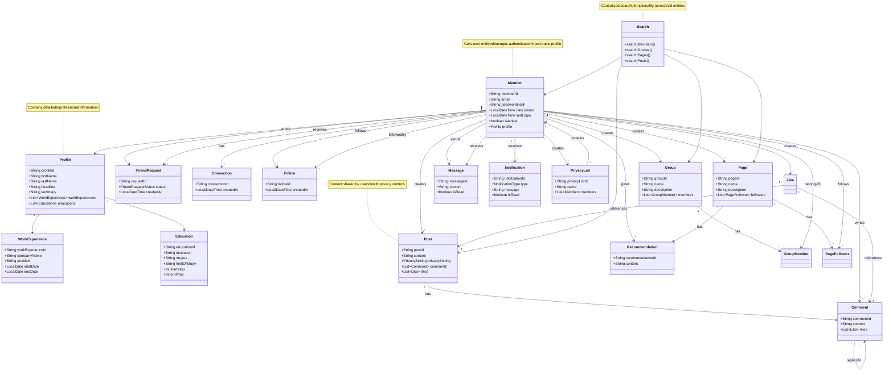
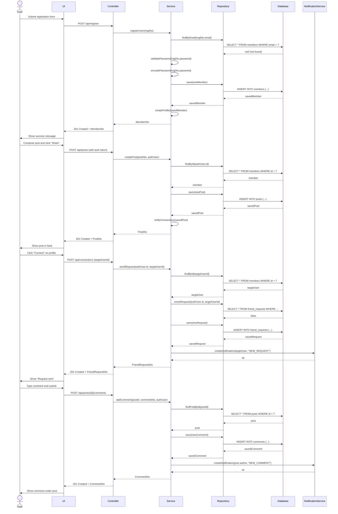
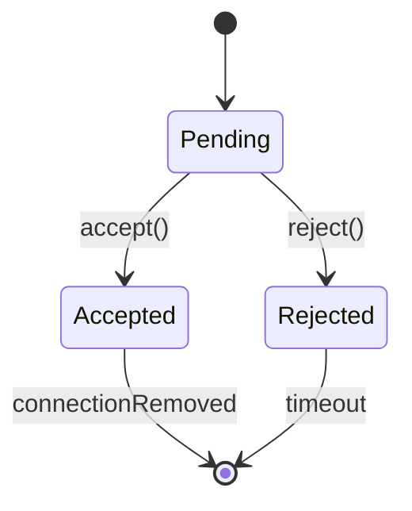
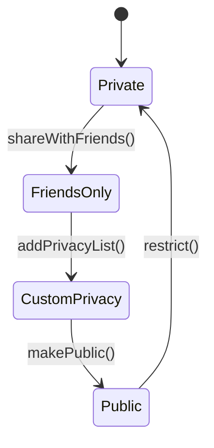
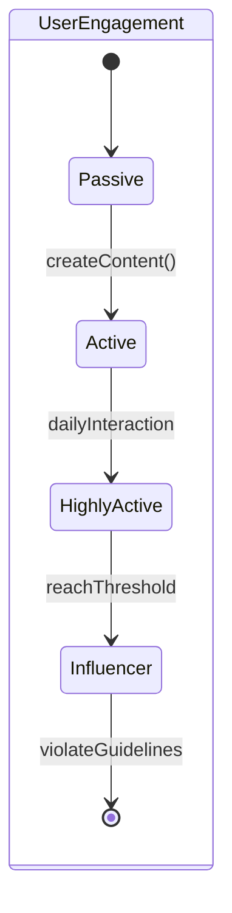
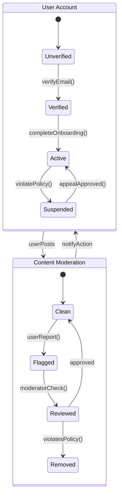

LinkedIn-like System - Low Level Design
---
Requirements
- Each member should be able to add information about their basic profile, work experience,
education, etc. 
- Any user of our system should be able to search other members, groups or pages by their
name. 
- Members should be able to send and accept/reject friend requests from other members. 
- Members should be able to follow other members without becoming their friend. 
- Members should be able to create groups and pages, as well as join already created groups,
and follow pages. 
- Members should be able to create new posts to share with their friends. 
- Members should be able to add comments to posts, as well as like or share a post or
comment. 
- Members should be able to create privacy lists containing their friends. Members can link any
post with a privacy list to make the post visible only to the members of that list. 
- Any member should be able to send messages to other members. 
- Any member should be able to add a recommendation for any page. 
- The system should send a notification to a member whenever there is a new message or
friend request or comment on their post. 
- Members should be able to search through posts, group for a word.

---

### Actors
1. Member (Regular User)
2. Admin (Special type of member with additional privileges)
3. System (Background processes for notifications, etc.)

### Core Classes
1. User/Member
2. Profile
3. WorkExperience
4. Education
5. FriendRequest
6. Connection
7. Group
8. Page
9. Post
10. Comment
11. Like
12. Share
13. PrivacyList
14. Message
15. Recommendation
16. Notification
17. Search


## Database Schema
### Tables and Relationships
1. Member (1:1 with Profile)
   - member_id (PK)
   - email 
   - password_hash
   - date_joined 
   - last_login 
   - is_active

2. Profile (1:M with WorkExperience, 1:M with Education)
   - profile_id (PK)
   - member_id (FK)
   - first_name
   - last_name
   - headline
   - summary
   - profile_picture_url
   - location

3. WorkExperience (M:1 with Profile)
   - work_experience_id (PK)
   - profile_id (FK)
   - company_name
   - position
   - start_date
   - end_date
   - description
   - is_current

4. Education (M:1 with Profile)
    - education_id (PK)
    - profile_id (FK)
    - institution
    - degree
    - field_of_study
    - start_year
    - end_year

5. FriendRequest (M:1 with Member for sender/receiver)
    - request_id (PK)
    - sender_id (FK to Member)
    - receiver_id (FK to Member)
    - status (PENDING/ACCEPTED/REJECTED)
    - created_at

6. Connection (M:M between Members)
    - connection_id (PK)
    - member_id (FK to Member)
    - member2_id (FK to Member)
    - created_at
    - description
    - is_current

7. Follow (M:M between Members)
    - follow_id (PK)
    - follower_id (FK to Member)
    - following_id (FK to Member)
    - created_at

8. Group (1:M with GroupMember)
    - group_id (PK)
    - creator_id (FK to Member)
    - name
    - description
    - created_at

9. GroupMember (M:1 with Group, M:1 with Member)
    - group_member_id (PK)
    - group_id (FK)
    - member_id (FK)
    - joined_at
    - role (MEMBER/ADMIN)

10. Page (1:M with PageFollower)
    - page_id (PK)
    - creator_id (FK to Member)
    - name
    - description
    - created_at

11. PageFollower (M:1 with Page, M:1 with Member)
    - page_follower_id (PK)
    - page_id (FK)
    - member_id (FK)
    - followed_at

12. Post (1:M with Comment, 1:M with Like, 1:M with Share)
    - post_id (PK)
    - author_id (FK to Member)
    - content
    - created_at
    - updated_at
    - privacy_setting (PUBLIC/FRIENDS/PRIVACY_LIST)

13. PostPrivacyList (M:M between Post and PrivacyList)
    - post_privacy_id (PK)
    - post_id (FK)
    - privacy_list_id (FK)

14. PrivacyList (1:M with PrivacyListMember)
    - privacy_list_id (PK)
    - creator_id (FK to Member)
    - name
    - created_at

15. PrivacyListMember (M:1 with PrivacyList, M:1 with Member)
    - privacy_list_member_id (PK)
    - privacy_list_id (FK)
    - member_id (FK)

16. Comment (1:M with Like)
    - comment_id (PK)
    - post_id (FK)
    - author_id (FK to Member)
    - content
    - created_at
    - parent_comment_id (FK, nullable) (for nested comments)

17. Like (M:1 with Member, M:1 with Post/Comment)
    - like_id (PK)
    - member_id (FK)
    - post_id (FK, nullable)
    - comment_id (FK, nullable)
    - created_at

18. Share (M:1 with Member, M:1 with Post)
    - share_id (PK)
    - member_id (FK)
    - post_id (FK)
    - shared_at
    - shared_content (optional additional text)


19. Message (M:1 with Member for sender/receiver)
    - message_id (PK)
    - sender_id (FK to Member)
    - receiver_id (FK to Member)
    - content
    - sent_at
    - read_at
    - is_read

20. Recommendation (M:1 with Member for giver/receiver, M:1 with Page)
    - recommendation_id (PK)
    - giver_id (FK to Member)
    - receiver_id (FK to Member, nullable)
    - page_id (FK, nullable)
    - content
    - created_at

21. Notification (M:1 with Member)
    - notification_id (PK)
    - recipient_id (FK to Member)
    - sender_id (FK to Member, nullable)
    - type (FRIEND_REQUEST/MESSAGE/COMMENT/LIKE/etc.)
    - reference_id (ID of the related entity)
    - message
    - created_at
    - is_read

### Relationships

1. Member 1:1 Profile (One member has one profile)
2. Profile 1:M WorkExperience (One profile can have multiple work experiences)
3. Profile 1:M Education (One profile can have multiple education records)
4. Member M:M Member through Connection (Members can be connected to multiple members)
5. Member M:M Member through Follow (Members can follow multiple members and be followed by multiple members)
6. Member M:M Member through FriendRequest (Members can send and receive multiple friend requests)
7. Member 1:M Group (One member can create multiple groups)
8. Member M:M Group through GroupMember (Many members can join many groups)
9. Group 1:M GroupMember (One group can have multiple members)
10. Member 1:M Page (One member can create multiple pages)
11. Member M:M Page through PageFollower (Many members can follow many pages)
12. Page 1:M PageFollower (One page can have multiple followers)
13. Member 1:M Post (One member can create multiple posts)
14. Post 1:M Comment (One post can have multiple comments)
15. Post 1:M Like (One post can have multiple likes)
16. Post 1:M Share (One post can be shared multiple times)
17. Post M:M PrivacyList through PostPrivacyList (One post can belong to multiple privacy lists)
18. Member 1:M PrivacyList (One member can create multiple privacy lists)
19. PrivacyList 1:M PrivacyListMember (One privacy list can have multiple members)
20. Member M:M PrivacyList through PrivacyListMember (Many members can be part of multiple privacy lists)
21. Comment 1:M Like (One comment can have multiple likes)
22. Comment 1:M Comment (One comment can have multiple nested comments)
23. Member 1:M Like (One member can like multiple posts/comments)
24. Member 1:M Share (One member can share multiple posts)
25. Member M:M Post through Like (Many members can like many posts)
26. Member M:M Comment through Like (Many members can like many comments)
27. Member 1:M Message (One member can send multiple messages)
28. Message M:1 Member for sender/receiver (Each message has a sender and receiver)
29. Member 1:M Recommendation (One member can give multiple recommendations)
30. Recommendation M:1 Page (Each recommendation is associated with a page or a member)
31. Member 1:M Notification (One member can receive multiple notifications)
32. Member M:M Member through Notification (Many members can send notifications to multiple members)

---

### Class Diagram



### Database schema

```mermaid
erDiagram
    MEMBER ||--o{ PROFILE : has
    MEMBER ||--o{ FRIEND_REQUEST : sends
    MEMBER ||--o{ FRIEND_REQUEST : receives
    MEMBER ||--o{ CONNECTION : "member1"
    MEMBER ||--o{ CONNECTION : "member2"
    MEMBER ||--o{ FOLLOW : follower
    MEMBER ||--o{ FOLLOW : following
    MEMBER ||--o{ GROUP_MEMBER : is_member
    MEMBER ||--o{ PAGE_FOLLOWER : follows
    MEMBER ||--o{ POST : creates
    MEMBER ||--o{ COMMENT : writes
    MEMBER ||--o{ LIKE : creates
    MEMBER ||--o{ SHARE : creates
    MEMBER ||--o{ PRIVACY_LIST : creates
    MEMBER ||--o{ PRIVACY_LIST_MEMBER : "in_list"
    MEMBER ||--o{ MESSAGE : sends
    MEMBER ||--o{ MESSAGE : receives
    MEMBER ||--o{ RECOMMENDATION : gives
    MEMBER ||--o{ RECOMMENDATION : receives
    MEMBER ||--o{ NOTIFICATION : receives

    PROFILE ||--o{ WORK_EXPERIENCE : has
    PROFILE ||--o{ EDUCATION : has

    GROUP ||--o{ GROUP_MEMBER : has
    GROUP ||--|| MEMBER : created_by

    PAGE ||--o{ PAGE_FOLLOWER : has
    PAGE ||--|| MEMBER : created_by
    PAGE ||--o{ RECOMMENDATION : has

    POST ||--o{ COMMENT : has
    POST ||--o{ LIKE : has
    POST ||--o{ SHARE : has
    POST ||--o{ POST_PRIVACY : "visible_to"
    POST ||--|| MEMBER : authored_by

    PRIVACY_LIST ||--o{ POST_PRIVACY : "used_by"
    PRIVACY_LIST ||--o{ PRIVACY_LIST_MEMBER : contains

    COMMENT ||--o{ LIKE : has
    COMMENT ||--o{ COMMENT : replies_to

    MEMBER {
        string member_id PK
        string email
        string password_hash
        datetime date_joined
        datetime last_login
        boolean is_active
    }

    PROFILE {
        string profile_id PK
        string member_id FK
        string first_name
        string last_name
        string headline
        string summary
        string profile_picture_url
        string location
    }

    WORK_EXPERIENCE {
        string work_experience_id PK
        string profile_id FK
        string company_name
        string position
        date start_date
        date end_date
        string description
        boolean is_current
    }

    EDUCATION {
        string education_id PK
        string profile_id FK
        string institution
        string degree
        string field_of_study
        int start_year
        int end_year
    }

    FRIEND_REQUEST {
        string request_id PK
        string sender_id FK
        string receiver_id FK
        enum status
        datetime created_at
    }

    CONNECTION {
        string connection_id PK
        string member1_id FK
        string member2_id FK
        datetime created_at
    }

    FOLLOW {
        string follow_id PK
        string follower_id FK
        string following_id FK
        datetime created_at
    }

    GROUP {
        string group_id PK
        string creator_id FK
        string name
        string description
        datetime created_at
    }

    GROUP_MEMBER {
        string group_member_id PK
        string group_id FK
        string member_id FK
        datetime joined_at
        enum role
    }

    PAGE {
        string page_id PK
        string creator_id FK
        string name
        string description
        datetime created_at
    }

    PAGE_FOLLOWER {
        string page_follower_id PK
        string page_id FK
        string member_id FK
        datetime followed_at
    }

    POST {
        string post_id PK
        string author_id FK
        string content
        datetime created_at
        datetime updated_at
        enum privacy_setting
    }

    POST_PRIVACY {
        string post_privacy_id PK
        string post_id FK
        string privacy_list_id FK
    }

    PRIVACY_LIST {
        string privacy_list_id PK
        string creator_id FK
        string name
        datetime created_at
    }

    PRIVACY_LIST_MEMBER {
        string privacy_list_member_id PK
        string privacy_list_id FK
        string member_id FK
    }

    COMMENT {
        string comment_id PK
        string post_id FK
        string author_id FK
        string content
        datetime created_at
        string parent_comment_id FK
    }

    LIKE {
        string like_id PK
        string member_id FK
        string post_id FK
        string comment_id FK
        datetime created_at
    }

    SHARE {
        string share_id PK
        string member_id FK
        string post_id FK
        datetime shared_at
        string shared_content
    }

    MESSAGE {
        string message_id PK
        string sender_id FK
        string receiver_id FK
        string content
        datetime sent_at
        datetime read_at
        boolean is_read
    }

    RECOMMENDATION {
        string recommendation_id PK
        string giver_id FK
        string receiver_id FK
        string page_id FK
        string content
        datetime created_at
    }

    NOTIFICATION {
        string notification_id PK
        string recipient_id FK
        string sender_id FK
        enum type
        string reference_id
        string message
        datetime created_at
        boolean is_read
    }
```



### Sequence Diagram



### State Diagram

```mermaid
stateDiagram-v2
    [*] --> Guest
    Guest --> Registered: register()
    Registered --> ProfileComplete: addProfileInfo()
    Registered --> ProfileIncomplete: skipProfile()

    state ProfileIncomplete {
        [*] --> BasicInfo
        BasicInfo --> WorkHistory: addWorkExperience()
        WorkHistory --> Education: addEducation()
        Education --> Skills: addSkills()
        Skills --> [*]
    }

    state ProfileComplete {
        [*] --> Active
        Active --> Connected: sendRequest()\nacceptRequest()
        Active --> Following: followUser()
        
        state Connected {
            [*] --> RequestSent
            RequestSent --> Connected: requestAccepted()
            RequestSent --> Rejected: requestRejected()
            Connected --> [*]: removeConnection()
        }
        
        state Following {
            [*] --> FollowingUser
            FollowingUser --> [*]: unfollow()
        }
    }

    state Post {
        [*] --> Draft
        Draft --> Published: publish()
        Published --> Edited: edit()
        Edited --> Published: update()
        Published --> Deleted: delete()
        Published --> Archived: archive()
    }

    state FriendRequest {
        [*] --> Pending
        Pending --> Accepted: accept()
        Pending --> Rejected: reject()
        Accepted --> [*]: connectionEstablished
        Rejected --> [*]: requestClosed
    }

    state Notification {
        [*] --> Unread
        Unread --> Read: view()
        Unread --> Dismissed: dismiss()
        Read --> Archived: archive()
    }

    state GroupMembership {
        [*] --> Member
        Member --> Admin: promote()
        Admin --> Member: demote()
        Member --> Banned: ban()
        Banned --> [*]: unbanned
    }

    Registered --> [*]: deactivateAccount()
    ProfileComplete --> [*]: deactivateAccount()
```
1. **User States**:
    - Guest → Registered (Upon account creation)
    - ProfileIncomplete → ProfileComplete (After adding profile details)
    - AnyState → Deactivated (Account deactivation)

2. **Connection States**:
    - FriendRequest: Pending → Accepted / Rejected
    - Follow: NotFollowing → Following → Unfollowed

3. **Post States**:
    - Draft → Published → Edited / Deleted / Archived
    - ContentModeration: Pending → Approved / Rejected

4. **Notification States**:
    - Unread → Read / Dismissed → Archived
    - NotificationLifecycle: Created → Notified → Expired

5. **Group Membership States**:
    - Member → Admin (Promotion)
    - Admin → Member (Demotion)
    - Member → Banned (Banning workflow)
    - Banned → Reinstated (Unbanning process)


### Important State Machines:

1. Friend Request State Machine:

2. Post Visibility State Machine:


3. User Engagement State Machine:


4. Alternative View (Nested States):

