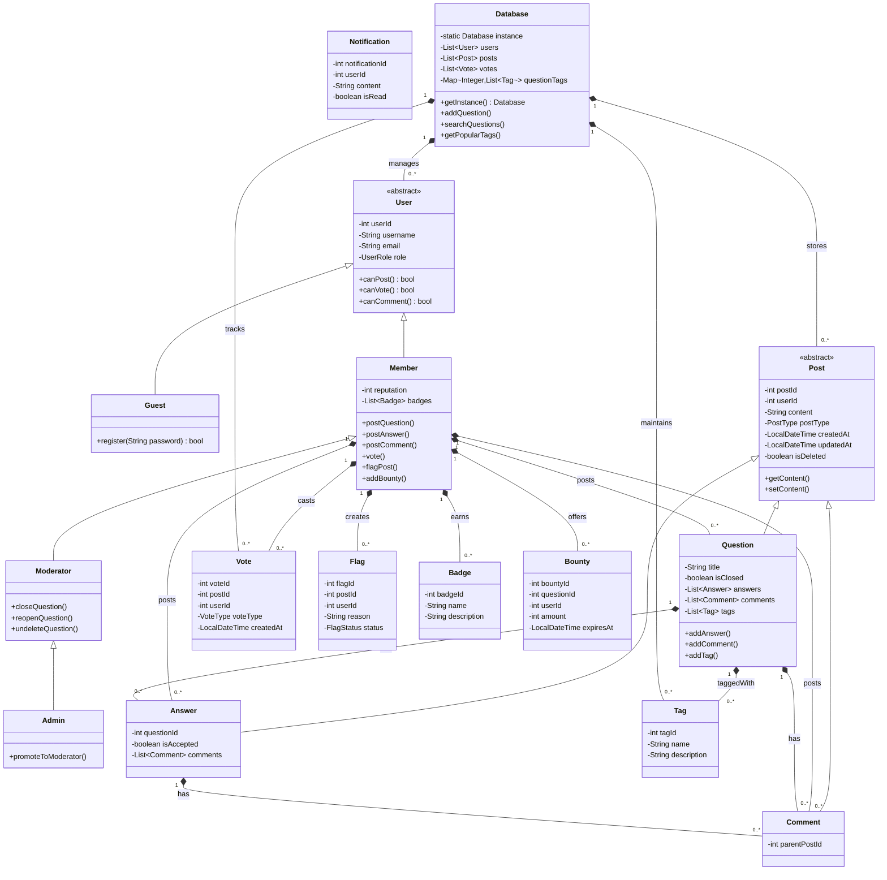

Stack Overflow LLD
---

### Requirements
- Any non-member (guest) can search and view questions. However, to add or upvote a question,
they have to become a member. 
- Members should be able to post new questions.
- Members should be able to add an answer to an open question.
- Members can add comments to any question or answer.
- A member can upvote a question, answer or comment.
- Members can flag a question, answer or comment, for serious problems or moderator attention.
- Any member can add a bounty to their question to draw attention.
- Members will earn badges for being helpful.
- Members can vote to close a question; Moderators can close or reopen any question.
- Members can add tags to their questions. A tag is a word or phrase that describes the topic of the
question.
- Members can vote to delete extremely off-topic or very low-quality questions.
- Moderators can close a question or undelete an already deleted question.
- The system should also be able to identify most frequently used tags in the questions.

## Stack Overflow-like Q&A Platform - Low Level Design

---

### Classes Identification
1. User (Abstract)
   - Guest 
   - Member 
   - Moderator (extends Member)
   - Admin (extends Moderator)

2. Post (Abstract)
   - Question 
   - Answer 
   - Comment 
3. Vote 
   - Upvote 
   - Downvote 

4. Flag 
5. Badge 
6. Tag 
7. Bounty
8. Notification 
9. Database (Singleton)

---

### Database Schema
#### Tables

1. users 
   - user_id (PK)
   - username 
   - email 
   - password_hash 
   - role (guest/member/moderator/admin)
   - reputation 
   - created_at 
   - updated_at 

2. posts 
   - post_id (PK)
   - user_id (FK to users)
   - content 
   - post_type (question/answer/comment)
   - parent_id (FK to posts, nullable for questions)
   - created_at 
   - updated_at 
   - is_closed (boolean)
   - is_deleted (boolean)

3. tags
   - tag_id (PK)
   - name 
   - description 
   - created_at

4. question_tags
   - question_id (FK to posts)
   - tag_id (FK to tags)
   - (Composite PK: question_id, tag_id)

5. votes
   - vote_id (PK)
   - post_id (FK to posts)
   - user_id (FK to users)
   - vote_type (upvote/downvote)
   - created_at
   - (Unique constraint: post_id, user_id)

6. flags 
   - flag_id (PK)
   - post_id (FK to posts)
   - user_id (FK to users)
   - reason 
   - created_at 
   - status (pending/resolved)

7. badges
   - badge_id (PK)
   - name 
   - description

8. user_badges 
   - user_id (FK to users)
   - badge_id (FK to badges)
   - awarded_at
   - (Composite PK: user_id, badge_id)

9. bounties
   - bounty_id (PK)
   - question_id (FK to posts)
   - user_id (FK to users)
   - amount 
   - created_at 
   - expires_at

10. notifications
    - notification_id (PK)
    - user_id (FK to users)
    - content 
    - is_read (boolean)
    - created_at

---
## Relationships
### 1:1 Relationships:
  - A Bounty belongs to one Question
  - A Question can have one Bounty (optional)

### 1:M Relationships:

- A User can create many Posts (Questions, Answers, Comments)
- A Question can have many Answers 
- A Post (Question/Answer) can have many Comments 
- A User can receive many Notifications 
- A User can earn many Badges 
- A User can cast many Votes 
- A User can create many Flags

### M:M Relationships:
- Questions and Tags (through question_tags)
- Users and Badges (through user_badges)




---
## Key Features Implemented
1. User System: Guest, Member, Moderator, Admin hierarchy with appropriate permissions 
2. Post System: Questions, Answers, Comments with proper relationships 
3. Voting: Upvote/downvote functionality 
4. Moderation: Close/reopen/undelete questions 
5. Tagging: Questions can be tagged with multiple tags 
6. Bounties: Members can add bounties to questions 
7. Command Line Interface: Basic menu-driven interface for all operations
---

## How to Extend
1. Add persistence by connecting to a real database 
2. Implement reputation system and badge awarding logic 
3. Add more sophisticated search functionality 
4. Implement notification system 
5. Add more moderator/admin features 
6. Improve error handling and input validation
---

### Why database is of map or list type of datastructure for above LLD?
In the provided LLD (Low-Level Design), the Database class uses Java Collections (List, Map) as its underlying data structures rather than connecting to a real database. This design choice was made for several important reasons:

1. Simplicity for Demonstration Purposes
   - The implementation is meant to be a self-contained, runnable example that doesn't require external dependencies 
   - Using in-memory collections makes it easier to understand the core design patterns without DB complexities 
   - Perfect for interviews/design discussions where focus is on OOP rather than persistence

2. Logical Representation of Relationships
   - The chosen data structures mirror how a real database would work:

| Data Structure         | Purpose                          | Analogous Database Table | Key Relationships               |
|------------------------|----------------------------------|--------------------------|---------------------------------|
| `List<Post>`           | Stores all questions/answers/comments | `posts`               | `post_id` (PK), `user_id` (FK)  |
| `Map<Integer, List<Tag>>` | Question-to-Tag mappings         | `question_tags` (Junction table) | `question_id` (FK), `tag_id` (FK) |
| `List<User>`           | Registered user accounts          | `users`                  | `user_id` (PK)                  |
| `List<Vote>`           | All upvotes/downvotes            | `votes`                  | `vote_id` (PK), `post_id` (FK), `user_id` (FK) |
| `List<Badge>`          | Available badge types            | `badges`                 | `badge_id` (PK)                 |
| `List<Flag>`           | Content flags/reports            | `flags`                  | `flag_id` (PK), `post_id` (FK), `user_id` (FK) |
| `List<Bounty>`         | Active question bounties         | `bounties`               | `bounty_id` (PK), `question_id` (FK), `user_id` (FK) |
| `List<Notification>`    | User notifications               | `notifications`          | `notification_id` (PK), `user_id` (FK) |

3. Correctness for LLD Context
   - In LLD, we focus on interfaces and relationships rather than storage implementation 
   - The Database class acts as a facade - its internal implementation could be swapped for a real DB later 
   - Methods like addQuestion(), searchQuestions() properly represent the contract that would exist with a real DB

4. Performance Not a Primary Concern
   - For small-scale applications (like this CLI demo), in-memory collections are sufficient.

5. Transaction Boundaries Are Implicit
   - Each method (like addQuestion()) conceptually represents a transactional operation 
   - In a real DB, these would use @Transactional

### When to Use Real Database Instead:
1. Data Persistence Needed (restart resilience)
2. Concurrent Access by multiple users 
3. Large Datasets that can't fit in memory 
4. Advanced Querying (JOINs, aggregation)
5. Production Environment
---
### What is a Facade?
A Facade is a design pattern that provides a simplified interface to a complex subsystem (a set of classes, libraries, or APIs). 
It:
1. Hides complexity – Clients interact with a single interface instead of managing multiple components.
- Instead of forcing clients to:
  - Manually store posts in a `List<Post>`
  - Track tags in a `Map<Integer, List<Tag>>`
  - Manage votes in a `List<Vote>`
2. Hides Low-Level Data Structures
   - Clients don’t need to know about:
   ```
    private List<Post> posts;  
    private Map<Integer, List<Tag>> questionTags;  
   ```
   - They interact with high-level methods like addAnswer() or getPopularTags().
3. Centralizes Access
   - All data operations (CRUD, search, voting) go through Database, making it the single entry point for persistence logic.

4. Mimics a Real Database’s Role
- Even though it uses in-memory collections, it behaves like a database abstraction layer, similar to:
  - Spring’s JpaRepository 
  - ORMs like Hibernate

5. Decouples code – Changes in the subsystem don’t affect client code. 
6. Organizes workflows – Coordinates interactions between subsystems behind the scenes.
---

### When to Replace the Facade
- If the system grows, you might:
  - Split it into smaller facades (e.g., `PostStore`, `UserManager`). 
  - Use real databases (e.g., replace `List<Post>` with `JpaRepository<Post, Long>`).
---

### The Database facade:
- ✅ Reduces complexity for clients. 
- ✅ Decouples business logic from storage details.
- ✅ Mimics real-world database abstractions.