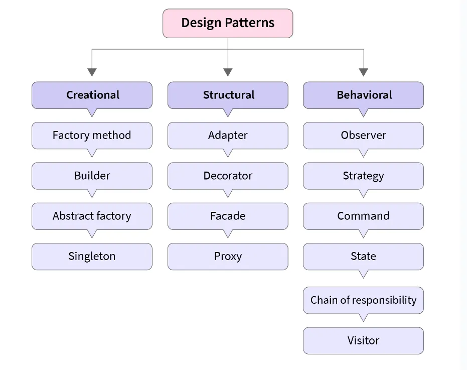
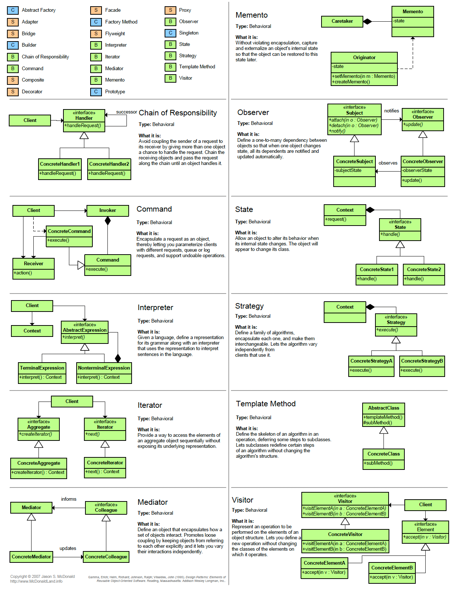
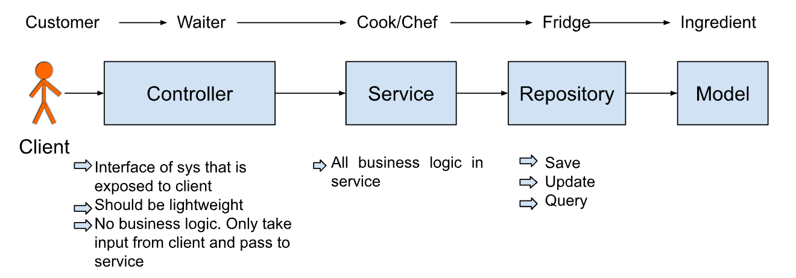

# Design Patterns:

Design patterns are reusable solutions to common software development problems. They provide a template for solving similar problems in different scenarios by providing a set of best practices and guidelines. These patterns help developers to write efficient, maintainable, and scalable code. Design patterns can be classified into three categories: creational patterns, structural patterns, and behavioral patterns. Creational patterns deal with object creation mechanisms, structural patterns deal with object composition, and behavioral patterns deal with object communication and delegation.

## How to approach a design problem:

## Overview: (1-2mins)
It's important to think like the person who is interviewing you. There are two situations to consider when doing this: either you have knowledge about the design problem being asked, or you don't. In either case, it's helpful to align your thinking with the interviewer's perspective.
1. When you know the system/problem then you can reply like
Thank you for your question. If I understand correctly, you are asking me to design a system with certain specific features, such as this, this, and this. Is that correct understanding of what you are looking for me to design?

 - Just to clarify, when you say "designing XYZ," are you asking me to create an entity design in which various entities that work together within the XYZ system? Or do you mean that you want me to develop a complete working system for XYZ, which would involve other related classes in addition to the entities involved in the XYZ system?

- Can you clarify how the XYZ system will receive input? Should I create a REST API or for now can it accept input from the command line or have default values already set in the Main program?

 - If we want to save data in the XYZ system, we may need to use a database. Should I set up a connection to the database, or is it okay to temporarily store the data in the memory for now?
 
2. **When you don’t know the system ?**
- Thanks for the question but, unfortunately, I am not really aware of what XYZ systems are. Do you mind giving a brief overview of what you mean by XYZ system so, I can proceed accordingly with requirement gathering or probably asking some questions around that etc? And then proceeding with the design.

A few questions: repeat the same as above.

### Gather Req & Clarify Req: (5-8 mins)

1. Suggest ideas with rationale and ask if we should suggest that.
2. Suggest **5-8 core** features that are easy to code. Don’t suggest complex ideas.
3. Try to visualize the system/entities and suggest ideas from what you visualize.
4. List down the point/requirement that is confirmed
5. For every feature, think if there are any edge cases or future scope changes (can feature evolve in the future) and clarify the same with the interviewer.

### Class Diagram:
1. Try to visualize the requirements.
2. Visualize the system by going outside to inside of the system to figure out different entities.
3. Find all nouns in the requirement
4. You are not expected to come up with all classes that will be there when you will code the system.
5. Instead, you are expected to come up with all entities, interfaces & enums around those and any classes wrt design patterns.

### Schema Design:
1. For each class that represents an entity in the class diagram, create a table in the schema design.
2. For each primitive attribute (int/boolean/string) in each entity class, put that attribute as a column in the corresponding table (non-object & non-associative attribute)
3. For every non-primitive attribute (relation with another class)
   - Find the cardinality of the relation
   - Represent that relation as per rules to represent that cardinality.
4. Inheritance is not represented by multiple tables with the same attributes. Instead, one table with common attributes and other tables with specific attributes and foreign keys.

### How to Code:
1. Project Structure (your code base should be structured as per the best practice in the industry). EX: MVC architecture
2. At least some of the requirements must be running end to end.
3. Code all the models (classes in the class diagram) first.
4. Go requirement by requirement in any order. The most preferable requirement should be an independent one or an easy one than others. Try to build the main core feature then go with other features.
5. While implementing requirements, implement each class/interface needed to satisfy that requirement.

6. The model represents entities/data that are used to store in DB via repository.

link : https://blog.bytebytego.com/p/ep17-design-patterns-cheat-sheet

**Easy**

- [Design Parking Lot](https://github.com/ashishps1/awesome-low-level-design/blob/main/problems/parking-lot.md)
- [Design a Vending Machine](https://github.com/ashishps1/awesome-low-level-design/blob/main/problems/vending-machine.md)
- [Design Stack Overflow](https://github.com/ashishps1/awesome-low-level-design/blob/main/problems/stack-overflow.md)
- [Design Logging Framework](https://github.com/ashishps1/awesome-low-level-design/blob/main/problems/logging-framework.md)
- [Design Coffee Vending Machine](https://github.com/ashishps1/awesome-low-level-design/blob/main/problems/coffee-vending-machine.md)
- [Design Traffic Signal Control System](https://github.com/ashishps1/awesome-low-level-design/blob/main/problems/traffic-signal.md)
- [Design a Task Management System](https://github.com/ashishps1/awesome-low-level-design/blob/main/problems/task-management-system.md)

**Medium**

- [Design Pub Sub System](https://github.com/ashishps1/awesome-low-level-design/blob/main/problems/pub-sub-system.md)
- [Design Tic Tac Toe Game](https://github.com/ashishps1/awesome-low-level-design/blob/main/problems/tic-tac-toe.md)
- [Design Car Rental System](https://github.com/ashishps1/awesome-low-level-design/blob/main/problems/car-rental-system.md)
- [Design an ATM](https://github.com/ashishps1/awesome-low-level-design/blob/main/problems/atm.md)
- [Design Hotel Management System](https://github.com/ashishps1/awesome-low-level-design/blob/main/problems/hotel-management-system.md)
- [Design LinkedIn](https://github.com/ashishps1/awesome-low-level-design/blob/main/problems/linkedin.md)
- [Design a Social Network like Facebook](https://github.com/ashishps1/awesome-low-level-design/blob/main/problems/social-networking-service.md)
- [Design an Elevator System](https://github.com/ashishps1/awesome-low-level-design/blob/main/problems/elevator-system.md)
- [Design a Library Management System](https://github.com/ashishps1/awesome-low-level-design/blob/main/problems/library-management-system.md)
- [Design Restaurant Management System](https://github.com/ashishps1/awesome-low-level-design/blob/main/problems/restaurant-management-system.md)
- [Design Airline Management System](https://github.com/ashishps1/awesome-low-level-design/blob/main/problems/airline-management-system.md)
- [Design a Digital Wallet System](https://github.com/ashishps1/awesome-low-level-design/blob/main/problems/digital-wallet-system.md)
- [Design an Online Auction System](https://github.com/ashishps1/awesome-low-level-design/blob/main/problems/online-auction-system.md)
- [Design a Concert Ticket Booking System](https://github.com/ashishps1/awesome-low-level-design/blob/main/problems/concert-ticketing-system.md)
- [Design a Cache using LRU Eviction Policy](https://github.com/ashishps1/awesome-low-level-design/blob/main/problems/lru-cache.md)

**Hard**

- [Design Movie Ticket Booking System](https://github.com/ashishps1/awesome-low-level-design/blob/main/problems/movie-ticket-booking-system.md)
- [Design Splitwise](https://github.com/ashishps1/awesome-low-level-design/blob/main/problems/splitwise.md)
- [Design a Snake and Ladder game](https://github.com/ashishps1/awesome-low-level-design/blob/main/problems/snake-and-ladder.md)
- [Design Online Shopping System like Amazon](https://github.com/ashishps1/awesome-low-level-design/blob/main/problems/online-shopping-service.md)
- [Design Online Stock Brokerage System](https://github.com/ashishps1/awesome-low-level-design/blob/main/problems/online-stock-brokerage-system.md)
- [Design CricInfo](https://github.com/ashishps1/awesome-low-level-design/blob/main/problems/cricinfo.md)
- [Design Chess Game](https://github.com/ashishps1/awesome-low-level-design/blob/main/problems/chess-game.md)
- [Design Ride-Sharing Service (like Uber)](https://github.com/ashishps1/awesome-low-level-design/blob/main/problems/ride-sharing-service.md)
- [Design Online Food Delivery Service (like Swiggy)](https://github.com/ashishps1/awesome-low-level-design/blob/main/problems/food-delivery-service.md)
- [Design Music Streaming Service (like Spotify)](https://github.com/ashishps1/awesome-low-level-design/blob/main/problems/music-streaming-service.md)
- [Design University Course Registration System](https://github.com/ashishps1/awesome-low-level-design/blob/main/problems/course-registration-system.md)
