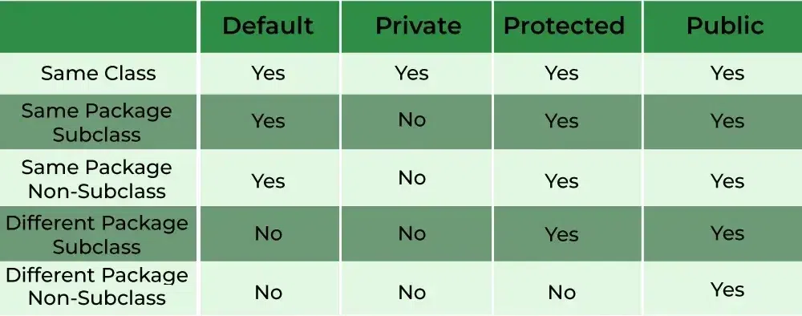

Here’s a basic algorithm for using access modifiers in Java:
- **Define a class**: Create a class that represents the object you want to manage.
- **Define instance variables**: Within the class, define instance variables that represent the data you want to manage.
- **Specify an access modifier**: For each instance variable, specify an access modifier that determines the visibility of the variable. The three main access modifiers in Java are private, protected, and public.
- **Use private for variables that should only be accessible within the class**: If you want to prevent access to a variable from outside the class, use the private access modifier. This is the most restrictive access modifier and provides the greatest level of encapsulation.
- **Use protected for variables that should be accessible within the class and its subclasses**: If you want to allow access to a variable from within the class and its subclasses, use the protected access modifier. This is less restrictive than private and provides some level of inheritance.
- **Use public for variables that should be accessible from anywhere**: If you want to allow access to a variable from anywhere, use the public access modifier. This is the least restrictive access modifier and provides the least amount of encapsulation.
- **Use accessor and mutator methods to manage access to the variables**: In order to access and modify the variables, use accessor (getter) and mutator (setter) methods, even if the variables have a public access modifier. This provides a level of abstraction and makes your code more maintainable and testable.

- **Default** access modifier can be accessed in **same package** i.e package level security.
- **Protected** can be accessed in **subclass(child class) along with diffrent package**