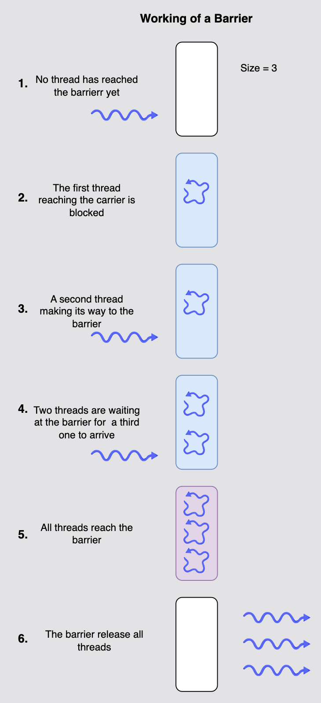

# CyclicBarrier

## Explanation
`CyclicBarrier` is a synchronization mechanism introduced in JDK 5 in the `java.util.concurrent` package. It allows multiple threads to wait for each other at a common point (barrier) before continuing execution. The threads wait for each other by calling the `await()` method on the `CyclicBarrier`. All threads that wait for each other to reach barrier are called parties. *You can read-up on designing and implementing a barrier for an interview question here.

`CyclicBarrier` is initialized with an integer that denotes the number of threads that need to call the `await()` method on the barrier. Second argument in `CyclicBarrier’s` constructor is a `Runnable` instance that includes the action to be executed once the last thread arrives. The most useful property of `CyclicBarrier` is that it can be `reset` to its initial state by calling the `reset()` method. It can be reused after all the threads have been released. Lets take an example where `CyclicBarrier` is initialized with 3 worker threads that will have to cross the barrier. All the threads need to call the `await()` method. Once all the threads have reached the barrier, it gets broken and each thread starts its execution from that point onwards.

```java
/**
 * Runnable task for each thread.
 */
class Task implements Runnable {
    
    private CyclicBarrier barrier;
    
    public Task(CyclicBarrier barrier) { 
        this.barrier = barrier;
    }
    
    //Await is invoked to wait for other threads
    @Override
    public void run() {
        try {
            System.out.println(Thread.currentThread().getName() + " is waiting on barrier");
            barrier.await();
            //printing after crossing the barrier
            System.out.println(Thread.currentThread().getName() + " has crossed the barrier");
        } catch (InterruptedException ex) {
            Logger.getLogger(Task.class.getName()).log(Level.SEVERE, null, ex);
        } catch (BrokenBarrierException ex) {
            Logger.getLogger(Task.class.getName()).log(Level.SEVERE, null, ex);
        }
    }

}


/**
 * Main thread that demonstrates how to use CyclicBarrier.
 */
public class Main {
    public static void main (String args[]) {

        //Creating CyclicBarrier with 3 parties i.e. 3 Threads needs to call await()
        final CyclicBarrier cb = new CyclicBarrier(3, new Runnable(){

            //Action that executes after the last thread arrives
            @Override
            public void run(){
                System.out.println("All parties have arrived at the barrier, lets continue execution.");
            }
        });

        //starting each thread
        Thread t1 = new Thread(new Task(cb), "Thread 1");
        Thread t2 = new Thread(new Task(cb), "Thread 2");
        Thread t3 = new Thread(new Task(cb), "Thread 3");

        t1.start();
        t2.start();
        t3.start();
    }
}
```

