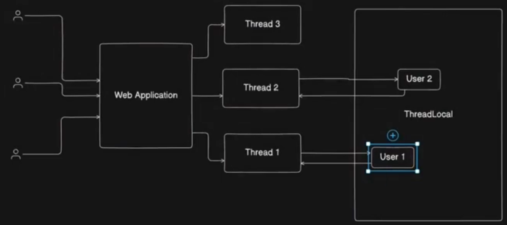

# Java Multithreading and Concurrency Interview Revision Guide

#### Q Java Multithreading is a critical aspect of Java programming, especially in today's world where parallel and concurrent processing are becoming increasingly important. Concurrency in Java stands as one of the most intricate and advanced subjects often discussed in technical interviews.

Imagine Java multithreading as a team of skilled chefs working together in a large kitchen to prepare a complex meal. Each chef represents a thread in Java, capable of independently carrying out tasks.

- Just like the chefs can divide tasks efficiently to speed up meal preparation, Java threads can execute multiple tasks simultaneously, making the program more efficient and responsive.
- If one chef encounters a bottleneck, such as waiting for an ingredient to be prepared, other chefs can continue working on different tasks, ensuring maximum utilization of resources and reducing idle time.
- By coordinating and communicating effectively, the chefs can synchronize their efforts to ensure that all components of the meal come together harmoniously at the right time. Similarly, Java provides mechanisms like synchronization and locks to coordinate thread activities and avoid conflicts.
- When the meal is ready, the chefs present a beautifully orchestrated dish. Similarly, in Java multithreading, when threads complete their tasks and synchronize their results, the program can deliver a seamless and high-performance outcome.

#### Q What Is the Difference Between a Process and a Thread?
In Java programming, a process and a thread are both units of execution, but they operate at different levels of abstraction and have distinct characteristics.

A process can be thought of as an independent entity that runs in its own memory space and has its own resources, including memory, file handles, and system resources. Processes are heavyweight entities, and each process operates independently of other processes. Examples of processes include running multiple instances of a web browser or a text editor on your computer. Each instance operates as a separate process, with its own memory space and resources.

On the other hand, a thread is a lightweight unit of execution that exists within a process. Threads share the same memory space and resources as the process to which they belong. Multiple threads can exist within a single process and share resources such as memory and file handles. Threads are used to achieve concurrency within a program, allowing multiple tasks to be performed simultaneously. For example, in a web server application, multiple threads can handle incoming client requests concurrently, improving the server's responsiveness and efficiency.

> Real-World Use Case Examples:
> - **Web Browser**: When you open multiple tabs in a web browser, each tab typically runs as a separate process. This isolation ensures that if one tab crashes or experiences issues, it does not affect the other tabs or the browser itself. Within each tab, multiple threads handle tasks such as rendering web pages, processing user input, and downloading resources concurrently.
> - **Word Processing Application**: In a word processing application like Microsoft Word, the application itself runs as a process. Within the application, various threads handle tasks such as user interface interactions, spell-checking, auto-saving, and printing. These threads operate concurrently, providing a smooth and responsive user experience.


#### How can we create a Thread in Java?
 - You can create a thread instance by either extending the Thread class or implementing the Runnable interface. Once you have created a thread instance, you can start it by calling the start() method. Please find below the code snippet for both the approaches:
```java
// Define a class that extends Thread
class MyThread extends Thread {
    public void run() {
        // Code to be executed by the thread
        System.out.println("Thread running: " + Thread.currentThread().getName());
    }
}

public class com.manish.OOD.CreationalDesign.BuilderDesign.Pizza.Main {
    public static void main(String[] args) {
        // Create an instance of MyThread
        MyThread myThread = new MyThread();
        // Start the thread
        myThread.start();
    }
}

```

```java
// Define a class that implements the Runnable interface
class MyRunnable implements Runnable {
    public void run() {
        // Code to be executed by the thread
        System.out.println("Thread running: " + Thread.currentThread().getName());
    }
}

public class com.manish.OOD.CreationalDesign.BuilderDesign.Pizza.Main {
    public static void main(String[] args) {
        // Create an instance of MyRunnable
        MyRunnable myRunnable = new MyRunnable();
        // Create a Thread instance and pass MyRunnable as a parameter
        Thread thread = new Thread(myRunnable);
        // Start the thread
        thread.start();
    }
}
```

#### Describe the Different States of a Thread?
During its lifecycle, a thread in Java can exist in several states, each representing a different stage of its execution. Please find below the different states of a thread:

**New:**
When a thread is created but not yet started, it is in the "New" state.
In this state, the thread has been instantiated, but the start() method has not been called.

**Runnable:**
After calling the start() method, the thread moves to the "Runnable" state.
In this state, the thread is eligible to run, but the scheduler has not yet selected it to be the running thread.

**Running:**
When the thread scheduler selects a thread from the "Runnable" state for execution, it enters the "Running" state.
In this state, the thread's code is actively being executed by the CPU.

**Blocked (or Waiting):**
A thread enters the "Blocked" state when it is temporarily inactive, typically because it is waiting for a resource or condition to become available.
For example, a thread may be blocked while waiting for I/O operations to complete or waiting to acquire a lock.

**Timed Waiting:**
Threads can also enter a "Timed Waiting" state, where they pause execution for a specified period.
This state occurs when a thread calls methods such as sleep() or join() with a specified timeout.

**Terminated:**
The final state of a thread is "Terminated."
This state indicates that the thread has completed its execution and will not run further.
Threads can enter this state either by successfully completing their task or by being explicitly stopped.

**Real-World Use Case:**

Imagine you're building a chat application. Each user's interaction with the chat interface is handled by a separate thread. Here's how the different thread states might come into play:

**New:** When a new user opens the chat application, a thread is created to handle their interactions.

**Runnable:** Once the user logs in, their thread transitions to the "Runnable" state, awaiting execution by the thread scheduler.

**Running:** When the scheduler selects the user's thread for execution, it enters the "Running" state, actively processing messages and user inputs.

**Blocked:** If the user sends a message and it needs to be sent over the network, the thread might enter the "Blocked" state while waiting for the network I/O operation to complete.

**Terminated:** Once the user logs out or closes the application, their thread enters the "Terminated" state, indicating the end of its lifecycle.


#### What Is a Daemon Thread and how to create a Daemon Thread? What are the real use cases of Daemon thread?
A daemon thread in Java is a special type of thread that runs in the background, providing services to other threads or performing tasks that are not critical to the application's lifecycle. Unlike user threads, daemon threads do not prevent the JVM from exiting when all user threads have finished executing. They are automatically terminated when all non-daemon threads have exited or when the JVM shuts down.

##### Real-World Use Cases:

**Garbage Collection:** Daemon threads are commonly used by the JVM for tasks such as garbage collection. The JVM creates a daemon thread to perform garbage collection in the background, ensuring that unused memory is reclaimed while the application continues to execute.

**Monitoring Services:** Daemon threads can be used to monitor system resources or perform periodic maintenance tasks in the background. For example, a daemon thread might monitor disk usage, network traffic, or system performance metrics without interfering with the main application's execution.

**Background Tasks:** In server-side applications, daemon threads can be used to handle background tasks such as logging, sending periodic heartbeats to a monitoring system, or cleaning up temporary files. These tasks are essential for the application's operation but do not require dedicated user threads.

By using daemon threads, you can offload non-critical tasks to background threads, improving the overall responsiveness and efficiency of your Java applications

To create a daemon thread in Java, you simply need to set the daemon flag to true before starting the thread.

```java
public class DaemonThreadExample {
    public static void main(String[] args) {
        Thread daemonThread = new Thread(() -> {
            while (true) {
                System.out.println("Daemon thread is running...");
                try {
                    Thread.sleep(1000); // Simulate some task
                } catch (InterruptedException e) {
                    e.printStackTrace();
                }
            }
        });
        daemonThread.setDaemon(true); // Set the thread as daemon
        daemonThread.start(); // Start the daemon thread
    }
}

```

#### What Is the Difference Between the Runnable and Callable Interfaces? https://www.geeksforgeeks.org/difference-between-callable-and-runnable-in-java/
The Runnable and Callable interfaces in Java both represent tasks that can be executed by threads, but they differ in several key aspects:

##### Return Value:
- The Runnable interface does not return a result when its task completes. Its run() method has a void return type.
- The Callable interface, on the other hand, can return a result when its task completes. It defines a call() method that returns a result of a specified type.

##### Exception Handling:
- In the Runnable interface, any checked exceptions thrown by the run() method must be caught and handled within the method itself.
- The Callable interface allows the call() method to throw checked exceptions. These exceptions can be caught and handled by the calling code.

##### Usage with Executors:
- The Runnable interface is primarily used with the Executor framework for executing tasks asynchronously in a thread pool.
- The Callable interface is used with the ExecutorService framework, which provides additional features such as the ability to submit tasks that return values and handle exceptions.

```java
// Java Program to illustrate Callable interface 

// Importing classes from java.util package 
import java.util.Random; 
import java.util.concurrent.Callable; 
import java.util.concurrent.Future;
import java.util.concurrent.ExecutorService;
import java.util.concurrent.Executors;

// Class
// Implementing the Callable interface
class CallableMessage implements Callable<String>{
public String call() throws Exception{
	return "Hello World!";
} 
}

public class CallableExample{
static ExecutorService executor = Executors.newFixedThreadPool(2);
	public static void main(String[] args) throws Exception{
		CallableMessage task = new CallableMessage();
		Future<String> message = executor.submit(task);
		System.out.println(message.get().toString());
	}
}
//___________________________________________________________________________________________
package java.util.concurrent;

/**
 * A task that returns a result and may throw an exception.
 * Implementors define a single method with no arguments called
 * {@code call}.
 *
 * <p>The {@code Callable} interface is similar to {@link
 * java.lang.Runnable}, in that both are designed for classes whose
 * instances are potentially executed by another thread.  A
 * {@code Runnable}, however, does not return a result and cannot
 * throw a checked exception.
 *
 * <p>The {@link Executors} class contains utility methods to
 * convert from other common forms to {@code Callable} classes.
 *
 * @see Executor
 * @since 1.5
 * @author Doug Lea
 * @param <V> the result type of method {@code call}
 */
@FunctionalInterface
public interface Callable<V> {
    /**
     * Computes a result, or throws an exception if unable to do so.
     *
     * @return computed result
     * @throws Exception if unable to compute a result
     */
    V call() throws Exception;
}
```

```java
// Java Program to implement Runnable interface
/*
public interface Runnable
{
    public abstract void run();
}
*/
 */

// Importing FileNotFound class from
// input output classes bundle
import java.io.FileNotFoundException;
import java.util.concurrent.*;

// Class
// Implementing the Runnable interface 
class RunnableImpl implements Runnable {

public void run()
{
	System.out.println("Hello World from a different thread than com.manish.OOD.CreationalDesign.BuilderDesign.Pizza.Main");
}
}
public class RunnableExample{
	static ExecutorService executor = Executors.newFixedThreadPool(2);
public static void main(String[] args){
		// Creating and running runnable task using Thread class
		RunnableImpl task = new RunnableImpl();
		Thread thread = new Thread(task);
		thread.start();
		// Creating and running runnable task using Executor Service.
		executor.submit(task);
	}
}

```

#### What Is Java Memory Model (JMM) and it' s purpose?
- The Java Memory Model (JMM) defines how Java programs interact with memory, including how threads interact through memory when executing concurrently. Its purpose is to ensure that concurrent Java programs behave predictably and consistently across different platforms and JVM implementations.

- The Java memory model specifies how the Java virtual machine works with the computer's memory (RAM).

- Each **Java thread operates with its own thread stack**, which maintains the call stack – a record of invoked methods leading to the current execution point. Local variables for each method reside in the thread stack and are exclusive to that thread.

- In contrast, **the heap stores all objects created within the Java application**, irrespective of the creating thread. This includes object versions of primitive types. Whether an object is assigned to a local or a member variable, it's stored in the heap.


#### What is Data Race Condition and Visibility problem?
**Data Race Condition:**
- A data race condition occurs when two or more threads access shared data concurrently, and at least one of the threads modifies the data. This can lead to unpredictable behavior and incorrect results due to the non-deterministic interleaving of thread operations. Data races can occur when threads access shared variables without proper synchronization, leading to inconsistent or corrupted data.

**Visibility Problem:**
- The visibility problem refers to the issue where changes made by one thread to shared variables may not be immediately visible to other threads. In Java, each thread has its own cache of variables, and changes made by one thread may not be immediately propagated to other threads' caches. This can result in one thread not seeing the most recent value of a shared variable, leading to incorrect behavior.

**Real-World Use Case:**
- Consider a scenario where multiple threads are updating a shared counter variable. Without proper synchronization, such as using locks or volatile variables, data races can occur. For instance, one thread may read the counter's value while another thread is in the process of updating it, leading to inconsistent or incorrect results. Additionally, if one thread updates the counter, other threads may not immediately see the updated value due to visibility issues.

```java
public class Counter {
    private int count;

    public void increment() {
        count++; // Not thread-safe
    }

    public int getCount() {
        return count; // Not thread-safe
    }
}

```

#### What is difference between Volatile, Atomic and Synchronized?
**Volatile:** The volatile keyword in Java is used to indicate that a variable's value may be modified by multiple threads, and changes to the variable should be immediately visible to other threads. However, it does not provide atomicity or mutual exclusion. Instead, it ensures that reads and writes to the variable are not reordered by the compiler or processor, thereby addressing the visibility problem.

**Atomic:** The java.util.concurrent.atomic package provides classes like AtomicInteger, AtomicLong, and AtomicReference, which offer atomic operations on variables without the need for explicit synchronization. These classes use compare-and-set (CAS) operations to ensure that updates to the variables are performed atomically and without data races. They are suitable for scenarios where operations like incrementing or updating variables need to be thread-safe.

**Synchronized:** The synchronized keyword in Java is used to create a mutually exclusive block of code, known as a synchronized block, which can only be executed by one thread at a time. It ensures that only one thread can execute the synchronized block, while other threads are blocked until the lock is released. Synchronization provides both atomicity and mutual exclusion, ensuring thread safety by preventing data races and ensuring consistent access to shared resources.

Real-World Use Cases:

**Volatile:** Use volatile when you have a variable that is shared among multiple threads, and you want to ensure that changes to the variable's value are immediately visible to other threads without the need for locking. For example, a flag indicating whether a thread should continue running.

**Atomic:** Use atomic variables when you need to perform atomic operations like incrementing, updating, or comparing variables in a thread-safe manner. For example, maintaining a global counter or implementing thread-safe caching mechanisms.

**Synchronized:** Use synchronized blocks when you need to ensure that only one thread can access a block of code or modify shared resources at a time. For example, updating shared data structures or performing critical operations that require exclusive access.

```java
// Volatile
public class VolatileExample {
    private volatile boolean flag;

    public void setFlag(boolean value) {
        flag = value;
    }

    public boolean getFlag() {
        return flag;
    }
}

// Atomic
import java.util.concurrent.atomic.AtomicInteger;

public class AtomicExample {
    private AtomicInteger counter = new AtomicInteger(0);

    public void increment() {
        counter.incrementAndGet();
    }

    public int getCount() {
        return counter.get();
    }
}

// Synchronized
public class SynchronizedExample {
    private int count;

    public synchronized void increment() {
        count++;
    }

    public synchronized int getCount() {
        return count;
    }
}


```

#### Explain about Deadlock, Livelock, and Starvation conditions in Java Multithreading?
**Deadlock:**
Deadlock occurs when two or more threads are blocked forever, waiting for each other to release the resources they need. Each thread holds a resource that another thread needs, creating a circular dependency.

- **Example:** Thread A holds Resource 1 and waits for Resource 2, while Thread B holds Resource 2 and waits for Resource 1. Both threads are blocked indefinitely.
- **Prevention:** Avoid circular dependencies by ensuring a consistent ordering of resource acquisition, use timeouts for acquiring locks, and consider using higher-level synchronization constructs.

**Livelock:**
Livelock occurs when two or more threads are actively trying to resolve a deadlock but end up constantly changing their states without making progress. Each thread sacrifices its own progress to avoid blocking.
- **Example:** Two people meet in a narrow corridor, and each tries to step aside to let the other pass. However, they continuously step in the same direction, preventing either from passing.
- **Prevention:** Introduce randomness or delays in the retry mechanism, change the algorithm to break the symmetry, or use higher-level coordination mechanisms like message passing.

**Starvation:**
Starvation occurs when a thread is unable to gain regular access to shared resources and is continuously denied service or delayed indefinitely.
- **Example:** A low-priority thread may be constantly preempted by higher-priority threads, causing it to wait indefinitely for CPU time, disk access, or other resources.
- **Prevention:** Use fair scheduling policies to ensure that all threads have a fair chance to access shared resources, prioritize critical tasks, and periodically reassess thread priorities.

**Real-World Use Cases:**

**Deadlock:** Consider a scenario where two threads need to acquire locks on two resources in a different order. Without proper synchronization, this can lead to a deadlock scenario.

**Livelock:** A live-lock occurs when two threads continuously react in response to the actions by the other thread without making any real progress.In a distributed system, multiple nodes may attempt to negotiate resource allocation in a decentralized manner, leading to livelock if they repeatedly adjust their requests without making progress.

**Starvation:** In a multi-threaded server application, low-priority client requests may be continuously delayed or preempted by high-priority requests, leading to starvation for low-priority clients.


#### Mutex
- Mutex as the name hints implies *mutual exclusion*. A mutex is used to guard shared data such as a linked-list, an array or any primitive type. A mutex allows only a single thread to access a resource or critical section.
- Once a thread acquires a mutex, all other threads attempting to acquire the same mutex are blocked until the first thread releases the mutex. Once released, most implementations arbitrarily chose one of the waiting threads to acquire the mutex and make progress.

#### Semaphore
- Semaphore, on the other hand, is used for limiting access to a collection of resources. Think of semaphore as having a limited number of permits to give out. If a semaphore has given out all the permits it has, then any new thread that comes along requesting for a permit will be blocked, till an earlier thread with a permit returns it to the semaphore.
- A semaphore with a single permit is called a binary semaphore and is often thought of as an equivalent of a mutex, which isn’t completely correct as we’ll shortly explain. 
- Semaphores can also be used for signaling among threads. This is an important distinction as it allows threads to cooperatively work towards completing a task. A mutex, on the other hand, is strictly limited to serializing access to shared state among competing threads.

#### When a Semaphore Masquerades as a Mutex?
A semaphore can potentially act as a mutex if the permits it can give out is set to 1. However, the most important difference between the two is that in case of a mutex **the same thread must call acquire and subsequent release on the mutex** whereas in case of a binary sempahore, **different threads can call acquire and release on the semaphore**. The pthreads library documentation states this in the *pthread_mutex_unlock()* method’s description.
>If a thread attempts to unlock a mutex that it has not locked or a mutex which is unlocked, undefined behavior results.

This leads us to the concept of ownership. A mutex is owned by the thread acquiring it till the point the owning-thread releases it, whereas for a semaphore there’s no notion of ownership.

#### MUTEX VS SEMAPHORE
- Mutex implies mutual exclusion and is used to serialize access to critical sections whereas semaphore can potentially be used as a mutex but it can also be used for cooperation and signaling amongst threads. Semaphore also solves the issue of missed signals.

- Mutex is owned by a thread, whereas a semaphore has no concept of ownership.

- Mutex if locked, must necessarily be unlocked by the same thread. A semaphore can be acted upon by different threads. This is true even if the semaphore has a permit of one.

- Think of semaphore analogous to a car rental service such as Hertz. Each outlet has a certain number of cars, it can rent out to customers. It can rent several cars to several customers at the same time but if all the cars are rented out then any new customers need to be put on a waitlist till one of the rented cars is returned. In contrast, think of a mutex like a lone runway on a remote airport. Only a single jet can land or take-off from the runway at a given point in time. No other jet can use the runway simultaneously with the first aircraft.

#### Task
- A task is a logical unit of work. Usually, a task should be independent of other tasks so that it can be completed by a single thread. A task can be represented by an object of a class implementing the Runnable interface. We can consider HTTP requests being fielded by a web-server as tasks that need to be processed. A database server handling client queries can similarly be thought of as independent tasks.

#### Executor Framework
In Java, the primary abstraction for executing logical tasks units is the Executor framework and not the Thread class. The classes in the Executor framework separate out:

- Task Submission
- Task Execution

The framework allows us to specify different policies for task execution. Java offers three interfaces, which classes can implement to manage thread lifecycle. These are:

- Executor Interface
- ExecutorService
- ScheduledExecutorService

The Executor interface forms the basis for the asynchronous task execution framework in Java.

You don't need to create your own executor class as Java's *java.util.concurrent* package offers several types of executors that are suitable for different scenarios. However, as an example, we create a dumb executor which implements the Executor Interface.

```java
import java.util.concurrent.Executor;
class ThreadExecutorExample {
    
  public static void main( String args[] ) {
     DumbExecutor myExecutor = new DumbExecutor();
     MyTask myTask = new MyTask();
     myExecutor.execute(myTask);        
  }
   
  static class DumbExecutor implements Executor {
    // Takes in a runnable interface object
    public void execute(Runnable runnable) {
      Thread newThread = new Thread(runnable);
      newThread.start();
    }
  }
  
  static class MyTask implements Runnable {
    public void run() {      
      System.out.println("Mytask is running now ...");
    } 
  }
  
}
//The Executor requires implementing classes to define a method execute(Runnable runnable) which takes in an object of interface Runnable.
```
#### Thread Pools
Thread pools in Java are implementations of the Executor interface or any of its sub-interfaces. Thread pools allow us to decouple task submission and execution. We have the option of exposing an executor's configuration while deploying an application or switching one executor for another seamlessly.

>A thread pool consists of homogenous worker threads that are assigned to execute tasks. Once a worker thread finishes a task, it is returned to the pool. Usually, thread pools are bound to a queue from which tasks are dequeued for execution by worker threads.

A thread pool can be tuned for the size of the threads it holds. A thread pool may also replace a thread if it dies of an unexpected exception. Using a thread pool immediately alleviates from the ails of manual creation of threads.

- There's no latency when a request is received and processed by a thread because no time is lost in creating a thread.

- The system will not go out of memory because threads are not created without any limits

- Fine tuning the thread pool will allow us to control the throughput of the system. We can have enough threads to keep all processors busy but not so many as to overwhelm the system.

- The application will degrade gracefully if the system is under load.

Below is the updated version of the stock order method using a thread pool.

```java
 void receiveAndExecuteClientOrdersBest() {

        int expectedConcurrentOrders = 100;
        Executor executor = Executors.newFixedThreadPool(expectedConcurrentOrders);

        while (true) {
            final Order order = waitForNextOrder();

            executor.execute(new Runnable() {

                public void run() {
                    order.execute();
                }
            });
        }
    }
    //In the above code we have used the factory method exposed by the Executors class to get an instance of a thread pool
```
#### Types of Thread Pools

Java has preconfigured thread pool implementations that can be instantiated using the factory methods of the Executors class. The important ones are listed below:

- `newFixedThreadPool:` This type of pool has a fixed number of threads and any number of tasks can be submitted for execution. Once a thead finishes a task, it can reused to execute another task from the queue.

- `newSingleThreadExecutor:` This executor uses a single worker thread to take tasks off of queue and execute them. If the thread dies unexpectedly, then the executor will replace it with a new one.

- `newCachedThreadPool:` This pool will create new threads as required and use older ones when they become available. However, it'll terminate threads that remain idle for a certain configurable period of time to conserve memory. This pool can be a good choice for short-lived asynchronous tasks.

- `newScheduledThreadPool:` This pool can be used to execute tasks periodically or after a delay.

There is also another kind of pool which we'll only mention in passing as it's not widely used: `ForkJoinPool`. A prefconfigured version of it can be instantiated using the factory method `Executors.newWorkStealingPool()`. These pools are used for tasks which fork into smaller subtasks and then join results once the subtasks are finished to give an uber result. It's essentially the divide and conquer paradigm applied to tasks.

Using thread pools we are able to control the order in which a task is executed, the thread in which a task is executed, the maximum number of tasks that can be executed concurrently, maximum number of tasks that can be queued for execution, the selection criteria for rejecting tasks when the system is overloaded and finally actions to take before or after execution of tasks.

#### Executor Lifecycle
An executor has the following stages in its lify-cycle:

- Running
- Shutting Down
- Terminated

As mentioned earlier, JVM can't exit unless all non-daemon thread have terminated. Executors can be made to shutdown either abruptly or gracefully. When doing the former, the executor attempts to cancel all tasks in progress and doesn't work on any enqueued ones, whereas when doing the latter, the executor gives a chance for tasks already in execution to complete but also completes the enqueued tasks. If shutdown is initiated then the executor will refuse to accept new tasks and if any are submitted, they can be handled by providing a `RejectedExecutionHandler`.


#### What is Java Executor Service and type of threadpools which can be created with Java Executor service?
The Java Executor Service is a higher-level concurrency utility that provides a simplified interface for managing threads and executing tasks asynchronously. It abstracts away the complexity of thread management, making our lives as developers much easier

**Types of Thread Pools:**

**FixedThreadPool:**
Description: A FixedThreadPool maintains a fixed number of threads in the pool. If a task is submitted when all threads are busy, it is queued until a thread becomes available.
Use Case: Suitable for scenarios where you have a predictable number of tasks and want to limit the maximum number of concurrent threads.

**CachedThreadPool:**
Description: A CachedThreadPool dynamically adjusts the number of threads based on the workload. Threads are created as needed and reused if available. Unused threads are terminated after a specified idle timeout.
Use Case: Ideal for scenarios with a large number of short-lived tasks or when the workload varies over time.

**SingleThreadPool:**
Description: A SingleThreadPool maintains a single thread in the pool, ensuring that tasks are executed sequentially in the order they were submitted. If the thread terminates due to an exception, a new one is created to replace it.
Use Case: Useful for scenarios where tasks must be executed sequentially or when you want to decouple task execution from the main application thread.

**ScheduledThreadPool:**
Description: A ScheduledThreadPool is used for executing tasks at a specific time or with a fixed delay between executions. It maintains a pool of threads and supports scheduling tasks with methods like schedule(), scheduleAtFixedRate(), and scheduleWithFixedDelay().
Use Case: Ideal for scenarios requiring periodic execution of tasks, such as scheduling background tasks or running recurring jobs.

#### Real-World Use Case Example:
Suppose you're developing a web server application where multiple client requests need to be processed concurrently. You can use a FixedThreadPool to limit the maximum number of concurrent connections and ensure efficient resource utilization. Additionally, you can use a ScheduledThreadPool to schedule periodic tasks like log rotation or cache cleanup.Types of Thread Pools:

**FixedThreadPool:**
Description: A FixedThreadPool maintains a fixed number of threads in the pool. If a task is submitted when all threads are busy, it is queued until a thread becomes available.
Use Case: Suitable for scenarios where you have a predictable number of tasks and want to limit the maximum number of concurrent threads.

**CachedThreadPool:**
Description: A CachedThreadPool dynamically adjusts the number of threads based on the workload. Threads are created as needed and reused if available. Unused threads are terminated after a specified idle timeout.
Use Case: Ideal for scenarios with a large number of short-lived tasks or when the workload varies over time.

**SingleThreadPool:**
Description: A SingleThreadPool maintains a single thread in the pool, ensuring that tasks are executed sequentially in the order they were submitted. If the thread terminates due to an exception, a new one is created to replace it.
Use Case: Useful for scenarios where tasks must be executed sequentially or when you want to decouple task execution from the main application thread.

**ScheduledThreadPool:**
Description: A ScheduledThreadPool is used for executing tasks at a specific time or with a fixed delay between executions. It maintains a pool of threads and supports scheduling tasks with methods like schedule(), scheduleAtFixedRate(), and scheduleWithFixedDelay().
Use Case: Ideal for scenarios requiring periodic execution of tasks, such as scheduling background tasks or running recurring jobs.

**Real-World Use Case Example:**
Suppose you're developing a web server application where multiple client requests need to be processed concurrently. You can use a FixedThreadPool to limit the maximum number of concurrent connections and ensure efficient resource utilization. Additionally, you can use a ScheduledThreadPool to schedule periodic tasks like log rotation or cache cleanup.

```java
// Fixed Thread Pool
// Create a FixedThreadPool with 3 threads
ExecutorService fixedThreadPool = Executors.newFixedThreadPool(3);

System.out.println("\nFixed Thread Pool:");
// Submit tasks to the FixedThreadPool
for (int i = 1; i <= 5; i++) {
final int taskId = i;
    fixedThreadPool.execute(() -> {
        // Task execution
        System.out.println("Fixed Thread Task " + taskId +
        " executed by Thread: " +
        Thread.currentThread().getName());
        });
        }

// Cached Thread Pool
// Create a CachedThreadPool
ExecutorService cachedThreadPool = Executors.newCachedThreadPool();

System.out.println("\nCached Thread Pool:");
// Submit tasks to the CachedThreadPool
for (int i = 1; i <= 5; i++) {
final int taskId = i;
    cachedThreadPool.execute(() -> {
        // Task execution
        System.out.println("Cached Thread Task " + taskId +
        " executed by Thread: " +
        Thread.currentThread().getName());
        });
        }

// Single Thread Executor
// Create a SingleThreadExecutor
ExecutorService singleThreadExecutor = Executors.newSingleThreadExecutor();

System.out.println("\nSingle Thread Executor:");
// Submit tasks to the SingleThreadExecutor
for (int i = 1; i <= 5; i++) {
final int taskId = i;
    singleThreadExecutor.execute(() -> {
        // Task execution
        System.out.println("Single Thread Task " + taskId +
        " executed by Thread: " +
        Thread.currentThread().getName());
        });
        }

// Scheduled Thread Pool
// Create a ScheduledThreadPool with 2 threads
ScheduledExecutorService scheduledThreadPool = Executors.newScheduledThreadPool(2);

// Schedule a task to execute after 5 seconds
scheduledThreadPool.schedule(() ->
        System.out.println("Scheduled Task"),
        5, TimeUnit.SECONDS);

// Schedule a task to execute every 1 second, starting immediately
        scheduledThreadPool.scheduleAtFixedRate(() ->
        System.out.println("Scheduled Task"),0, 1, TimeUnit.SECONDS);

```

#### What Are Executor and Executorservice and Differences Between them?
**Executor:** It is a simple interface in Java that provides a way to decouple task submission from task execution. It defines a single method, execute(Runnable command), which executes the given command in a thread pool.

**ExecutorService:** It is a subinterface of Executor that represents a more complete version of the Executor, providing methods to manage the lifecycle of the thread pool, submit tasks for execution, and obtain Futures representing task results.

**Differences between them:**

- `Lifecycle Management:`

`Executor:` It does not provide methods for managing the lifecycle of the underlying thread pool. It only provides a way to execute tasks.

`ExecutorService:` It extends Executor and adds methods for managing the lifecycle of the thread pool, such as shutdown(), shutdownNow(), and awaitTermination().

- `Task Submission and Execution:`

Both Executor and ExecutorService provide methods to submit tasks for execution (execute(Runnable command) in Executor, submit(Runnable task) and submit(`Callable<T> task`) in ExecutorService).

- `Task Result Handling:`

`Executor:` It does not provide a way to obtain the result of a task execution directly.

`ExecutorService:` It provides methods to submit tasks that return a Future representing the result of the task execution (submit(Callable<T> task)). It also allows for task result retrieval through the Future interface.

- `Termination:`

`Executor:` It does not provide methods for terminating the thread pool.

`ExecutorService:` It provides methods to gracefully shut down the thread pool (shutdown()), forcibly shut down the thread pool (shutdownNow()), and await termination of all tasks (`awaitTermination()`).

#### Use Case Scenarios:

- Use Executor when you only need to execute tasks asynchronously without managing the thread pool's lifecycle.

- Use ExecutorService when you need more control over the thread pool, such as managing its lifecycle, submitting tasks with results, and awaiting termination.

### What is Producer-Consumer problem and how to resolve it?
The `Producer-Consumer` problem is a classic synchronization problem in `concurrent programming`, where there are two types of threads: `producers` and `consumers`. 
- Producers `generate data or items` 
- Consumers `consume or process these items`.

The challenge is to ensure that:
- producers `do not produce items` when the `buffer is full`.
- Consumers `do not consume items` when the `buffer is empty`. 
- It requires efficient `coordination and synchronization` between producers and consumers to avoid `race condition`s and ensure proper resource management.

`Solution :`
One effective solution to this problem is using the `BlockingQueue` interface in Java, which provides a `thread-safe` queue implementation with `blocking operations`.

**Real-World Use Case Example:**

- Consider a scenario where a web server application `receives requests` from clients and `processes them concurrently`. 
- Producers enqueue incoming requests into a `BlockingQueue`, and multiple `worker threads` (consumers) `dequeue requests` from the queue and process them. This ensures efficient request handling without the risk of `data corruption` or `race conditions`.

```java
import java.util.concurrent.BlockingQueue;
import java.util.concurrent.ArrayBlockingQueue;

public class ProducerConsumerExample {
    private static final int BUFFER_SIZE = 10;
    private static BlockingQueue<Integer> buffer = new ArrayBlockingQueue<>(BUFFER_SIZE);

    public static void main(String[] args) {
        Thread producerThread = new Thread(new Producer());
        Thread consumerThread = new Thread(new Consumer());

        producerThread.start();
        consumerThread.start();
    }

    static class Producer implements Runnable {
        public void run() {
            try {
                int item = 1;
                while (true) {
                    // Produce item
                    buffer.put(item++);

                    System.out.println("Produced item: " + (item - 1));
                    Thread.sleep(1000); // Simulate production time
                }
            } catch (InterruptedException e) {
                Thread.currentThread().interrupt();
            }
        }
    }

    static class Consumer implements Runnable {
        public void run() {
            try {
                while (true) {
                    // Consume item
                    int item = buffer.take();

                    System.out.println("Consumed item: " + item);
                    Thread.sleep(2000); // Simulate processing time
                }
            } catch (InterruptedException e) {
                Thread.currentThread().interrupt();
            }
        }
    }
}

```
#### ThreadLocal
- ThreadLocal class helps in creating variables that can only be read and written by the same thread.
- These variables are unique to each thread and are not shared among different threads.
- it's particularly handy in scenarios where you need to maintain per-thread context or state, such as in web applications handling user sessions or database connections.
- Improve `performance by avoiding synchronization` overhead in multithreaded environments.
- Each thread holds its own copy of the variable, it's easy to accidentally retain references longer than necessary, leading to memory leaks.


#### What is threadLocal and what are the advantages of using ThreadLocal?
ThreadLocal is a class in Java that provides thread-local variables. Each thread accessing a ThreadLocal variable has its own, independently initialized copy of the variable. ThreadLocal variables are typically used to store data that is specific to a particular thread and should not be shared among multiple threads.

**Advantages of Using ThreadLocal:**

`Thread Isolation:` ThreadLocal provides thread isolation by maintaining separate copies of variables for each thread. This prevents concurrent threads from accessing or modifying each other's data, enhancing thread safety and avoiding race conditions.

`Thread Confinement:` ThreadLocal supports the concept of thread confinement, where data is confined to a specific thread's execution context. This helps in encapsulating thread-specific data and prevents the need for synchronization or locks when accessing the data.

`Reduced Synchronization Overhead:` Since each thread has its own copy of ThreadLocal variables, there is no need for explicit synchronization mechanisms like locks or atomic operations when accessing these variables. This can lead to improved performance and scalability in multi-threaded applications.

`Avoids Memory Leaks:` ThreadLocal variables are garbage collected along with the thread that owns them. This helps in preventing memory leaks that may occur when using shared resources across multiple threads, as the resources are automatically released when the thread terminates.

`Contextual Data Storage:` ThreadLocal variables are often used to store contextual data related to the current thread's execution context. This can include user sessions, transaction contexts, request-specific data in web applications, and more. Using ThreadLocal makes it easy to access and manage such contextual data within the thread.

**Real-World Use Case Example:**
In a web application framework, ThreadLocal variables are commonly used to store user authentication information or request context data. For example, in a servlet-based web application, a ThreadLocal variable can be used to store the current HTTPServletRequest object, allowing components downstream to access request-specific information without passing it explicitly.

By leveraging ThreadLocal, developers can ensure that each thread has access to its own instance of the data, eliminating the need for complex parameter passing or synchronization mechanisms. This improves code readability, simplifies concurrency management, and enhances overall application performance.

```java

public class ThreadLocalExample {
    private static ThreadLocal<Integer> threadLocal = new ThreadLocal<>();

    public static void main(String[] args) {
        // Set thread-local value for main thread
        threadLocal.set(100);

        // Create and start a new thread
        Thread thread = new Thread(() -> {
            // Access thread-local value in the new thread
            System.out.println("ThreadLocal value in new thread: " + threadLocal.get());
        });
        thread.start();
    }
}
```
#### Example1:
```java
public class com.manish.OOD.CreationalDesign.BuilderDesign.Pizza.Main {
    public static void main(String[] args) {

        // Creating a ThreadLocal instance to hold userId for each thread
        ThreadLocal<Long> userIdThreadLocal = new ThreadLocal<>();

        // Simulate users landing on the webpage with their user IDs
        Long userId = 12345L;
        Long userId1 = 56789L;

        // Handle the first request in a new thread
        Thread requestThread1 = new Thread(() -> {
            System.out.println("Started thread for user: " + userId);
            
            // Set userId in ThreadLocal for this thread
            userIdThreadLocal.set(userId);

            // Process some logic here (e.g., simulate a database call)
            // Simulate some work
            try {
                Thread.sleep(200);
            } catch (InterruptedException e) {
                e.printStackTrace();
            }
            
            System.out.println("Completed logic for user: " + userId);
            
            // Good practice: Remove the ThreadLocal value after work is done
            userIdThreadLocal.remove();
            System.out.println("Removed ThreadLocal for user: " + userId);
        });

        // Handle the second request in another new thread
        Thread requestThread2 = new Thread(() -> {
            System.out.println("Started thread for user: " + userId1);
            
            // Set userId in ThreadLocal for this thread
            userIdThreadLocal.set(userId1);

            // Process some logic here (e.g., simulate a database call)
            // Simulate some work
            try {
                Thread.sleep(200);
            } catch (InterruptedException e) {
                e.printStackTrace();
            }
            
            System.out.println("Completed logic for user: " + userId1);
            
            // Good practice: Remove the ThreadLocal value after work is done
            userIdThreadLocal.remove();
            System.out.println("Removed ThreadLocal for user: " + userId1);
        });

        // Start both threads
        requestThread1.start();
        requestThread2.start();
    }
}

```
#### Explanation:
- `ThreadLocal<Long> userIdThreadLocal`: This is used to store a userId specific to each thread. It ensures that each thread has its own isolated copy of the userId.
- `Two Threads (requestThread1 and requestThread2)`: Each thread simulates a request with its own userId (12345L and 56789L) and processes the logic.
- `userIdThreadLocal.set(userId)`: Each thread sets its own userId to the ThreadLocal to avoid sharing userId data between threads.
- `Thread.sleep(200)`: This simulates some processing time (like a database call).
- `userIdThreadLocal.remove()`: It's good practice to remove the value from the ThreadLocal when the thread finishes its work to prevent memory leaks.

### Parent-Child thread
- In some case we use Parent-Child thread, in that case we use InheritableThreadLocal.
-  The InheritableThreadLocal allows the child threads to inherit values from their parent threads.

```java
public class com.manish.OOD.CreationalDesign.BuilderDesign.Pizza.Main {
    public static void main(String[] args) {

        // Creating a ThreadLocal instance to hold userId for each thread
        ThreadLocal<Long> userIdThreadLocal = new ThreadLocal<>();
        
        // Simulate users landing on the webpage with their user IDs
        Long userId = 12345L;
        Long userId1 = 56789L;

        // Handle the first request in a new thread
        Thread requestThread1 = new Thread(() -> {
            System.out.println("Started thread for user: " + userId);
            
            // Set userId in ThreadLocal for this thread
            userIdThreadLocal.set(userId);

            // Process some logic here (e.g., simulate a database call)
            try {
                Thread.sleep(200); // Simulate some work
            } catch (InterruptedException e) {
                e.printStackTrace();
            }

            System.out.println("Completed logic for user: " + userId);
            
            // Good practice: Remove the ThreadLocal value after work is done
            userIdThreadLocal.remove();
            System.out.println("Removed ThreadLocal for user: " + userId);
        });

        // Handle the second request in another new thread
        Thread requestThread2 = new Thread(() -> {
            System.out.println("Started thread for user: " + userId1);
            
            // Set userId in ThreadLocal for this thread
            userIdThreadLocal.set(userId1);

            // Process some logic here (e.g., simulate a database call)
            try {
                Thread.sleep(200); // Simulate some work
            } catch (InterruptedException e) {
                e.printStackTrace();
            }

            System.out.println("Completed logic for user: " + userId1);
            
            // Good practice: Remove the ThreadLocal value after work is done
            userIdThreadLocal.remove();
            System.out.println("Removed ThreadLocal for user: " + userId1);
        });

        // Start both threads
        requestThread1.start();
        requestThread2.start();

        // Creating an InheritableThreadLocal to hold a String that can be inherited by child threads
        InheritableThreadLocal<String> inheritableThreadLocal = new InheritableThreadLocal<>();

        // Example of using InheritableThreadLocal and ThreadLocal in a new thread
        Thread objThread3 = new Thread(() -> {
            // Set values in ThreadLocal and InheritableThreadLocal
            inheritableThreadLocal.set("Instagram");
            userIdThreadLocal.set(12344557L);

            // Create a child thread which inherits the value from InheritableThreadLocal
            Thread childThread = new Thread(() -> {
                System.out.println("InheritableThreadLocal value in child thread: " + inheritableThreadLocal.get());
                System.out.println("ThreadLocal userId in child thread: " + userIdThreadLocal.get()); // This will be null since ThreadLocal is not inherited
            });

            // Start the child thread
            childThread.start();

            try {
                childThread.join();
            } catch (InterruptedException e) {
                e.printStackTrace();
            }

            // Print the values in the parent thread
            System.out.println("InheritableThreadLocal value in parent thread: " + inheritableThreadLocal.get());
            System.out.println("ThreadLocal userId in parent thread: " + userIdThreadLocal.get());
        });

        // Start objThread3
        objThread3.start();

        // Wait for objThread3 to complete
        try {
            objThread3.join();
        } catch (InterruptedException e) {
            e.printStackTrace();
        }
    }
}

```

#### Explanation:
- `ThreadLocal<Long> userIdThreadLocal`: This holds a `userId` specific to each thread. The value is not inherited by child threads.
- `InheritableThreadLocal<String> inheritableThreadLocal`: This holds a value that can be inherited by child threads, unlike `ThreadLocal`.
- `objThread3`: A thread that sets values in both `ThreadLocal` and `InheritableThreadLocal`, and then spawns a child thread.
- `Child Thread`: It inherits the value of `inheritableThreadLocal` but not `userIdThreadLocal`, demonstrating the difference between `ThreadLocal` and `InheritableThreadLocal`.

### What are Virtual Threads in Java 21?
- Virtual Threads are `lightweight`, `user-mode` threads `managed` by the Java Virtual Machine (`JVM`). 
- Unlike traditional OS threads (kernel threads), `virtual` threads are `managed entirely by the JVM` and can be `created and scheduled` more efficiently.

- Virtual threads are `lightweight` compared to traditional `OS threads`, requiring fewer system resources for creation and management. This makes them `suitable` for applications with a `large number of concurrent tasks`.
- Use virtual threads in `high-throughput concurrent` applications, especially those that consist of a great number of `concurrent tasks` that spend much of their time waiting. `Server applications` are examples of `high-throughput` applications because they typically handle many client requests that perform blocking `I/O operations` such as `fetching resources`.

Virtual threads are not faster threads; they do not run code any faster than platform threads. They exist to provide scale (higher throughput), not speed (lower latency).

```java
 public static void main(String[] args) {
                Thread virtualThread = Thread.startVirtualThread(() -> {
                    System.out.println("Running task with virtual thread: "
                            + Thread.currentThread().getName());
                });

                // Waiting for virtual threads to complete
                try {
                    virtualThread.join();
                } catch (InterruptedException e) {
                    e.printStackTrace();
                }
            }
```

### What is the Fork/Join Framework in Java?
It provides a high-level approach for parallelizing divide-and-conquer algorithms, where a problem is broken down into smaller subproblems that can be solved independently.

##### Key Components in Fork/Join framework:

- `ForkJoinPool`: It is a specialized implementation of ExecutorService designed for executing ForkJoinTasks. ForkJoinPool manages worker threads and distributes tasks across these threads for parallel execution.

- `ForkJoinTask`: It represents a task that can be forked (split) into smaller subtasks and joined (combined) when completed. ForkJoinTask is an abstract class that can be extended to implement parallel algorithms. There are two main types of ForkJoinTasks: RecursiveTask, which returns a result, and RecursiveAction, which performs an action without returning a result.

- `Work Stealing`: ForkJoinPool employs a work-stealing algorithm to balance the workload across worker threads dynamically. Each worker thread has its own deque (double-ended queue) of tasks. When a thread runs out of tasks, it can steal tasks from the tail of other threads' deques, helping to maintain high CPU utilization and reduce idle time.

**Advantages:**

- `Parallelism`: The Fork/Join Framework simplifies the development of parallel algorithms by abstracting away low-level thread management details. It allows developers to focus on the algorithm's logic rather than thread synchronization and coordination.
- `Load Balancing`: ForkJoinPool automatically distributes tasks across available worker threads and balances the workload to maximize CPU utilization. This helps in achieving efficient parallel execution and reduces idle time.
- `Scalability`: By leveraging multiple processor cores effectively, the Fork/Join Framework enables scalable parallel processing of large datasets or computationally intensive tasks.

**Real-World Use Cases:**

**Recursive Algorithms:** Fork/Join Framework is well-suited for parallelizing recursive algorithms such as quicksort, merge sort, matrix multiplication, and tree traversal.
**Data Parallelism:** It can be used to parallelize data-parallel tasks such as image processing, matrix operations, and parallel reduction operations.
**Concurrent Programming:** Fork/Join Framework is applicable in concurrent programming scenarios where tasks can be decomposed into smaller, independent units of work that can be executed in parallel.

Below code demonstrates how to leverage the Fork/Join Framework to parallelize the computation of the sum of array elements, improving performance by utilizing multiple threads efficiently.

```java
import java.util.concurrent.RecursiveTask;
import java.util.concurrent.ForkJoinPool;

public class ForkJoinSumExample {
    // Define a task to compute the sum of elements in a given range of an array
    static class SumTask extends RecursiveTask<Integer> {
        private static final int THRESHOLD = 10; // Threshold for splitting tasks
        private int[] array;
        private int start, end;

        // Constructor to initialize the task with the array and range
        public SumTask(int[] array, int start, int end) {
            this.array = array;
            this.start = start;
            this.end = end;
        }

        // Override the compute() method to define the task logic
        protected Integer compute() {
            // If the range is small, compute the sum directly
            if (end - start <= THRESHOLD) {
                int sum = 0;
                for (int i = start; i < end; i++)
                    sum += array[i];
                return sum;
            } else {
                // If the range is large, split the task into subtasks
                int mid = (start + end) / 2;
                SumTask leftTask = new SumTask(array, start, mid);
                SumTask rightTask = new SumTask(array, mid, end);

                // Fork the subtasks to execute in parallel
                leftTask.fork();
                rightTask.fork();

                // Join the results of subtasks
                return leftTask.join() + rightTask.join();
            }
        }
    }

    public static void main(String[] args) {
        int[] array = {1, 2, 3, 4, 5, 6, 7, 8, 9, 10};

        // Create a ForkJoinPool with the default parallelism level
        ForkJoinPool pool = ForkJoinPool.commonPool();

        // Execute the main task and get the result
        int result = pool.invoke(new SumTask(array, 0, array.length));

        // Print the result
        System.out.println("Sum: " + result);
    }
}

```

### Q. What Is the Purpose of the Wait, Notify and Notifyall Methods?
The `wait()`, `notify()`, and `notifyAll()` methods in Java are used for `inter-thread communication`. They `allow threads to wait for a certain condition to be met` and then be notified when it is.

**wait():**
- `Purpose`: The wait() method is used to make a thread wait until another thread notifies it. It is typically called inside a synchronized block or method.
- `Usage`: Threads call wait() when they need to wait for a condition to be satisfied before proceeding with their execution. For example, a consumer thread may wait for a producer thread to produce data.

**notify():**
- `Purpose`: The notify() method is used to wake up a single waiting thread that is waiting on the same object's monitor. It notifies one of the waiting threads to resume its execution.
- `Usage`: Threads call notify() to signal other threads that a particular condition has been met or a resource is available for consumption. For example, a producer thread may notify a consumer thread when new data is available.

notifyAll():
- `Purpose`: The notifyAll() method is used to wake up all waiting threads that are waiting on the same object's monitor. It notifies all waiting threads to resume their execution.
- `Usage`: Threads call notifyAll() when multiple threads are waiting for the same condition or resource. It ensures that all waiting threads are notified and can compete for the shared resource or condition. This method is generally used to prevent potential deadlock situations.

**Important Points:**

- `wait()`, `notify()`, and `notifyAll()` must be called from within a `synchronized block` or method to ensure proper thread coordination and avoid `race conditions`.
- These methods are used to implement the classic `producer-consumer pattern`, where producers produce data and `notify consumers` when data is `available for consumption`.
- It's important to use these methods carefully to prevent potential issues such as deadlock or livelock.

```java
public class WaitNotifyExample {
    private static final Object lock = new Object(); // Object used as a monitor for synchronization
    private static boolean condition = false; // Shared condition variable

    public static void main(String[] args) {
        // Consumer thread
        Thread consumerThread = new Thread(() -> {
            synchronized (lock) {
                while (!condition) { // Wait until condition is true
                    try {
                        lock.wait(); // Wait for notification
                    } catch (InterruptedException e) {
                        e.printStackTrace();
                    }
                }
                // Condition is true, consume the resource
                System.out.println("Consumer: Resource consumed");
            }
        });

        // Producer thread
        Thread producerThread = new Thread(() -> {
            // Produce the resource
            System.out.println("Producer: Resource produced");
            synchronized (lock) {
                condition = true; // Set condition to true
                lock.notify(); // Notify waiting threads
            }
        });

        // Start consumer and producer threads
        consumerThread.start();
        producerThread.start();
    }
}
```

### What Is the Purpose of the Thread.yield()?
- The purpose of the `Thread.yield()` method in Java is to hint to the thread scheduler that the current thread is willing to relinquish its current use of the CPU. When a thread calls yield(), it suggests that the scheduler should move it from the running state back to the runnable state, allowing other threads of the same or higher priority to execute.

- However, the exact behavior of Thread.yield() is platform-dependent and not guaranteed. It's up to the thread scheduler to decide whether to act on this hint or not, so it may not have any effect at all. Generally, Thread.yield() is used in scenarios where a thread needs to wait for some condition but doesn't want to block completely (like with sleep() or wait()), allowing other threads a chance to run.

- The output of below can be different everytime you will run below code because the behavior of yield() is non-deterministic and platform dependent as well.

```java
Runnable r = () -> {
            int counter = 0;
            while (counter < 2) {
                System.out.println(Thread.currentThread()
                        .getName());
                counter++;
                Thread.yield();
            }
        };
        new Thread(r).start();
        new Thread(r).start();
```
### What is the purpose of Semaphore?
- The purpose of Semaphore is to control access to a shared resource or a pool of resources by multiple threads concurrently. 
- It provides a way to limit the number of threads that can access the resource simultaneously, thus preventing resource contention and managing concurrent access in a controlled manner.
- It is a synchronization construct that controls access to a shared resource by using a counter. If the counter is greater than zero, access is allowed. If it is zero, access is denied. The counter keeps track of permits that allow access to the shared resource. To access the resource, a thread must acquire a permit from the semaphore. When the thread no longer needs access to the shared resource, it releases the permit, allowing another thread to acquire it.
- In Java, the Semaphore class in the java.util.concurrent package implements this mechanism, so you don't have to implement your own semaphores.
- In below code example, each thread acquires a permit using semaphore.acquire() before accessing the shared resource and releases the permit using semaphore.release() after completing its work.
- As a result, only 2 threads are allowed to access the resource concurrently, while other threads wait for a permit to become available.

```java
import java.util.concurrent.Semaphore;

public class SemaphoreExample {
    private static final int NUM_THREADS = 5;
    private static final Semaphore semaphore = new Semaphore(2); // Allow only 2 threads to access the resource simultaneously

    public static void main(String[] args) {
        // Create and start multiple threads
        for (int i = 0; i < NUM_THREADS; i++) {
            Thread thread = new Thread(() -> {
                try {
                    semaphore.acquire(); // Acquire permit
                    System.out.println(Thread.currentThread().getName() + " is accessing the resource");
                    Thread.sleep(1000); // Simulate resource usage
                    System.out.println(Thread.currentThread().getName() + " released the resource");
                    semaphore.release(); // Release permit
                } catch (InterruptedException e) {
                    e.printStackTrace();
                }
            });
            thread.start();
        }
    }
}
```